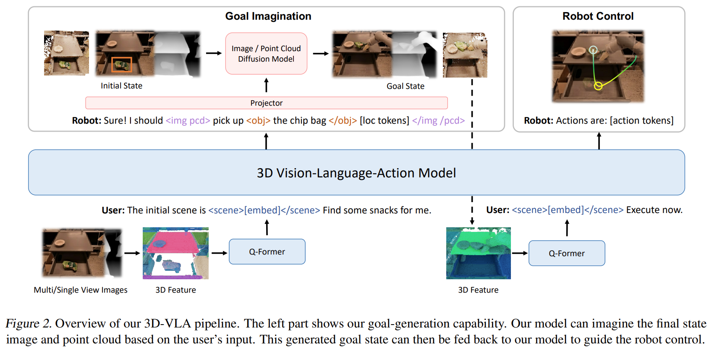
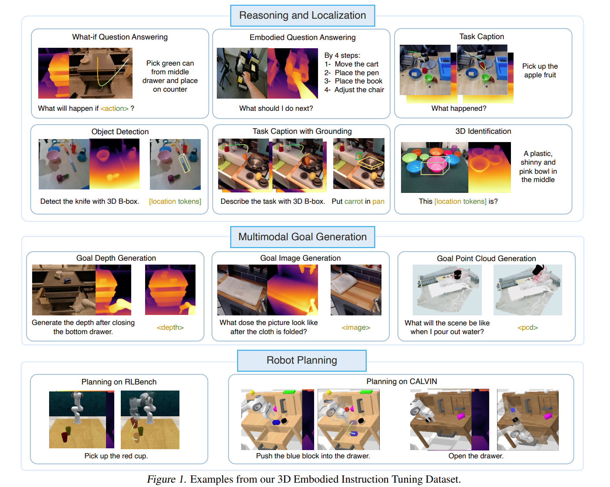

# 3D-VLA: A 3D Vision-Language-Action Generative World Model

## 1.19-1.26周报.md

    - **Motivation：**
        * 现有 VLA 模型主要基于二维视觉输入(基本是视频或者图片)，这种 2D 表征无法充分捕捉三维物理世界的几何结构和空间关系，而这些信息对机器人理解环境和执行任务至关重要。
        * 当前多数模型采用感知到动作直接映射策略：现有 VLA 多是 end-to-end imitation 或 token-level action generation缺少对 world dynamics 的显式建模。
        * 人类理解世界的方式基于内部世界模型：人类不仅识别当前环境，还能“想象”未来状态，从而进行有效的行动规划。该工作旨在实现类似能力，将这种WM引入机器人智能体中，从而提高任务推理和规划能力。
    - **Technique：**
        * 基于3D的大语言模型（**3D-LLM**）作为核心，这个是最重要的核心，输入不是单张图像，而是 multi-view → 3D feature，3D信息直接参与 language reasoning，而不是后期对齐。 一步解决的是 state representation 是否足够表达真实世界 的问题。
        * **Interaction Tokens：**作者引入了多类具身 token：Object tokens、Location tokens、Scene tokens、Action tokens。这些token是提高表达能力很重要的内容。
        * **Generative World Model：**这是 3D-VLA 最world model的部分。训练条件 diffusion model 来预测 future goal：从Point cloud到Point cloud，关键不是 diffusion 本身，而是diffusion 不直接输出给控制器，而是通过 projector 对齐到 LLM embedding space，LLM 可以调用生成结果，参与 reasoning。这一步的本质是：把连续机器人控制问题，翻译成 LLM 能操作的符号空间。
        * 还有一个非常重要的是构建了一个数据集：2M条3D-language-action的数据，这个贡献是很大的。
        *

    - **Advantage：**
        * **规划能力来自结构，而不是模型规模：**3D-VLA 的提升是把 task 被重写为：$ s_0→s_{goal}→a_{0:T} $这使得 long-horizon planning 成为可能。
        * **显式 goal state，降低推理难度：**直接生成动作：高维、强耦合、不稳定，生成 goal state：更可解释，更接近人类 planning。实验中，goal image / point cloud 的质量，直接相关 action success rate。
        * **3D grounding 显著提升 reasoning 和 localization：**这个是论文中提到的数据，至少都比2D的baseline们要好。

