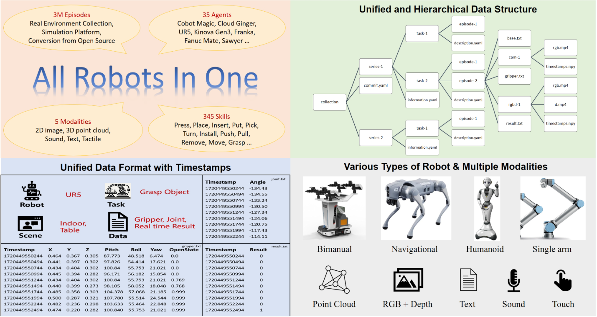

# ARIO (All Robots in One)

## 2.9-2.23周报.md

+ Motivation
    - ARIO 给我的直观感受是：它更像一个数据工程项目，而不是单纯堆一个更大的数据集。具身智能里数据多样性和格式统一经常是互相牵制的：数据源越多，格式越难统一；格式越统一，可用的数据又越受限。ARIO 试图用统一标准把多源数据拉到可融合、可复用的状态。
+ 数据内容与组织方式（按我关心的问题来拆）
    - 模态：它覆盖 2D/3D、文本等多模态输入，这意味着后续不只是在训练单一视觉策略，而是可能支持 VLA、世界模型、以及多模态对齐这类路线。
    - 任务类型：同时覆盖操作与导航，意味着任务链条可能从单一动作扩展到更长 horizon 的具身过程。
    - 平台：包含仿真与真实数据，也包含多种机器人硬件，这一点对跨 embodiment 训练和评测很关键。
+ 数据来源与可比性问题
    - ARIO 把数据分成开源数据集转换、仿真生成、真实采集三类来源。这里我比较在意的是它如何定义统一字段和动作/观测表示，因为这直接决定了跨来源训练到底是在学技能，还是在学不同数据源的偏置。
    - 另一个关键点是分布统计。即便总量很大，如果任务主要集中在少数室内场景，或者硬件形态高度偏向单臂，那么模型看起来效果很好也可能只是对某个子分布特别拟合。ARIO 的统计视角提醒我：后续做跨数据源评测，必须把分布对齐当成评测的一部分。
+ Thinking
    - 这次阅读让我更明确数据对齐在工程中的优先级。如果后续我要做跨数据源训练或评测，第一步不该是直接开训，而是先对齐任务定义、观测字段、动作表示，至少保证训练和评测在同一语义空间里。
    - 从更现实的角度看，如果没有精力做完整对齐，也可以先做一个最小子集：只选同一种任务类型、同一类模态、同一类动作表示，先验证融合训练是否带来增益，再逐步扩大覆盖面。
