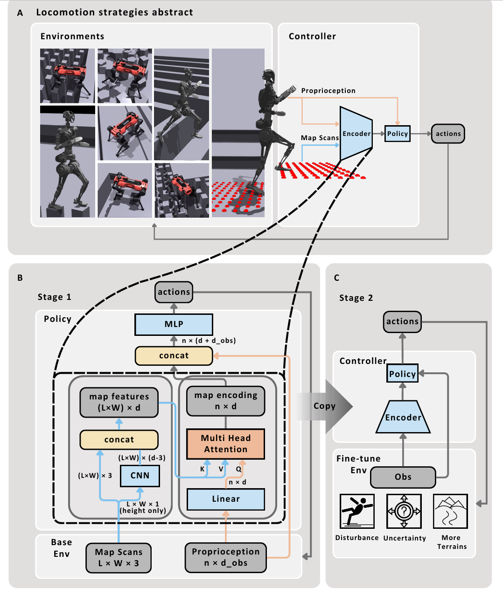
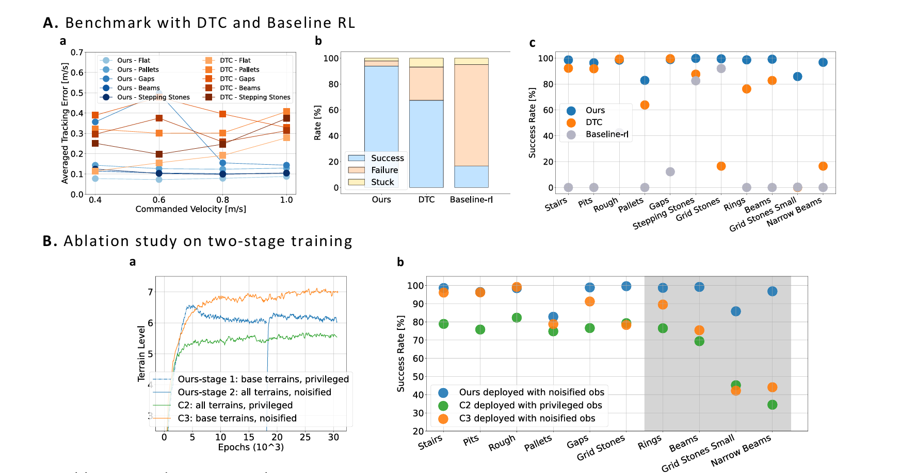

# Attention-Based Map Encoding for Learning Generalized Legged Locomotion

## 3.2-3.9周报.md

+ Motivation
    - 论文关注的是稀疏可落脚点地形上的足式 locomotion。主要想解决的是机器人如何在 `gaps`、`beams`、`stepping stones` 这类地形上既能精确找到可踩位置，又能对噪声、扰动和状态漂移保持鲁棒。
    - 传统 model-based 方法通常依赖完整地图、准确动力学和显式在线 planner，但在 sparse terrains 上常常找不到关键 footholds，也更容易对训练地形过拟合。
    - 作者不是想再加一个 planner，而是想把从地图里挑出当前最关键的可踩区域这件事直接融进端到端学习控制器里。

+ Technology
    - 任务是直接把 proprioception 和 robot-centric map scans 映射成 joint-level actions，让机器人在多类复杂地形上完成动态 locomotion。输入包括本体状态、速度命令和 `L x W x 3` 的局部地图扫描。
    - 方法可以理解为地图编码器 + 策略网络。创新主要集中在地图编码器上。
    - stage A：先构建 robot-centric map scans，把机器人周围地形表示成规则网格形式的局部地图。这个地图就是策略的外感知输入。
    - stage B：开始处理地图信息：然后让地图中的高度值经过两层 `CNN`，提取每个地图点周围的局部几何特征。把 CNN 输出与原始 3D 坐标拼接，形成 `point-wise local features`。这一步很重要，因为它既保留了语义特征，也保留了每个点的空间位置信息。然后把 proprioception 通过线性层映射成一个 `query embedding`。这意味着，同一张地图在不同运动状态、不同速度命令下，应该关注的区域可以不一样。
    - stage C：执行 `multi-head attention`。以 proprioception embedding 为 query，以地图点特征为 key，得到最终的 `map encoding`。最后把`map encoding` 再送入 A/C MLP，actor 输出 joint-level actions，critic 输出 value。这样就有一个完整的端到端网络。
    - 训练逻辑：训练采用两阶段流程。`stage B` 只在 base terrains 和 perfect perception 下训练，目标是先学会基础 locomotion 和地图编码；`stage C` 再加入更难地形、观测噪声、地图 drift、外部 pushes、质量和摩擦随机化，用于提升泛化和 sim-to-real 鲁棒性。算法上仍然是 `PPO`，critic 训练时可使用 privileged observations。
    - 部署闭环：部署时，ANYmal-D 用 onboard elevation mapping 提供地图，GR-1 则通过 terrain mesh 和位姿做 ray-casting。策略本身直接根据当前 proprioception 和 map scans 推理动作，不再额外串联显式 contact planner。

+ Advantage
    - 与 DTC 这类 planner + DRL tracking 路线相比，本文减少了对 steppable-area 阈值、固定 gait frequency 和建模精度的依赖。把attention用作 state-conditioned 的地图点选择机制，在 sparse terrains 上更容易聚焦真正关键的 footholds。
    - 两阶段训练被实验明确证明是有效的。直接在所有地形和所有噪声上从零训练，不如先学会看地图，再学会带噪运行这一策略稳定。
    - 作者在 ANYmal-D benchmark 上报告，完整训练地形集合中，本文 success rate 相比 `DTC` 和 `baseline-rl` 都有显著提升；经过 stage 2 fine-tuning 后，ANYmal-D 和 GR-1 在未见 `obstacle parkour` 上都达到 `100%`胜率。
+ Thinking
    - 这篇论文有启发的一点，是把 `MHA` 用在最需要选择的地方，也就是地图点筛选。
    - 另一个值得学习的地方，是两阶段训练的逻辑很清楚：先解决看图的问题，再解决带着噪声和扰动去走的问题。很多时候真正的性能差异，不一定来自更大的网络，而来自更合理的训练顺序。
    - 当然或许有值得修改的部分。第一，方法依赖 `2.5D height map`，在遮挡严重或空间受限场景中可能不够。第二，GR-1 和 ANYmal-D 的实机感知设置不完全等价，所以跨平台结论要谨慎。第三，训练成本依然不低，说明它虽然减少了显式 planner，但没有真正消除工程复杂度。
