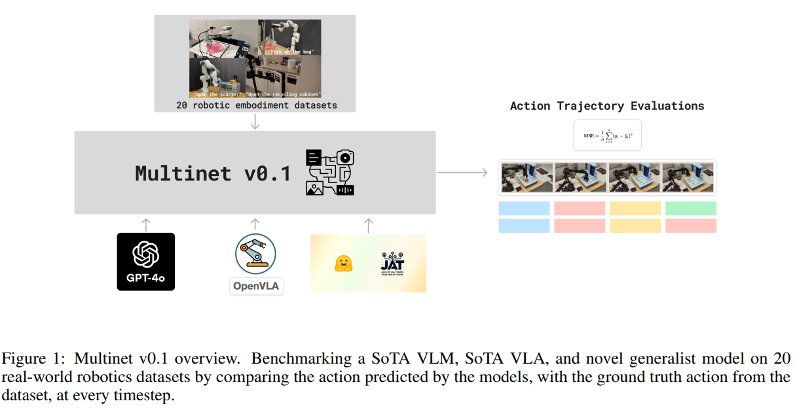

# Benchmarking Vision, Language, & Action Models on Robotic Learning Tasks

## 2.2-2.9周报.md

+ Motivation
    - 尽管VLA蓬勃发展，但社区中没有一套能够系统评估不同 VLA 模型横跨多种机器人任务的统一 benchmark。现有研究往往只在个别任务或单一环境下评估，缺乏跨任务、跨机器人平台以及跨动作空间等多维度能力比较的标准框架。为了解决这一挑战，作者提出了一个综合评估框架与 benchmark 套件，特别针对 VLA 模型在现实机器人学习任务中的表现进行大规模系统性的横向比较。
+ Benchmark的主要内容
    - 该 benchmark 面向的是一类被称为 **VLA 模型** 的系统，其输入同时包含视觉观测和语言指令，输出是可执行的机器人动作。benchmarks 的核心内容包括：
    - 20 个多样化的机器人任务集合，主要覆盖不同 Manipulation/运动场景：从相对基础的抓取、移动，到更复杂的连贯动作序列与语义理解场景。
    - 任务来源是 Open-X-Embodiment 数据集下的多种实例，这个数据集汇聚了多个平台、不同机器人体型和任务设置的数据作为评测基础。
    - 评测重点不是单一任务性能，而是模型在跨任务、跨机器人平台、以及不同 action 空间结构下的泛化与鲁棒性。
    - 多模型对比：该 benchmark 对 GPT-4o、OpenVLA、JAT 等当前领先的 VLM/VLA 进行了 profiling 比较。
+ Benchmark的构建逻辑：
    - 从 benchmark 构建方法来看，它的核心构成不是单一新数据集，而是一个跨现有多数据源和任务的统一评测体系。其主要设计要素包括：
    - 使用现有的多任务、多机器人数据集作为输入。基于 Open-X-Embodiment：一个大型多机器人轨迹集合（来自 20+ embodiment，不同尺寸、不同形态的机器人）。覆盖了操作、拿取、环境交互等多个类别的任务。
    - **统一的评测协议和指标：**所有模型按统一方式输入视觉帧与语言指令，输出动作序列。使用一致的评价指标衡量在不同 tasks&robot 平台下的表现。分析重点包括任务难度、动作空间影响、以及动作序列的多步可执行性。
