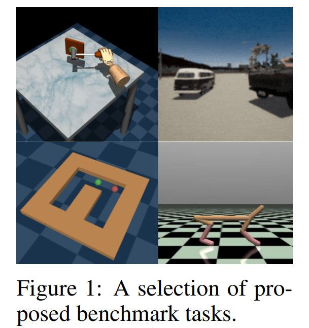

# D4RL: Datasets for Deep Data-Driven Reinforcement Learning

## 2.2-2.9周报.md

+ Motivation
    - D4RL 的提出，直接源于强化学习领域在 **offline RL** 方向上的缺失。在 D4RL 之前，几乎所有主流 RL benchmark 都默认智能体可以与环境进行在线交互，而当对于仅依赖固定数据、不再与环境交互的离线强化学习时，不同论文使用不同来源的数据、不同质量的轨迹、不同评测协议，导致算法效果难以比较。
+ Benchmark的主要内容
    - D4RL的整体的内容比较丰富，包括有一组具有代表性的强化学习场景，包括有Mujoco连续控制任务，迷宫导航类任务， 以及具有操作语义的 Franka Kitchen 任务
    - D4RL 的核心贡献，在于提供了同一任务下多种不同数据分布的并存。例如，在同一个环境中，D4RL 提供由随机策略、部分最优策略、混合策略以及接近专家策略生成的数据集，使算法必须在数据质量不完美、分布不理想的条件下进行学习。评测指标仍以标准 RL success 为主，但其隐含目标是衡量算法在无法试错的情况下，能否从静态数据中学习到有效策略。
+ Benchmark的构建逻辑
    - D4RL的构建逻辑就和RLBench截然不同了，因为RLBench 构建的是任务生成系统，而 D4RL 构建的则是**一组静态、不可再交互的数据集集合**。其基本流程是：首先选定一组标准 RL 环境，然后使用不同类型的行为策略在环境中进行大量 rollout，记录得到的状态、动作、奖励和终止标记，并将这些轨迹固化为 offline dataset。
    -  一旦数据集生成完成，训练阶段便不再允许任何形式的环境交互，算法只能基于这批数据进行学习。D4RL 在 benchmark 层面进一步做的一件关键事情，是对所有数据集使用统一的数据格式、统一的加载接口以及统一的评测方式，从而确保不同论文之间的实验结果具备可比性。
