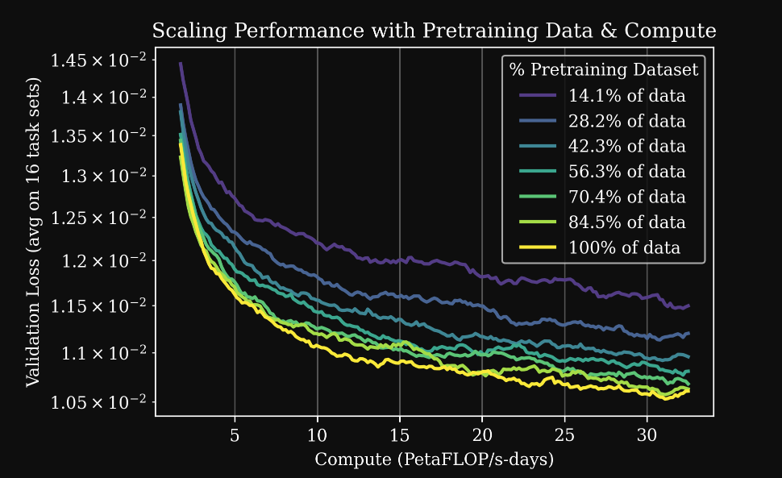
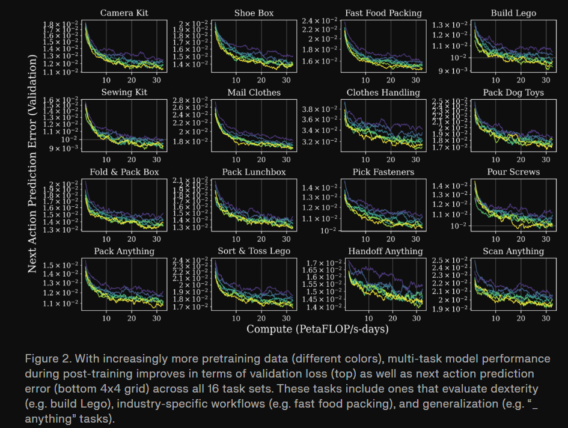

# GEN-0: Embodied Foundation Models That Scale with Physical Interaction

## 1.26-2.2周报.md

+ Motivation
    - GEN-0 的核心动机是一个更底层的问题：具身智能是否真的存在类似 NLP / CV 中的 Scaling Law，以及如果存在，它是否依赖于真实物理交互数据而不是文本或仿真。
    - 在此前的大多数机器人工作中，模型要么太小、学不进复杂的感觉-运动模式，要么数据规模太有限，导致模型在预训练阶段很快进入上线。GEN-0 明确指出：这不是算法问题，而是规模问题。
    - Generalist 观察到一个此前在机器人领域从未被系统性报告过的现象：当模型规模不足时，预训练会出现ossification——模型参数不再吸收新信息，即使继续喂数据也几乎不提升性能。
    - 因此，GEN-0 的动机可以概括为一句话：只有当模型规模、数据规模和数据形态同时跨过某个阈值，具身基础模型才真正成立。

+ Technology
    - GEN-0 在技术上最关键的贡献不是某一个网络结构细节，而是把模型-数据-训练基础设施当成一个整体系统来设计。
    - 在模型规模上，Generalist 系统性比较了 1B、6B、7B 以及 10B+ 级别模型的行为，发现 7B 是一个明显的相变点：
        * 小模型1B在预训练阶段无法内化复杂、多样的感觉-运动分布，表现为权重逐渐固化；
        * 中等型6B：开始出现多任务能力，但迁移仍依赖大量后训练；
        * 大模型7B以上：能够真正吃下大规模机器人数据，并在下游任务中仅需极少步数就完成适应。
    - 在训练范式上，GEN-0 强调 **Harmonic Reasoning**，即在连续时间、异步的感知 token 流和行动 token 流之间建立稳定耦合，而不是引入显式的 System-1 / System-2 或推理时指导机制。这一设计让模型可以自然扩展到更大规模，而不引入复杂的双系统控制逻辑。
    - 在架构层面，GEN-0 从一开始就以 **cross-embodiment** 为前提设计模型接口，使同一基础模型可以在 6DoF、7DoF、16+DoF 乃至半人形机器人上运行，而不是事后再做适配。
+ Thinking
    - GEN-0 作为具身智能的大脑。它关心的是这个世界里有哪些任务、动作大概长什么样、不同操作之间有什么共性。
    - GEN-0 最重要的发现是：只有当模型足够大、真实交互数据足够多时，这个大脑才真的会形成。小模型学不进去，会卡住，就像还没发育完全的大脑，再怎么喂数据也长不起来。
    - 与之相对的，小脑负责的是另一件事：稳定地走、别摔倒、别抖、别撞。这类事情需要的是快、准、稳定，而不是规模。GEN-0 并没有试图自己去当小脑，而是默认这些事情交给下游控制系统。
    - 这其实是一种很清醒的选择：大脑负责理解和泛化，小脑负责执行和稳定。如果让一个超大的模型既想当大脑、又想直接控制每个关节，反而两件事都做不好。
