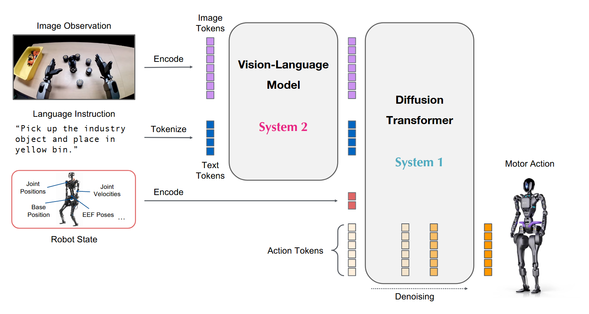
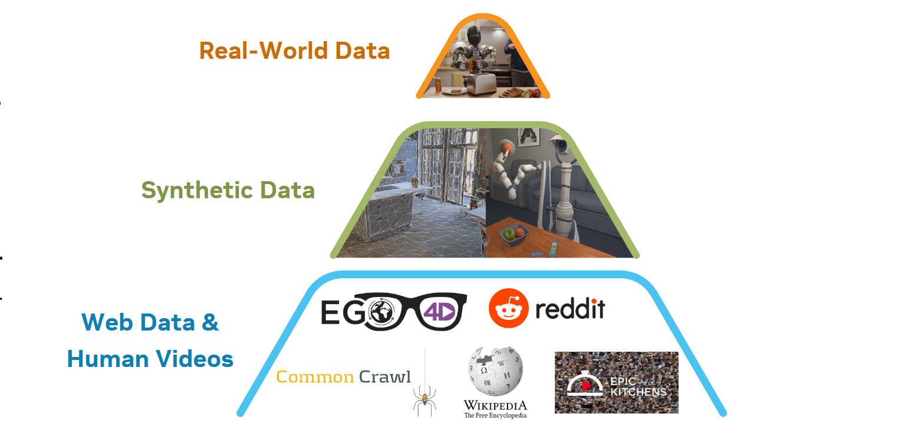
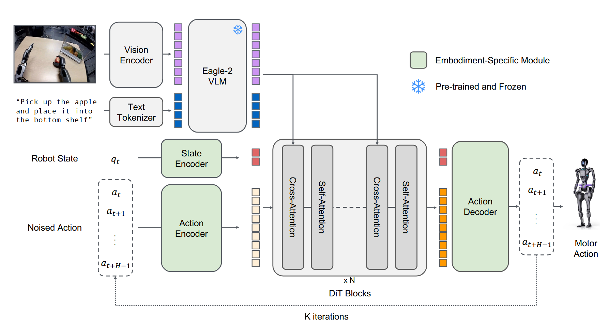

# GR00T N1: An Open Foundation Model for Generalist Humanoid Robots

## 11.31-12.07周报.md

+ GR00T N1和$ \pi_{0.5} $都是旨在解决Generalist Robot的问题，但是在技术上的差别比较大。而且在这个架构里面的world model的应用方式还不太一样。

+ Motivation：
    - **Humanoid Focus (人形机器人优先):** 文章明确指出，为了达到人类级别的物理智能，必须依赖人形机器人。但人形机器人的数据极其稀缺且昂贵。
    - 然后给出了一个数据金字塔：既然机器人数据不够，那就用金字塔策略
        * 塔尖：昂贵的真机数据。
        * 塔中：仿真数据 + **Neural Trajectories (模型生成的数据)**。
        * 塔基：海量的人类视频（Human Videos）。人类视频的数据极大，但是人类视频是没有Action Label的，所以本文章一个很大的工作是引入Latent Action和IDM（逆动力学模型）来给视频打标。
        *

    - **System 1 & System 2 (快慢系统):** 这一点是 GR00T N1 的核心哲学。
        * **System 2 (类似于大脑):** 主要做的是Reasoning的工作，负责理解复杂的视觉和语言指令，频率低（10Hz）。
        * **System 1 (小脑):** 主要做的是Actuation的工作，负责生成高频、流畅的电机控制信号，频率高（120Hz）。
+ Architectrue
    - GR00T N1 的架构设计非常“工程化”且模块分明，其实有点像一个比较典型的VLM + DiT (Diffusion Transformer)组合
    - **System 2: Vision-Language Module (VLM)**
        * Backbone: 使用了 Eagle-2 (基于 SmolLM2 + SigLIP-2)。
        * Function: 输入图像和文本，输出 Vision-Language Tokens。
        * 特点: 这是一个预训练好的大模型，负责看懂环境。它不直接输出动作，而是输出高维特征。
    - **System 1: Diffusion Transformer (DiT)**
        * Backbone: 一个基于 Transformer 的 Flow Matching Policy (类似 $ \pi_0 $)。
        * Input:
            1. Robot State: 经过 Embodiment-Specific Encoder 编码的本体感知信息。
            2. Noised Action: 扩散过程中的噪声动作。
            3. Conditioning: 来自 System 2 的 VLM Tokens（通过 Cross-Attention 注入）。
        * Output: 去噪后的动作（Motor Action）。
        * 特点: 这是一个专门训练用来做运动生成的模块，参数量相对小，推理速度快。
    - **Cross-Embodiment Encoders (绿色模块)**
        * 为了让模型能同时控制单臂、双臂、甚至不同的人形机器人，GR00T N1 为每个机器人设计了独立的 State Encoder 和 Action Decoder (MLP)。这使得中间的 DiT 可以在一个统一的 Latent Space 中处理动作
    -

+ Advantage
    - Dual-System Efficiency：System 2 (1.34B 参数) 跑得慢（10Hz），System 1 跑得快（120Hz）。这非常符合机器人控制的实际需求：不需要每一毫秒都重新思考我要做什么，但需要每一毫秒都调整电机力矩。
    - Neural Trajectories：这是本文的一大亮点。他们不仅用仿真数据，还微调了一个视频生成模型（Image-to-Video Model），让模型“想象”出新的轨迹（比如把绿辣椒换成红苹果）（**这个视频生成模型是World Model架构的**）。这是在用 Video Gen AI 做 Data Augmentation，极大地扩展了数据的多样性。
    - Latent Actions from Human Videos：利用 VQ-VAE 从人类视频中提取“潜在动作”。这意味着模型可以直接从 YouTube 视频中学习“把右手往左移”这种抽象动作，并在真机上通过 Inverse Dynamics Model 还原。
+ Thinking
    - $ \pi_{0.5} $** :** 追求万物皆 Token。视觉、文本、动作都在**同一个** Transformer 的上下文中流转。做的事极致的语义融合，Higher-level reasoning直接指导动作。但是实际上推理成本高，整个大模型都要跑一遍才能出一个动作。
    - GR00T N1：追求各司其职。VLM 只负责看和想，DiT 只负责动。推理效率极高，同时模块化训练。但是VLM 和 DiT 之间的 Cross-Attention 可能会成为瓶颈，VLM 的推理能力可能无法像 $ \pi_{0.5} $ 那样深入地渗透到每一个动作细节中。
    - 在世界模型（World Model）的理解这个部分来说：
        * $ \pi_{0.5} $ (Semantic World Model): 通过预测 Text Subtask，隐式地构建了对任务流程的理解。它更像是一个拥有 Chain-of-Thought 的 Agent。
        * GR00T N1: 通过 Video Generation (Neural Trajectories) 来显式地生成未来的像素帧。它把 Video Gen 模型当作一个 Simulator 用来造数据。
    - 就我自己来看：GR00T N1 是**英伟达硬件思维的体现**（追求高频、实时、模块化），而 $ \pi_{0.5} $ 是**AI 原生思维的体现**（追求端到端、大一统、思维链）。
