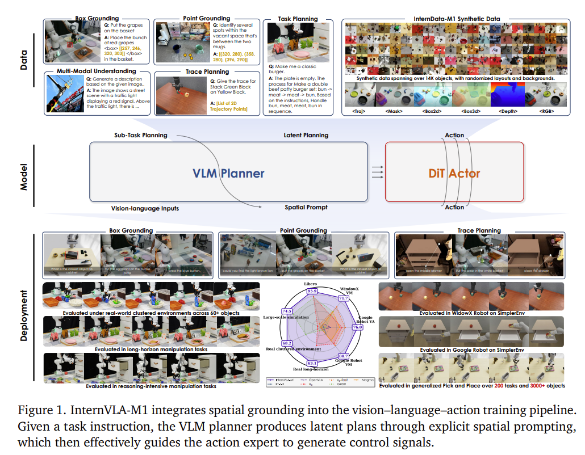
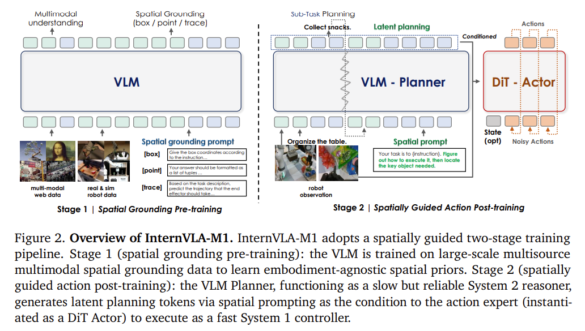

# InternVLA-M1: A Spatially Guided Vision-Language-Action Framework for Generalist Robot Policy

## 1.26-2.2周报.md

+ Motivation
    - InternVLA-M1 关注的核心问题是：**通用 VLA 模型虽然“懂语言、看得见”，但往往不知道“具体该动哪儿”**。
    - 传统 VLA 模型更擅长语义理解，比如“抓杯子”“放到桌子上”，但在真实场景中，机器人真正需要的是**清晰的空间指向**，例如“哪个杯子”“桌子的哪个位置”。
    - 因此，这篇工作的动机可以理解为：**把“语言里的模糊意图”，变成“空间上明确可执行的动作目标”**。

+ **Technology**
    - InternVLA-M1 的核心思路是引入spatial guidance，让语言不只是参与理解任务，而是明确参与定位和对齐动作。
    - 在整体框架中，模型不会只输出抽象动作，而是先通过视觉与语言共同推断出关键空间区域或目标位置，再基于这些空间线索生成动作。
    - 这种设计相当于在 VLA 中显式强调先对齐空间，再生成动作，避免模型只在语义层面知道要做什么，却在物理层面犹豫不决。
    - 从结构上看，它并不是推翻已有 VLA，而是在中间插入了一层空间约束，让动作生成更贴近真实机器人执行。
+ **Advantage**
    - 最大的优势是动作更稳定、更可解释：模型不是凭隐式特征猜怎么动，而是围绕明确的空间目标展开。
    - 在复杂场景或多物体环境中，空间引导可以有效减少抓错对象等常见错误。
    - 对通用机器人来说，这种方式更接近人类的操作逻辑——先看清楚在哪里，再决定怎么动，而不是两件事混在一起。
+ **Thinking**
    - 从整体脉络看，InternVLA-M1 并不追求更大的模型或更多的数据，而是在回答一个更基础的问题：VLA 模型是不是缺了一层空间意识。这篇工作传达的一个信号是：未来的通用机器人策略，不仅要懂语言、会规划，还必须在空间层面说得清楚、对得上现实世界。本质上是一个显式的Planner模块的添加。
    - 它的思路非常朴素，但也很重要：如果机器人连空间都没对齐，再强的语言理解也很难落到真实动作上。
    - 和 GEN-0、NanoVLA 相比，InternVLA-M1 更像是在补齐 VLA 的中间一环，让理解任务和执行动作之间的过渡更自然。
