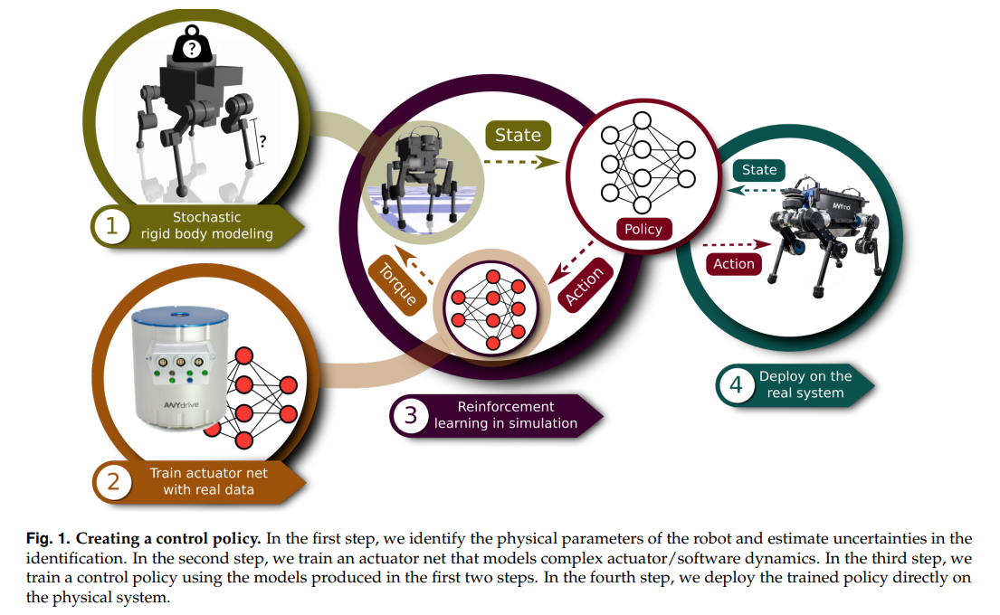

# Learning Agile and Dynamic Motor Skills for Legged Robots

## 2.9-2.23周报.md

+ Motivation
    - 这类工作关注的重点不是把仿真策略搬到真实系统上跑通，而是把迁移目标明确成可验证的能力：在四足场景里，最难的往往不是稳态走路，而是在动态极限附近仍能保持稳定，并且对外界扰动有恢复能力。
+ Technology / 方法视角（按我自己的理解归纳）
    - 主要路线还是仿真训练 + 现实部署，但关键在于如何把仿真里的不确定性覆盖住，让策略不要把某一套动力学假设学死。
    - 从工程直觉上看，sim2real 的核心不是某个单点技巧，而是你是否把系统性偏差当成主要变量去处理，包括动力学参数误差、接触模型差异、传感器噪声、控制频率不一致等。
+ Thinking
    - 如果后续要调整训练流程，应该先明确要迁移的能力清单，以及必须覆盖的偏差清单，再决定用什么 randomization 或结构先验去覆盖它们。
