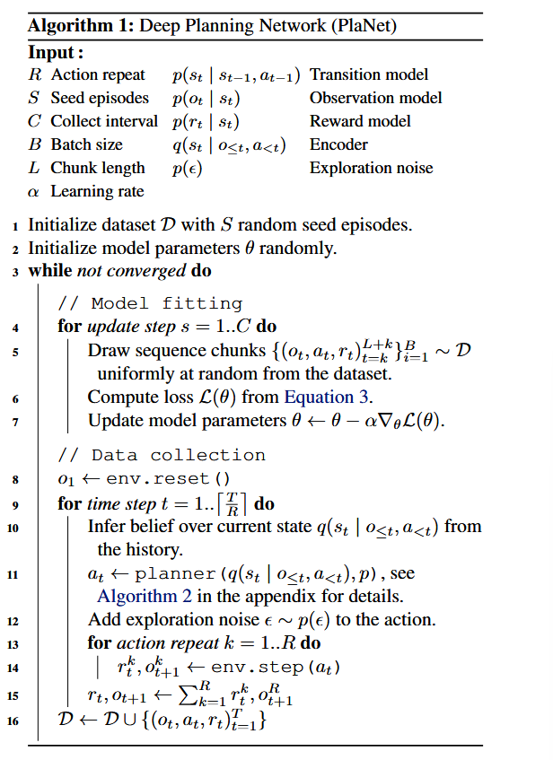
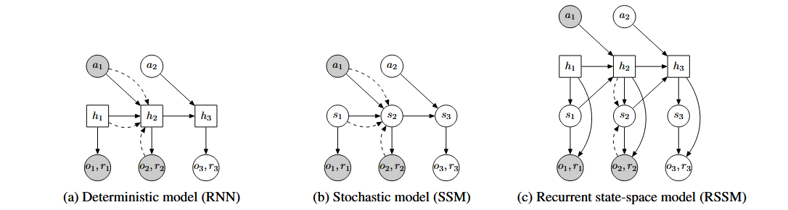
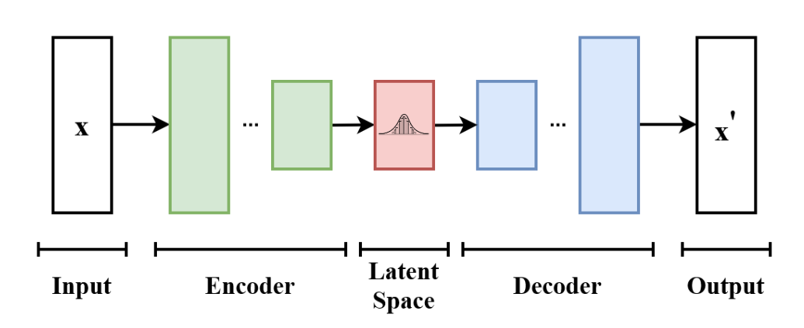
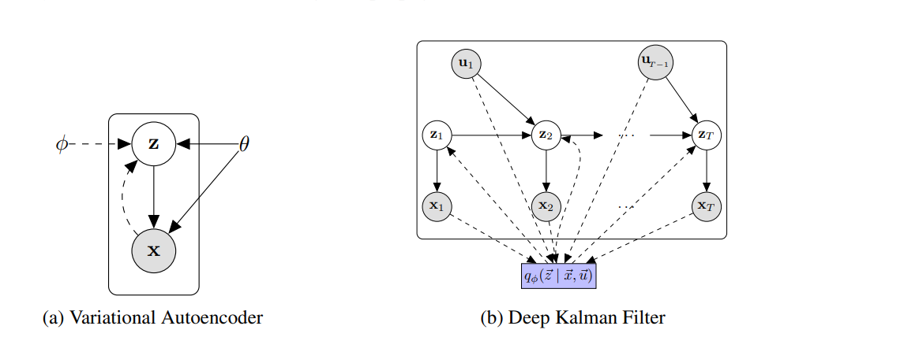
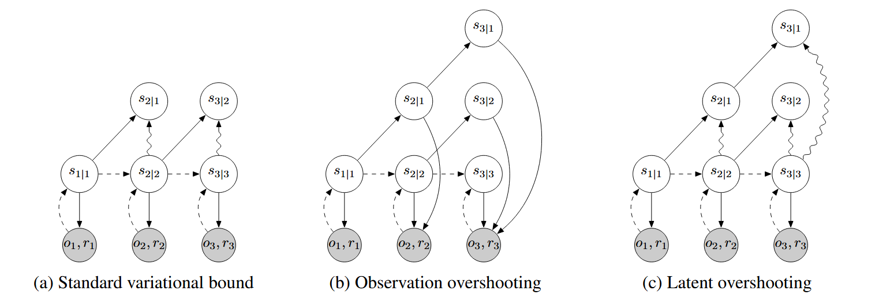

# Learning Latent Dynamics for Planning from Pixels

## 11.31-12.07周报.md

+ Motivation：
    - 文中开头就提出了，在经典的控制或者博弈问题里面，只要环境动力学已知（比如一个物理模拟器），用Planning方式，可以做到很好的表现，比如说AlphaGo，但是在真实环境或者是复杂模拟之中，动力学是未知的，只能用交互经验去学，在这样的情境中，有一条路线是model-free RL，也就是我所熟知的强化学习算法（PPO，GPRO这一类方法），但是传统的model-free RL虽然简单，但是数据极度低效，需要上十万到上百万的episode。
    - 因此本文想要基于model-based加以演进，提出world-model-based的一种思路，在复杂的控制任务中（接触，长时序，稀疏奖励），依然使用规划，同时还可以改变model-free的问题，使得样本更加高效。
+ Architecture：这篇文章的核心架构是围绕着文章开篇就提到的本文的三个核心贡献来完成的。
    - 第一个贡献是：Latent Space Planning
        * 这个部分其实是整个模型PlaNet的算法运行思路。
        * 模型一共有五个网络，分明是：
            + Transition model：过渡网络
            + Observation model：观测空间模型
            + Reward Model：奖励模型
            + Encoder：解码
            + Policy：策略函数（或者称为Planning）
        * 然后就定义了模型的核心算法：
            +

        * 用语言文字来简要描述一下，核心是两步，第一步是mode fitting，第二步是data collection。
            + model fitting：
                - 从数据集中采样 B 个序列样本（每个样本长度为 L）；
                - 然后使用这些序列训练模型参数；损失函数 $ Loss(\theta) $ 来自论文的 Equation 3，即变分下界（后面详细说明）；
                - 最后利用梯度下降更新模型参数。（更新的是Transition model，Obervation model，Reward model，以及encoder）
            + data collection：
                - 首先重置环境，开始新的一回合。
                - 推断当前潜在状态 $ q(s_t|o_{\le t}, a_{<t}) $,编码器根据历史观测和动作推断此时的latent state。
                - 然后规划动作 $ a_t $（这里使用了前面提到的planner策略函数）。只执行序列的第一个动作（Model Predictive Control 原则）。添加探索噪声 $ \varepsilon \sim p(\varepsilon) $，保证多样性；
                - 重复该动作若干次 (R 次)，收集每次的 $ (r_t, o_t) $，将重复的奖励求和、观测取最后一帧；
                - 将新数据加入数据集 D，供下轮训练使用。
        * 算法其实是一个闭环：**(1) 学模型 → (2) 规划动作 → (3) 执行动作 → (4) 收集新数据 → (5) 再学模型 。**文中其实说到了这种范式是一种典型的Model-Based Reinforcement Learning with Active Data Collection。
            + 前面的模型fitting的过程，其实本质上是在从已有数据中训练潜在动力学模型 $ p(s_t | s_{t-1}, a_{t-1}) $，让模型学会预测未来的情况。
            + Data Collection基于当前的模型去规划行动，与环境交互产生新的数据，并加入数据集。，从这个方面来看，模型极大程度的提高了数据效率，按照模型的测试结果所说，在DeepMind的Image based control domains 来看的话，只需要200次的交互就可以学到一个非常稳定且良好的策略。（我之前使用A2C以及A3C算法，在Cartpole上做的RL方法，至少都需要10000次交互才可以学到稳定的策略，这确实极大程度的获得了极高的数据效率）。
    - 第二个贡献是：Recurrent State Space Model
    -

        * 首先列举RNN，这个模型很熟悉，是循环神经网络：循环神经网络由当前的动作输入和上一时刻的hidden state，决定本时刻的hidden state，同时输出此时的Observation和Reward。 但由于模型完全确定性，它只能记忆过去，无法捕捉未来的不确定性。
        * 然后是SSM，这个部分其实不太好理解，因此特别返回阅读了VAE和SSM原论文的内容：
            + VAE（变分自动编码器）：原论文没有给VAE一个特别合适的模型图示，我再wiki上找到一个大致如下，我们基于此来从理论角度介绍一下：
                -

                - VAE本质上是为了学会一个latent space，在这个空间中可以高效地表示和生成复杂的数据，本质就是想学一个模型$ p_\theta(x, z) = p_\theta(z)  p_\theta(x|z) $。
                    * $ x $：观测数据；
                    * $ z $：atent variable；
                    * $ (p_\theta(x|z)) $：生成网络（decoder）；
                    * $ (p_\theta(z)) $：潜在先验（通常是高斯分布）。
                - 我们考虑最后的最大似然分布：$ \ln p(x) = \ln \int p(x,z) , dz $，但是积分在实际场景中是不可计算的，所以我们引入变分计算（泛函里面来的），于是引入一个可学习的近似后验分布 $ q_\phi(z|x) $， 用它来近似真实的后验 $ p(z|x) $。
                - 我们本质是要找到这个最大似然分布的最大值，所以我们尝试找一个最大下界，来拟合这个模型。这里用到了ELBO的变分下界。$ \ln p(x) \geq E{q_\phi(z|x)}[\ln p_\theta(x|z)]-D_{KL}(q_\phi(z|x) \parallel p_\theta(z)) $这个公式就是得到这个对数似然的一个下界的值。我们详细探讨这个公式的几个部分：
                    * 第一个部分$ E{q_\phi(z|x)}[\ln p_\theta(x|z)] $：是用首先用q去解码z，然后用z去重新编码x的过程，也即是本质是一个reconstruction的过程。
                    * 第二个部分$ D_{KL}(q_\phi(z|x) \parallel p_\theta(z)) $：本质上是一个正则化的过程，KL约束其实是很常见的约束方法，在Mechine Learning中使用的很多，本质是用来衡量两个网络的近似程度，相当于是保证$ \phi $网络和$ \theta $网络的在结果分类的相似性，做了一个正则的过程。
                    * 使用这个最大似然的变分下界，作为我们需要最大化的Loss，用这个公式更新两个网络。$ \theta $：Decoder的参数；$ \phi $：Encoder的参数。$ L(θ,ϕ;x)=E{q_\phi(z|x)}[\ln p_\theta(x|z)]-D_{KL}(q_\phi(z|x) \parallel p_\theta(z)) $
                - 当然作模型更新的细节远远不止这些内容：在数据流动的时候我们进一步探讨重建项的构建$ E{q_\phi(z|x)}[\ln p_\theta(x|z)] $。
                    * 这里牵扯到对模型更加深刻的理解，第一个部分是latent space，也就是Encoder的结果，这个地方输出的结果，本质上是一个latent space的一个点云的分布，然而实际上decoder的输入结果是一个具体的latent variable。
                    * 这中间就会存在错差，因此这个varible其实是从这个点云分布模型随机选择的，因此如果想要更新encoder的参数就存在问题了。
                    * 我们都知道参数的更新依赖于梯度的传递，梯度传递的本质依赖于损失函数的构建，但是在这个模型里面存在不止一个干扰项，因为最后的variable除了受限于网络的参数，更是受限于最后的随机选择。因此我们要想个办法把这个random pick给先摘除出去，从而可以更好的更新模型。
                    * 原输出是这样的：$ z \sim \mathcal{N}(\mu_\phi(x), \sigma_\phi(x)) $，编码器的输出值实际上是均值和标准差。
                    * 这里使用了一种特殊的technique，叫做重参数（Reparameterization Trick），把缘由的分布式子，改写为$ z = \mu_\phi(x) + \sigma_\phi(x) \odot \epsilon, \quad \text{where } \epsilon \sim \mathcal{N}(0, I) $这样就把分布给隔离开了，使得latent variable $ z $对于encoder的参数$ \theta $是可导的。
                - 最后我们总结一下这个VAE究竟干了什么： 输入 $ x $被映射到一个大的潜在世界 latent space 的某个高斯点云区域中，然后从这个点云中随机采样出一个 $ z $，再用解码器重建出 $ x' $ 。VAE是让我真正意识到了究竟什么是latent space，本质上有点像一个有架构的宇宙。
            + 然后是SSM：把 VAE 的单点 latent扩展成随时间演化的 latent 轨迹。
                - 下面的图片所说的Deep Kalman Filter其实就是这个SSM。SSM 本质上是在 VAE 的生成建模里，引入时间 t 的链式Markov以及动作/控制量 (u)。SSM是一串 $ x_{1:T} $ 对应一串隐藏状态 $ z_{1:T} $，并且 $ z_t $ 会在动作 $ u_{t-1} $ 作用下从 $ z_{t-1} $ 演化到 $ z_t $。所学的模型是这样的：$ p_\theta(x_{1:T}, z_{1:T}\mid u_{1:T-1}) = p_\theta(z_1) \prod_{t=2}^{T} p_\theta(z_t \mid z_{t-1}, _{t-1})\prod_{t=1}^{T} p_\theta(x_t \mid z_t) $
                    * $ x_t $：第t步观测
                    * $ z_t $：第t步隐藏状态
                    * $ u_{t} $：动作/控制输入
                    * $ p_\theta(z_1) $：初始状态先验
                    * $ p_\theta(z_t \mid z_{t-1}, u_{t-1}) $：动力学/转移模型（世界怎么动）
                    * $ p_\theta(x_t \mid z_t) $：观测/生成模型（世界状态怎么解码成观测）
                - 同样需要变分后验：
                    * 同 VAE 一样，我们想最大化序列似然：$ \log p_\theta(x_{1:T}\mid u_{1:T-1})\log \int p_\theta(x_{1:T}, z_{1:T}\mid u);dz_{1:T} $这个对 $ z_{1:T} $ 的积分同样不可算，于是引入近似后验：$ q_\phi(z_{1:T}\mid x_{1:T}, u_{1:T-1}) $常见的一种（过滤式 filtering）分解写法是：$ q_\phi(z_{1:T}\mid x_{1:T}, u) q_\phi(z_1\mid x_1)\prod_{t=2}^{T} q_\phi(z_t\mid z_{t-1}, x_t, u_{t-1}) $直觉上就是：每一步用“上一时刻状态 + 当前观测 + 当前动作”去推断当前状态。
                    * 此时的ELBO就不一样了，多了一个时间的累计：$ \log p\theta(x{1:T}\mid u) \ge \sum_{t=1}^{T}\mathbb{E}{q_\phi}\big[\log p_\theta(x_t\mid z_t)\big] - D_{KL}\big(q\phi(z_1\mid x_1)|p\theta(z_1)\big)- \sum_{t=2}^{T}\mathbb{E}{q\phi}\Big[ D_{KL}(q_\phi(z_t\mid z_{t-1},x_t,u_{t-1})|p_\theta(z_t\mid z_{t-1},u_{t-1})\big) \Big] $除去之前的重建项，初识KL，多了一个动态的一致性，这个动态的一致性说明了推断出来的状态序列，不能只会解释当前观测，还必须符合你学到的动力学规律。 这是 SSM 相比 VAE 多出来的时间结构约束。
                -

        * 最后我们可以总结上面的内容，进一步说到RSSM。
            + RNN：状态完全是确定性的 $ h_t $，但是无法表达uncertainty  multimodal futures，而且规划时容易钻模型偏差的空子。
            + SSM： 状态完全是随机的隐藏状态$ s_t $，但是状态完全是随机的$ s_t $。
            + RSSM想要做到的事既能够记住长期信息，又能够对外来保持不确定性，从而更加稳健的预测和规划
            + 论文给的RSSM的数学形式的生成过程是这样的：$ \textbf{Deterministic: }; h_t = f(h_{t-1}, s_{t-1}, a_{t-1}) \\
\textbf{Stochastic: }; s_t \sim p(s_t \mid h_t) \\
\textbf{Observation: }; o_t \sim p(o_t \mid h_t, s_t)  \\
\textbf{Reward: }; r_t \sim p(r_t \mid h_t, s_t) \\ $
            + 其中：
                - $ h_t $：RNN/GRU 的隐藏状态，像“记忆带”，把历史信息稳定地累积下来（解决纯SSM 难记忆的问题）。
                - $ s_t $：每一步都采样的随机 latent，用来表达环境的不可观测因素或者是多解未来（解决纯 RNN 不会不确定的问题）。
                - 观测$ o_t $和奖励$ r_t $都由 $ (h_t, s_t) $ 生成，规划时也在这个 latent 里滚动预测。
            + 论文的 encoder 用 filtering posterior（只用过去信息，贴合在线规划）来近似后验，并把它写成逐步分解：同时在 RSSM 里，后验参数化是：$ q(s_{1:T}\mid o_{1:T}, a_{1:T})=\prod_{t=1}^{T} q(s_t\mid h_t, o_t) $这里有一个很关键的理论点：论文强调观测信息必须通过对$ s_t $的采样这一步，避免出现从输入到重建的确定性捷径，否则模型可能绕开 stochastic part。
    - 第三个贡献是：Latent Overshooting

        * 这个部分要解决的痛点：是标准 ELBO 只把转移学成一步准，原始问题在于：变分下界的KL 正则只直接训练了一步转移。论文把它说得很直白：梯度会穿过$ p(s_t|s_{t-1}) $ 去影响$ q(s_{t-1}) $，但从不会穿过多个 p 串起来的链条。因此模型即使一步预测看起来不错，多步 rollout 还是可能飘，尤其在模型容量有限时更明显，PlaNet 的规划（CEM）是在 latent 里把未来滚很多步来算回报的，所以关心的是：多步预测必须稳。
        *  一个自然想法是：那我就把模型 roll 出t+1,t+2,…的 latent，然后每一步都 decode 成图像，做额外的重建损失——这就是他们提到的observation overshooting。（论文原理比较简单，我这里就带过了）。
        * 核心定义：d 步预测的先验$ p(s_t\mid s_{t-d}) $
            + 先定义d 步转移不是简单套一次 $ p(s_t|s_{t-1}) $，而是把中间状态积分掉（等价于反复应用转移模型滚动 d 次)$ p(s_t \mid s_{t-d})=\int \prod_{\tau=t-d+1}^{t} p(s_\tau \mid s_{\tau-1}) \; ds_{t-d+1:t-1} $直觉：从$ s_{t-d} $出发，连续滚动$ d $次，得到对$ s_t $的开环预测分布。
        *  第一步推广：对“固定距离 d”的多步预测，写一个对应的变分下界
            + 把标准的变分下界推广到d 步预测分布$ p_d $上（训练时假装模型只能每 d 步看一次锚点信息，其余靠自己滚）。
            + 标准公式是这样的：$ \ln p_d(o_{1:T}) \ge \sum_{t=1}^{T} \Big( \mathbb{E}_{q(s_t\mid o_{\le t})},[\ln p(o_t\mid s_t)] - \underbrace{\mathbb{E}_{p(s_{t-1}\mid s_{t-d}),q(s_{t-d}\mid o_{\le t-d})} \Big[ \mathrm{KL}\big(q(s_t\mid o_{\le t})|p(s_t\mid s_{t-1})\big) \Big]}_{\text{multi-step prediction}} \Big). $
            + 关键看 KL 那一项的期望是怎么取的：它会从$ q(s_{t-d}\mid o_{\le t-d}) $采样一个锚点latent，然后用模型的转移滚到t-1，再用一步先验$ p(s_t|s_{t-1}) $去对齐当前后验$ q(s_t|o_{\le t}) $。这样一来：梯度就必须穿过“多步转移链”（因为$ s_{t-1} $来自滚动结果），从而真的在训练rollout 多步也要对。
            + 只训某个固定 d 仍然不够，因为规划要用到 所有长度 的预测（从短到长一直到规划视野）。于是他们把所有距离的 bound 平均/加权起来，得到式 (7)，这就是 latent overshooting 本体：$ \frac1D\sum_{d=1}^D \ln p_d(o_{1:T}) \ge \sum_{t=1}^T \Big( \text{reconstruction} \frac1D\sum_{d=1}^D \beta_d -\mathbb{E}[\text{KL}(q_t | p_t^{(d)})] \Big) $
            + 两个实现细节，特别重要
                - $ \beta_d $权重：想让模型更重视长程还是短程，可以调。借鉴 $ \beta-VAE $ 的思想，引入每个距离的权重$ \beta_d $.论文里说为了简单可以把所有d>1的$ \beta $设成同一个值，但你也可以用它强调长程或短程。
                - stop gradient方向：只让先验追后验，不反过来拖后验。很关键的一句：实践中对 d>1 的 overshooting 停止后验的梯度，意思是让多步预测去贴近信息更充分的后验，但不要让后验也被这个正则反向拉扯。
+ Thinking：
    - 这篇 PlaNet 让我第一次把 world model这四个字落到一个非常具体的工程闭环上：先在 latent space 里学一个能滚动预测的动力学模型（带不确定性与记忆），再（表征学习—预测—决策）三件事拆得很干净，并且用 CEM 这种朴素但鲁棒的优化器把规划跑通了。world model其实并不是一个多复杂的网络（其实也相当的复杂，有着巨大的数学基础内容，以及前置研究），而是一套训练目标 + 动力学结构 + 推理/规划机制的组合。
    - 同时，latent overshooting 这节明确world model 的难点不在单步拟合得像不像，而在多步 rollout 是否稳定；一旦要做规划，模型误差就会被反复放大，所以训练目标必须显式地照顾到多步一致性，这也是它和普通的序列 VAE/SSM 在用途上的本质差别之一。
