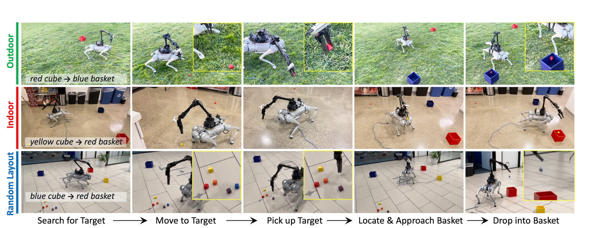
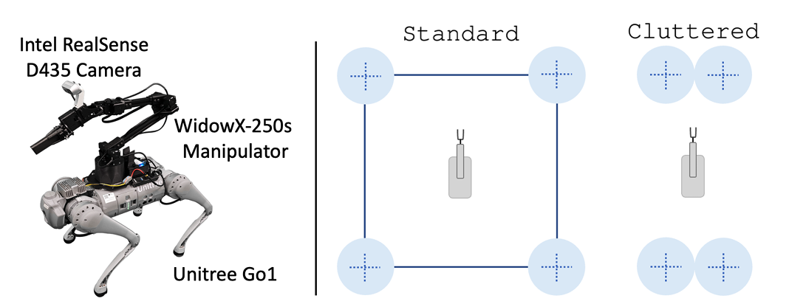
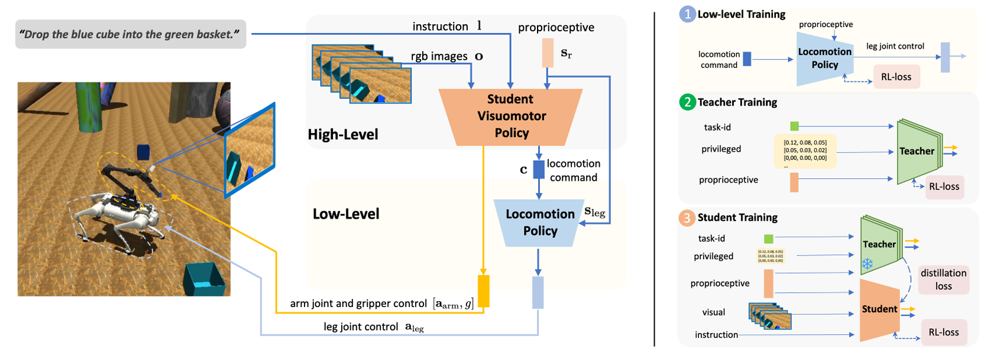
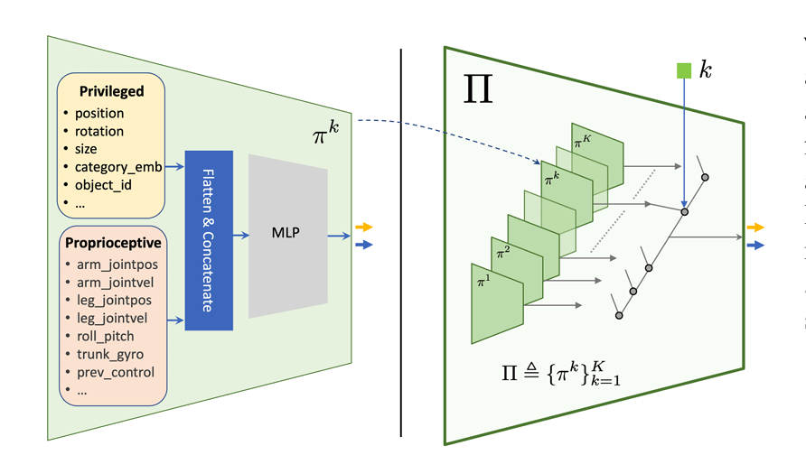

# Learning Multi-Stage Pick-and-Place with a Legged Mobile Manipulator

## 3.2-3.9周报.md



+ Motivation
    - 这篇论文基本和我们目前探索的任务差不多，包含搜索、接近、抓取、持物搜索、运输和投放多个阶段。
    - 已有工作往往只解决其中一部分。要么重点放在低层 loco-manipulation 技能，要么只做短时程 mobile manipulation；还有一些方法借助全局相机、已知目标位置或外部 API 来降低问题难度。
    - 论文切入点是，设计SLIM 的目标更接近真实应用场景，即在 `ego-centric + active search + long-horizon` 三个条件同时成立时，让四足移动操作器完成完整 pick-and-place 闭环。
    -

+ Technology



    - 任务要求机器人先搜索目标立方体，移动接近并抓取；然后在持物状态下重新搜索目标篮筐，再携带物体移动并完成投放。输入不仅有视觉和本体状态，还有语言指令；输出同时包括底盘运动命令、机械臂动作和夹爪控制。
    - 整体框架：方法采用分层 teacher-student 结构。低层负责高频 locomotion control，高层负责长时程任务决策。作者的核心思路，是把长时程探索学习和从视觉输入学习可部署策略拆开处理。
    - Pipeline 第一步：先训练 low-level locomotion policy。这个低层策略只负责跟踪前向速度和角速度命令，学成后保持冻结。这样做的目的，是先把四足底盘的稳定运动问题单独解决。
    - Pipeline 第二步：训练 high-level teacher。teacher 使用 privileged、低维、结构化状态，不直接从像素学，而是先在更容易优化的状态空间里把长时程任务学会。
    -

    - Teacher 关键设计：作者先把完整任务拆成 `Search`、`MoveTo`、`Grasp`、`SearchWithObj`、`MoveToWithObj`、`MoveGripperToWithObj`、`DropInto` 等子任务，再提出 `Progressive PEX`。它不是用一个共享网络覆盖所有阶段，而是为不同 subtask 分配不同策略子网络。这样，新阶段到来时可以恢复探索能力，旧阶段技能也不容易被遗忘。
    - Teacher 训练逻辑：teacher 使用 multi-task variant of `SAC`。作者关心的不是单阶段动作最优，而是让策略能持续跨 stage 探索，并避免在训练后期出现 capacity loss 或 catastrophic forgetting。
    - Pipeline 第三步：训练 student。student 才是最终部署策略。它的输入是 wrist camera 的堆叠 RGB、本体状态和语言指令；输出包括 locomotion command、机械臂 delta joint position 和 gripper control。
    - Student 关键设计：作者采用 `distillation-guided RL`。一方面用 mixed rollout，让有些 episode 由 teacher 采样，有些由 student 采样，从而覆盖更长、更有效的轨迹；另一方面在 `SAC` 中加入 `KL`，把 teacher 的行为蒸馏给 student，同时保留 student 自己继续用 RL 优化任务奖励的能力。
    - Sim-to-Real：为了减少现实落差，作者加入了多项关键设计，包括 `arm retract reward`、对象和安装扰动建模、视觉增强等。
+ Advantage
    - SLIM 不是只在仿真里展示阶段性能力，还直接在真实机器人上完成完整长时程 pick-and-place 评测，这让它的证据强度明显高于很多只给仿真结果的方法。
    - 主结果：在 `Lobby + Standard` 设定下，完整 `SLIM` 达到 `78.3 ± 5.8%` 的 full-task success，平均完成时间 `43.8 ± 6.0s`，不仅优于多个消融版本，甚至略高于共享相同观测的人类遥操作参考 `75.0 ± 5.0%```。
    - 中间阶段表现：它在 `Search+MoveTo`、`Grasp` 和 `Search+MoveTo` 上也都保持很高成功率，说明系统不是靠偶然完成最后一步，而是在整个任务链条上都比较稳定。
    - 实验分量：论文总共完成了 `400` 次真实世界实验，这在 legged mobile manipulation 里是比较有分量的，也增强了方法可信度。
+ Thinking
    - 我觉得 SLIM 非常准确地抓住了长时程移动操作真正困难的地方。问题不只是抓取精度或视觉识别，而是探索不能断、阶段之间不能互相遗忘，而且高层任务决策和低层稳定控制必须明确分工。
    - `Progressive PEX` 在我看来很有意思。它不是看起来很复杂的新结构，而是很直接地对准了多阶段 teacher 学习中的 exploration bottleneck 和 catastrophic forgetting，这一点比很多更大网络的改法更实在。
