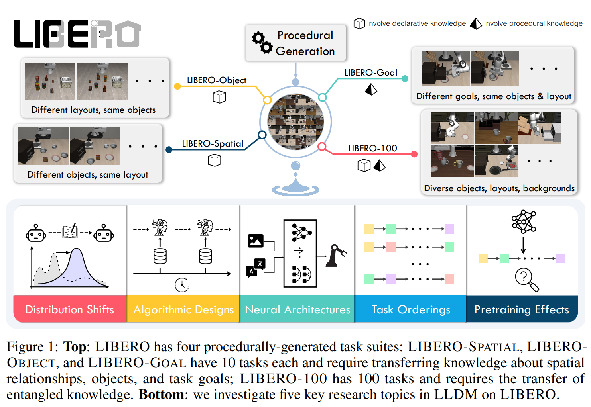
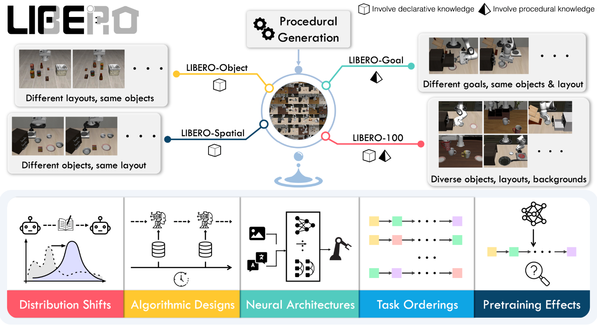

# LIBERO: Benchmarking Knowledge Transfer for Lifelong Robot Learning

## 来源周报

- 2.2-2.9周报.md
- 2.9-2.23周报.md

## 2.2-2.9周报.md

+ Motivation
    - LIBERO 的提出在决策与机器人领域的终身学习Lifelong Learning中，不仅需要传递表征性的declarative knowledge，例如对象类别和空间位置；还必须传递执行行为的程序性知识procedural knowledge，例如如何抓取、如何移动。
    - 传统终身学习 benchmark 多聚焦于图像/文本分类等被动任务，而机器人操作任务具有动作序列与策略决策的特点，因此现有 benchmark 无法系统评估如何随着任务序列扩展累积并传递多种知识。LIBERO 的核心动机就变成了提供一个面向机器人操作的终身学习 benchmark。
+ Benchmark的主要内容
    - 多种类型知识的转移评估：包括空间关系（spatial）、对象特性（object）、目标目标（goal）以及这些因素的混合，需要模型从先前任务中有效迁移相关知识。
    - 决策与动作执行能力的连续学习：每个任务不仅涉及视觉感知，还涉及动作生成与策略决策，因此 benchmark 检验 agent 在新任务上forward transfer与保持旧任务backward transfer的双重能力。
    - 语言条件任务：任务是用自然语言描述的 manipulation 指令集合，这要求模型理解语义描述并把它映射到动作空间。
    - 评测维度不仅包括成功率，还涵盖因任务顺序或预训练策略带来的性能变化等指标。
+ Benchmark的构建逻辑：

    - LIBERO 的 benchmark 构建同样是一个程序化任务生成与评测框架，其核心设计方式包括：
        * LIBERO 提出了一种 procedural generation pipeline，允许以人为可控的方式自动生成大量 manipulation 任务。任务定义基于语言模板，从大型人类活动数据集中抽取行为模式，并结合场景配置与目标状态，形成动态语言描述和对应初始状态及目标设定。这种生成机制理论上可以生成无限多不同组合的任务实例，保证任务的多样性和长期扩展性。
    - 四组标准任务套件：为了系统性评测各类知识迁移问题，LIBERO 提供了四个 task suites（共 130 任务）：
        * LIBERO-Spatial：空间关系变化的任务集合
        * LIBERO-Object：不同对象类别的任务集合
        * LIBERO-Goal：任务目标变化的集合
        * LIBERO-100：综合三者特征的 100 个任务
    - 人工示范数据与评测规则
        * 为了支持样本高效学习，LIBERO 提供了每个任务的高质量人工远程操作示范数据。示范数据包括环境状态、动作序列等，可以作为模仿学习或策略初始化的基础。评估流程为：按预定任务顺序训练模型，然后在测试任务上评估前向迁移或者是顺序鲁棒性等表现。

## 2.9-2.23周报.md

上一个周报（2.2-2.9）里我已经读过 LIBERO，当时更多是把它放在一串 benchmark 里做横向对比，重点在于知道它在测终身学习、它提供了哪些 suites、以及整体评测口径大致是什么。这一次选择重读，主要是因为我最近的关注点从读懂 benchmark 是什么，转向 benchmark 的构建逻辑能不能变成我自己的评测模板。换句话说，上次读完我能复述它的设置，这次读完我更希望回答：为什么要这样拆 suites、这样组织任务序列能诊断出什么、以及这种受控迁移的设计能不能迁移到我当前的工程问题归因里。

+ Motivation
    - LIBERO 的切入点是终身学习在机器人操作场景下到底怎么测。相比图像分类那类被动任务，机器人学习同时包含感知、决策与动作序列，模型要面对的不只是学会新任务，还要尽量不遗忘旧任务，以及能否把以前学到的知识迁移到新任务上。
+ Benchmark 的主要内容
    - 任务组织方式：LIBERO 的核心是任务序列，而不是单独的任务列表。它把不同类型的变化做成若干 task suites，用来控制迁移难度来源。
    - Suites 的含义（我自己的整理）
        * Spatial：空间关系变化为主，测模型是否能把同一技能迁移到不同相对位置/布局下。
        * Object：对象类别变化为主，测表征与操作策略能否迁移到不同对象。
        * Goal：目标变化为主，测同一场景中目标条件改变时的适应能力。
        * 综合套件则把多种变化叠加，测试长期学习中更真实的分布漂移。
    - 训练与基线：LIBERO 提供了多种视觉运动策略架构与典型终身学习算法对照，并且常配合示范数据/模仿学习范式，让评测更贴近机器人领域奖励稀疏、数据昂贵的现实。
+ Benchmark 的构建逻辑（我比较关心的点）
    - 受控分布迁移：它不是把所有变化混在一起，而是把变化因子拆开，这样当模型迁移失败时，至少能回答是因为空间变化、对象变化还是目标变化。
    - forward transfer 与遗忘：终身学习真正关心的是随着任务序列推进，学习新任务是否更快（forward transfer），以及旧任务性能是否保持（避免 catastrophic forgetting）。LIBERO 的设计就是为了把这两个维度显式化。
+ Thinking
    - 对我来说，LIBERO 更像一套实验设计模板：如何把迁移难度拆成可解释的因子，如何把评测组织成任务序列，并把结果报告成可比较的曲线而不是单点数字。
    - 这个视角也能反过来指导工程：如果我在做 sim2sim/sim2real 迁移，很多问题其实也是分布迁移。我们可以仿照 LIBERO 的思路，把变化因子拆开做对照实验，而不是一次性把所有改动都堆在一起导致无法归因。
    - 这次重读的一个新收获是，我更能理解 suites 之间的诊断意义：Spatial/Object/Goal 并不只是任务分类，而是在刻意控制变量，帮助把迁移失败的原因从模型不行拆到空间关系没学到、对象表征没迁移、目标条件变化没适配这类更具体的层面。这个思路和我最近在工程里做问题定位的需求是契合的。
    - 另一个新收获是对序列本身的认识更清楚了：终身学习的评测不是把任务打乱平均一下就结束，而是强调随着任务顺序推进，旧任务是否被冲掉、新任务是否越来越容易学。换成工程语言，就是它把训练过程中的稳定性与可持续性当成被评测对象，而不是训练结束后的某一个截面分数。
