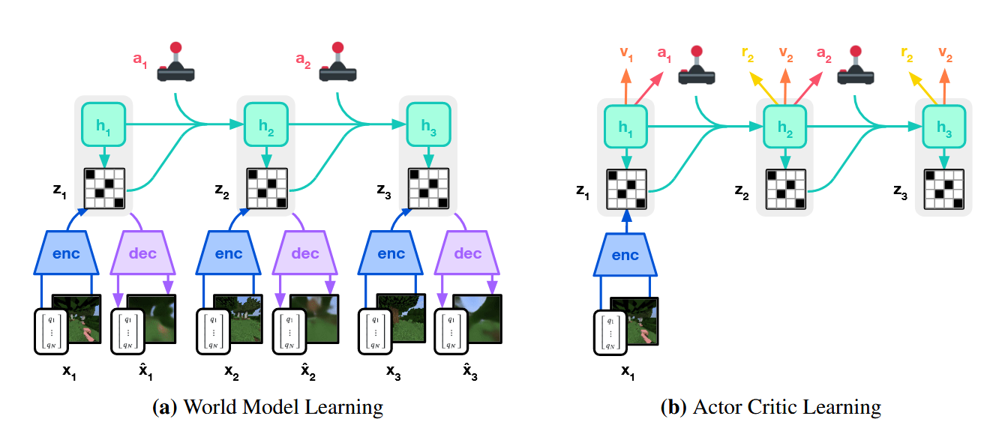

# Mastering Diverse Domains through World Models

## 11.31-12.07周报.md

如果用一句话概括：DreamerV3 是一个利用 RSSM 进行后台规划（Background Planning），并通过一系列信号变换技术（Symlog）实现了跨域鲁棒性（Robustness）的通用智能体。

+ Motivation：
    - **PlaNet 逻辑**：
        * 在推理时（Inference Time），利用 RSSM 进行多步预测，通过 CEM (Cross Entropy Method) 搜索最优动作序列，执行第一步。
        * **PlaNet 的痛点**：**推理昂贵**：每一步都要做大量的 Rollout 搜索（主要是受限于CEM）。**Short Horizon**：受限于计算量，通常只能看未来 10-20 步，无法处理像 Minecraft 这种需要数千步才能挖到钻石的长视界任务。**鲁棒性差**：RSSM 对超参数极其敏感，换个环境（奖励尺度不同）模型就崩了。
    - **DreamerV3 的动机**就是要解决这些问题：
        * Amortized Inference：不再在推理时做昂贵的搜索，而是训练一个 Actor (Policy Network) 来直接拟合最优动作。规划发生在训练阶段的“想象”中（Background Planning）。
        * Long Horizon：引入 Critic (Value Network) 来估计无限视界的回报，通过 Bootstrapping 解决短视问题。
        * Fixed Hyperparameters：这是 V3 最大的贡献。设计一套机制，使得模型对输入信号的尺度（Scale）不敏感，从而实现一套参数跑通 Atari, Minecraft, Proprioception 等所有任务。
+ Architecture：Dreamer v3的核心结构主要分为三个部分，分别是World Model Learning，行为学习和核心的信号变换。

    - World Model：这部分是本质还是RSSM的架构逻辑，两个核心部分是Encoder和Decoder，Recurrent Model的hidden state的处理逻辑也是一样的，但是有一个核心的优化是，latent state的fucntion的分布逻辑是不一样的，在PlaNet使用的是Guass的分布，但是Dreamer系列，从v2开始，都是一以贯之沿用的Categorical Distribution。离散的latent比起高斯的连续来说，更加贴近于世界的本质，同时更加容易优化。
    - Actor-Critic Learning：这是与 PlaNet 最大的不同。DreamerV3 在 RSSM 的 Latent Space 中进行想象训练。**Actor (**$ \pi_\phi $**)**: 输入状态 $ s_t $，输出动作 $ a_t $。**Critic (**$ v_\psi $**)**: 输入状态 $ s_t $，预测未来的累积回报 $ R_t $。
        * Two-hot Bucket Regression: V3 的 Critic 不直接回归标量值。它预测一个离散的分布（Buckets）。 这使得 Critic 能够通过概率分布来捕捉多模态的回报，并且通过 Symlog 变换后的 Buckets 保证了梯度的稳定性。
    - **The Symlog Transformation**
        * 这是 V3 的灵魂。为了让模型在不同任务（Reward 范围可能是 $ [0, 1] $ 也可能是 $ [-100, 10000] $）下都能稳定训练，V3 对所有输入和目标（Image, Vector, Reward）进行了 Symlog 变换：$ \text{symlog}(x) = \text{sign}(x) \ln(|x| + 1) $作 这是一个双向对称的对数变换。
        * 它将及其宽广的数值范围压缩到了一个对神经网络友好的范围内。网络不再预测原始 $ R $，而是预测 $ \text{symlog}(R) $。
+ Advantage：
    - True Generality：Dreamer V3是第一个仅用像素输入，稀疏奖励，并且不使用人类演示数据就在Minecraft中从零学会挖钻石的算法。依靠的是symbol和two-hot regression，不需要针对认为做特定的微调。
    - 得益于 Critic 的 Value Learning 和长程预测能力，它比 PlaNet 这种 Short-horizon Planner 更擅长处理稀疏奖励问题
+ Thinking：
    - PlaNet：在每次行动之前都需要深思熟虑，导致核心的计算负担都在Inference。
    - Dreamer：在训练的时候就深思熟虑，同时训Actor，然后再推理的时候，仅仅使用Actor的前向传播，这是Amortized Planning。也就是将Planning的结果直接内化进入自觉网络。
