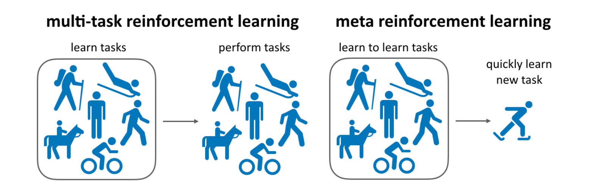

# Meta-World

## 2.9-2.23周报.md

+ Motivation
    - Meta-World 更像是在回答一个问题：如果我们真的希望模型学到可迁移的操作技能，而不是在单任务上刷分，那么 benchmark 本身必须提供任务分布结构，并且通过不同的划分方式把多任务共训和跨任务适应测出来。
+ Benchmark 的主要内容
    - 任务集合：提供 50 个 MuJoCo 里的操作任务，覆盖抓取、推拉、开合等基本操作模式。它的价值不在于每个任务有多复杂，而在于这些任务之间有共享结构，适合研究表示复用与迁移。
    - 观测与动作：通常会给到机器人本体状态与目标相关信息，动作多采用关节或末端控制接口。对比一些强调视觉的 benchmark，Meta-World 更像一个控制与策略学习的标准场。
+ 评测模式与训练/测试划分（我自己的理解）
    - MT（multi-task）系列强调在固定任务集合上联合训练，评价的是同一个策略能否覆盖多个技能，任务之间的干扰与共享是否处理得好。
    - ML（meta-learning）系列强调从训练任务中学到快速适应能力，再在未见任务上用少量数据/步骤完成适应，评价的是模型是否学到任务分布层面的规律。
    - 因此 ML1/10/45 和 MT1/10/50 的差异，本质是任务集合规模与训练/测试拆分方式不同，从而对应不同的泛化压力。
+ Thinking
    - 我之前更容易把 Meta-World 当成 50 个任务的列表，现在更清楚它真正测的是任务分布组织。这个视角对后续自建评测很关键：任务不需要很多，但必须能清楚地区分你到底在测共训、还是在测适应。
    - 如果我后续要在 legged loco-manipulation 场景里做类似的评测，可能也需要先定义两条路径：一条是多任务联合学到稳定技能覆盖，一条是少样本适应新任务/新场景。
