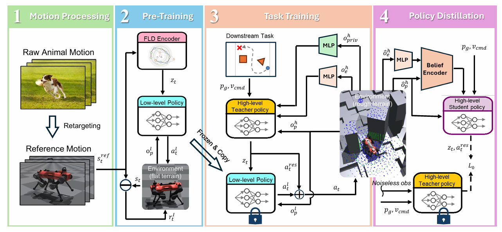

# Motion Priors Reimagined: Adapting Flat-Terrain Skills for Complex Quadruped Mobility

## 3.2-3.9周报.md

+ Motivation
    - 该文章探讨了如何把在平地动物动作数据上学到的 `motion prior`，迁移到复杂地形上的四足机器人 locomotion 和 local navigation 任务中，同时尽量保留自然、动物风格的 gait。
    - 纯 RL 方法虽然能把机器人训练到能走、能爬、能避障，但往往依赖大量 reward shaping，动作风格容易变得僵硬甚至跳跃化；纯模仿学习虽然能学到更自然的 gait，但一旦部署到示范分布之外的地形，有可能泛化性太差。
+ Technology
    - 任务是复杂地形上的 `goal-conditioned locomotion + local navigation`。机器人需要根据目标位置和局部地形信息，一边朝目标移动，一边在 locomotion 层面直接避开障碍，而不是依赖独立高层规划器先输出 waypoints。
    - 方法采用分层结构。低层负责生成自然 gait，高层负责根据地形和目标对低层动作做任务级调节。作者的核心思想是把风格保持和环境适应分开学习。
    - Pipeline 第一步：先把动物 `mocap` 数据 retarget 到 ANYmal 的运动学结构上，得到机器人可执行的参考动作。这样做的作用，是把动物运动数据变成后续 low-level imitation 的监督信号。
    - Pipeline 第二步：用 `FLD` 学习周期性的 latent dynamics，把 walking、pacing、cantering 等 gait 压缩成结构化 latent 表示。这里的 latent 不是普通特征，而是高层后续可以调用的 skill interface。
    - Pipeline 第三步：在平地上训练 low-level imitation policy。它读取本体状态和 latent encodings，输出 `12` 维 joint actions。低层的目标不是解决 rough terrain 任务，而是把自然、稳定的 animal-like gait 固化成 `motion prior`。
    - Pipeline 第四步：训练 high-level teacher。它的输入包括目标位置 `p_g`、速度命令 `v_cmd`、proprioception、外感知地形信息，以及训练时可用的 privileged states；输出包括 `16` 维 latent commands `z_t` 和 `12` 维 joint residuals`a_t^res`。其中 `z_t` 用来调节低层 prior 的运动模式，`a_t^res` 用来在 rough terrain 上对关节动作做地形相关补偿。
    - 训练逻辑：low-level 和 teacher 都用 `PPO`。高层 reward 主要由目标到达项、速度项和 residual penalty 组成。这里最关键的是 residual penalty，因为它控制高层到底是在轻微修正 low-level prior，还是完全推翻 low-level prior 重学动作。
    - Sim-to-Real：作者没有直接把 teacher 部署到真实机器人上，而是再训练一个 student。student 只接收 noisy proprioception 和 exteroception，并通过 `GRU belief encoder` 恢复隐状态；
    - 部署闭环：部署时，student 先输出 `z_t` 和 `a_t^res`，冻结的 low-level policy 根据 `z_t` 产生基础 joint actions，然后与 residual 相加形成最终控制。整个闭环中，低层保证 gait 自然性，高层负责目标驱动和地形适应。
+ Advantage
    - 它先验做成了一个高层可调的控制接口，所以高层不需要从零生成全部关节动作。
    - 与依赖 uneven-terrain demonstrations 的方法不同，本文只用 flat-ground animal motions 就完成了 rough-terrain skill adaptation，这一点非常关键，因为复杂地形示范数据本来就难采。
    - 与scratch RL 相比，本文更容易保持自然 gait，而不是学出强补偿、强跳跃式动作。
+ Thinking
    - 我觉得 `residual penalty` 这个设计很有启发性。它让风格保持和任务适应之间的 tradeoff 变得可控，而不是只能靠大量 reward 项去慢慢调。
    - 它的边界同样明显：技能库还不够大，真实世界量化不够完整，对更难 terrain 的覆盖也有限。
