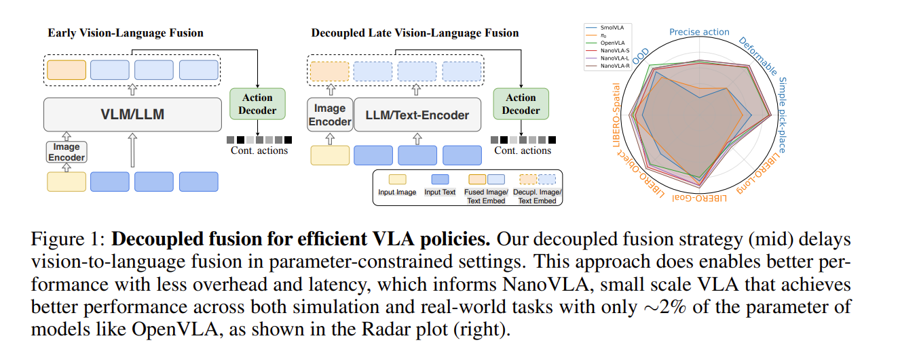
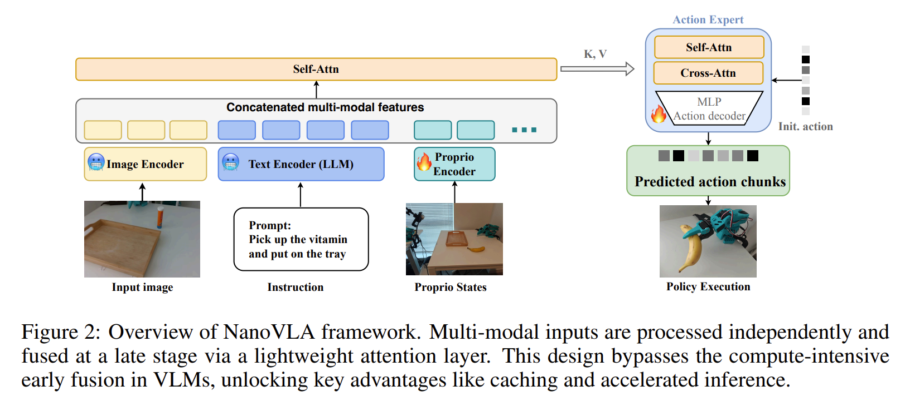
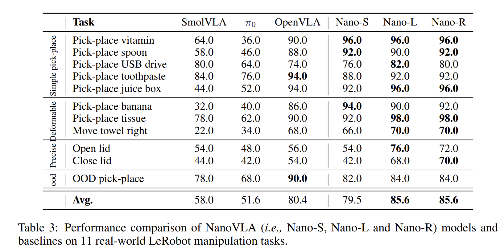

# NanoVLA: Routing Decoupled Vision-Language Understanding for Nano-sized Generalist Robotic Policies

## 1.26-2.2周报.md

+ Motivation
    - 这篇文章要解决的痛点非常直接：通用 VLA 模型（把视觉、语言、动作统一到一个大网络里）在云端机器上表现很好，但一旦落到边缘设备（比如 NVIDIA Jetson Orin Nano）就会被**延迟、算力、内存**卡死，尤其是机器人控制需要持续高频推理时更明显。
    - 作者认为“把模型缩小”本身不是根治方案，因为真正浪费计算的地方往往是：指令不变但每一步都重复算语言；长时任务要么抖动要么僵硬；用同一个骨干网络做所有任务会出现“简单任务过算、复杂任务又不够强”的容量错配。
    - 所以 NanoVLA 的动机更像一句工程原则：**让计算按需分配**——哪些信息是静态的就缓存，哪些需要高频反馈就用更合适的动作展开方式，哪些任务真需要大模型再调用大模型。

+ Technology
    - 它的第一个tech是“视觉-语言解耦 + 晚融合”。传统 VLA 往往在早期就把视觉和语言深度纠缠在一起，导致每个控制步都要做重的跨模态计算；NanoVLA 让视觉和语言各走各的编码路径，把跨模态融合推迟到动作生成阶段只做一次，从结构上减少冗余。
        * 在这个结构上，作者把“缓存”做成了自然能力：指令 embedding 可以算一次后反复复用，而视觉 embedding 每帧更新即可。论文在消融里给了很明确的收益：用 Qwen 0.5B 做骨干时缓存可节省约 62% 的单次推理时间，用 BERT-base 也有约 35% 的节省。
    - 第二个tech是 Long-short action chunking（LSAC）。训练时让模型学习预测更长的动作序列以保证时序连贯，但推理执行时只执行短窗口、然后用最新观测快速重规划，目的就是同时满足**长时平滑**和**实时纠偏**。$ \mathcal{L} = \sum_{t=1}^{T} \| a_t - \hat{a}_t \|^2 $ ，从控制角度看，这相当于把一个长规划任务拆成多个“短 receding-horizon control”，但**规划是在策略内部完成的，而不是外部 MPC**。
    - 第三个tech是动态路由：引入一个路由器在推理时在不同容量的语言骨干间切换。作者不是用硬标签来决定“这任务难不难”，而是用 Beta-Binomial 的成功率不确定性建模，并用成对胜率（含蒙卡洛Beta 估计）来做更稳健的选择。
+ Advantage
    - 论文最核心的“结果承诺”是：在边缘设备上做到极高吞吐，同时不牺牲任务成功率。摘要里明确写到：相对以往 SOTA VLA，在边缘设备上最高可到 52× 推理速度、参数量减少 98%，且准确率/泛化不降甚至更好。

    - 在 Jetson Orin Nano 的推理分析里，作者报告 NanoVLA 相比 OpenVLA 能达到 52× FPS，同时成功率 +13.8%（并注明即便 4-bit OpenVLA 在该设备上也可能 OOM，因此做了对齐说明）。
    - LSAC 的优势：长短分块在较宽的 chunk 步长范围内都能保持较高且平稳的成功率平台，而固定 chunk 在步长变大后会出现明显的成功率塌陷；这意味着部署时你可以更灵活地用调 chunk 换吞吐而不至于立刻把精度搞崩。
    - 动态路由的优势不只是省算力，而是省算力还能更稳：论文展示路由能把平均模型规模从 520M 降到 251M，同时把成功率从 80.5% 拉到 83.6%，并且在阈值上比朴素基线更不敏感、更好调。
