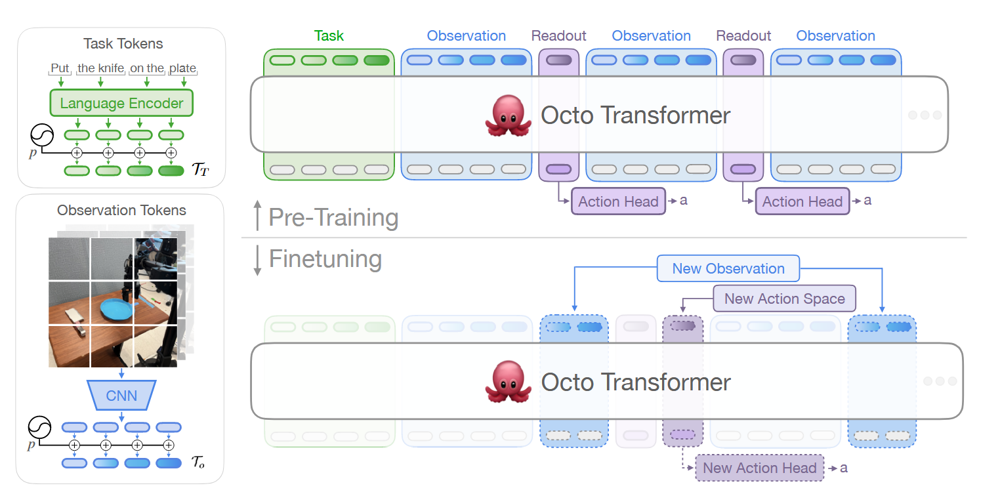
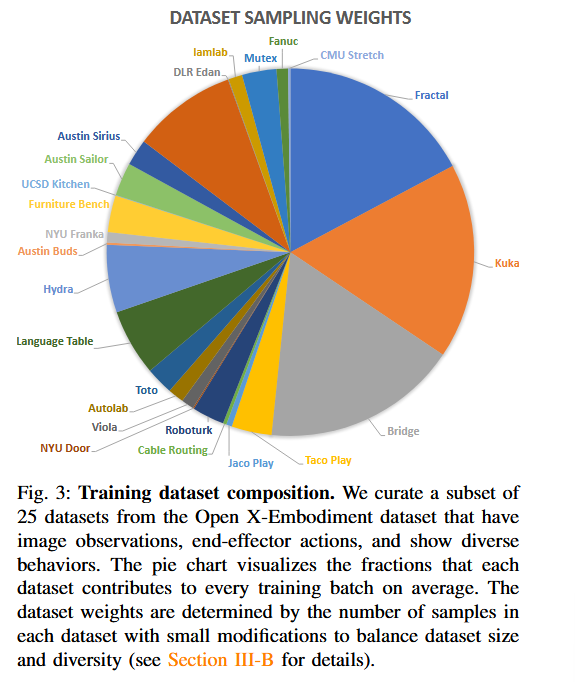

# Octo: An Open-Source Generalist Robot Policy

## 11.17-11.23周报.md

+ Motivation：
    - 首先在之前的VLA的研究中，数据规模太小，导致策略很难泛化。RT-1用了13w的Demo；RT-2将Internet的知识融入进去，但是机器人数据仍然太小；OpenVLA的数据量也是20w左右。同时因为LLM已经基本认可了Scaling Law的存在，所以说Octo的第一个核心工作就是构建一个合适的数据集（多场景、多任务，多机器人）。
    - 第二个是由于之前的VLA的研究都是单机器人操作和学习，Octo致力于找到一个GPR（Generalisted Policy Robot），能够实现zero-shot的训练和多机器人的泛化学习。
+ Architecture：It consists of three key parts
    - Input tokenizers: 主要分为两个部分，针对Language inputs，使用了T5 Encoder作为解码器，实现token embedding。针对Image observations，使用一个浅层的ViM（或者用小型的CNN），进行视觉信息的采集。
    - Transformer backbone: 这个部分和之前的OpenVLA以及RT2的区别不是特别的大，主要在于Octo提出了一个叫**Block-wise masked**，也就是Block内部用传统的causal mask进行隔离，Block之间做Structural mask，把不同模态给隔离开。这样好处是每个观测空间block是可选择依赖的，是可以调整的，这对于不同数据集的训练是非常有好处的。因为不同的数据集有不一样的观测空间，语言指令、wrist camera、RGBD、propri等等这些并不是所有数据集都有，因此如果不做这个block-wise的masked，就需要对数据集作庞大的处理和对齐，而使用这个方式可以灵活动态的调整这些模块的增删。同时这样也可以满足Octo的Observation blocks是一个可变帧数的空间，例如原论文中使用的是3 frames配置。
    - Readout heads+Action Head: 这个部分应该是相比于OpenVLA差别最大的一个部分了，在OpenVLA以及之前的RT-2中，都是用一个MLP，将LLM输出的结果映射到Action Space的空间里面，他本质上是一个 cross entropy 的Loss descent的过程。但是在Octo里面，他用一个Readout heads来summarize所有观测空间的结果，用抽象成一个compact vector embedding，然后把这个vector给输入进本质是Diffision的Action heads里面，用Diffision的思路生成最后的Action的序列。为什么这么做，是因为Diffision的学习思路是通过去噪的方式，学出一个在multi-model distribution下的一个高质量的轨迹，但是MSE更倾向于学出来一个损失最小的均值解。所以Diffision的思路才可以学出来一个平滑的，高质量的连续的控制序列。

    - 下图所示的，是Octo仅次于架构的另一个非常重要的成果，就是做了一个完整的庞大的Octodataset，把十几家实验室的任务数据统一到一个模态格式，从而有大批量的可使用的训练数据：

+ Limitation：主要的限制还是老生常谈的问题，第一个就是还是用的多帧token拼接的方式，没有一个显式的planning的部分，来处理复杂问题，reasoning的能力还是不够。第二个问题就是虽然做了一个巨大的数据集，但是数据集的质量和观测空间参差不齐，有待改进。第三个问题是Octo的训练要求相当高，导致训练成本特别大，latency也非常高，没办法轻量化的部署在便携机器人上。
