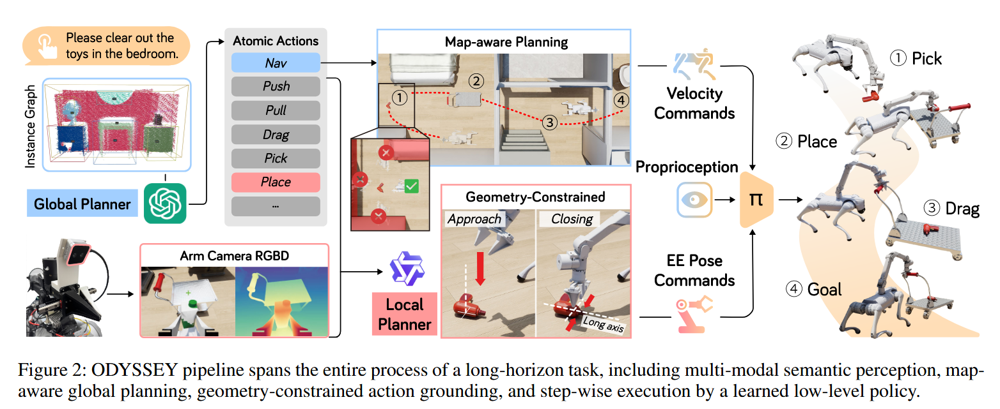

# ODYSSEY: Open-World Quadrupeds Exploration and Manipulation for Long-Horizon Tasks

## 12.25-1.6周报.md

+ Motivation：
    - 大多数 VLA / Manipulation 工作集中在固定基座或桌面机械臂，但是真实世界任务往往需要移动 + 操控 +感知探索 的统一能力
    - 同时现有方法多是短时、单技能、封闭环境；难以处理长时序（long-horizon）、跨房间、跨子任务的任务结构。地图一旦进入 open-world，性能急剧下降
    - 作者提到的主要贡献是：自主探索、语义理解、复杂操控、长时规划
+ Technology：
    - VLM + World Representation + Planner + Low-level Skills
    - Perception & World Representation：使用VLM进行目标识别、语义理解和语言条件的目标解析。这里会有一个重建的工作：构建 instance-level semantic map。地图不仅包含几何结构还包含 物体实例、类别、affordance等语义信息。
    - Long Horizon：引入显式 planner，在语义地图和任务目标之上会构建一个结构华的任务图：比如 Nav / Pick / Place / Drag / Push / Pull …
    - Skill-based Control ：低层并非端到端学习，而是预训练 / 设计好的 locomotion、navigation、manipulation skill。planner 负责 调用技能而技能负责 稳定执行
    -  Low-level Policy Execution ： 由学习到的低层控制策略执行。
+ Advantage：
    - 优点自然是实现了从平台机械臂到四足机器人的前进，提升研究与真实部署之间的相关性
    - 其次就是有比较长任务的实现可能，主要可能是基于skil库和预先的地图重建的工作有关。
    - 主要是提出了一个相对显式一点的planner的结构，类似于VLA+Planner的方式。
