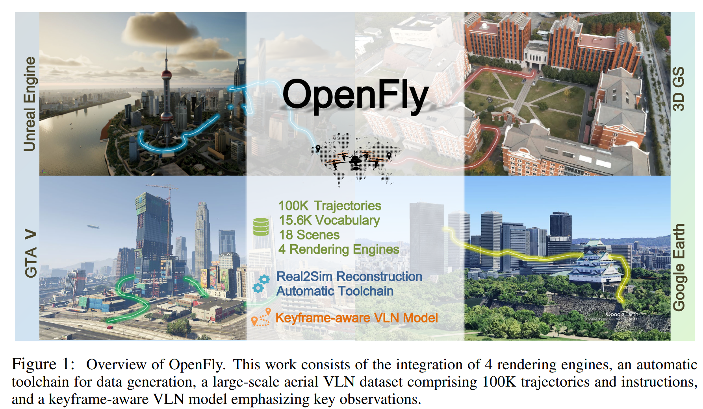
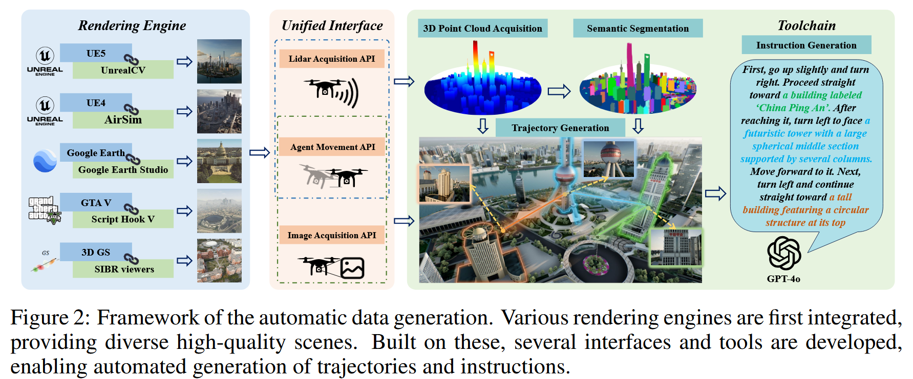

# OpenFly: A Comprehensive Platform for Aerial Vision-Language Navigation

## 2.23-3.2周报.md

+ Motivation：这篇文章的动机主要是VLN在地面机器人上发展迅速，但在UAV场景几乎没有系统化平台，而且这种平台没有可迁移性，主要是VLN平台基本是2D平面移动，离散的动作，并且有地图或者静态建模环境。但是UAV是需要考虑高度、俯仰、滚转，他对于视觉和定义的依赖性更高。同时飞行类的VLN也没有一个成熟体系下的benchmark。

+ Main work：这个文章就是基于各种痛点，搭建了一个综合的基于UAV的平台，有以下的几个方面：
    - 构建UAV的一个高保真仿真环境，构建了一个空中导航专用仿真平台，6Dof控制的，三维网格
    - 构建数据集，平台包含多个复杂三维场景，有城市场景、建筑群、户外开阔区域等等
    - 设置Aerial VLN的任务，输入是第一人称的视觉和自然语言指令（自然语言的生成机制包括也很广泛，空间关系词、动作动词、顺序逻辑），同时输出是连续的飞行控制指令。同时有众多任务类型：
        * PointCoal任务，飞到某一个指定的位置
        * Landmark-conditioned 型 ： 经过/绕过/接近某地标
        * Sequential multi-step 型 ：按语言顺序完成多个子目标
    - 最后是一个统一评测协议（Evaluation Protocol），涵盖指标比较广泛：
        *  Success Rate (SR)
        *  SPL（Success weighted by Path Length） ：$ SPL = \frac{1}{N} \sum_i S_i \frac{L_i^*}{\max(L_i, L_i^*)} $
        *  Path Deviation / Navigation Error
        *  Collision Rate
    -  论文实现多个 baseline，包括：CNN + RNN VLN，视觉-语言融合模块， 还进行了诸多测试：单步 vs 多步任务对比，Seen vs Unseen 场景测试，语言泛化能力测试。
