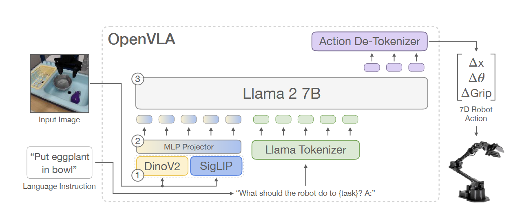
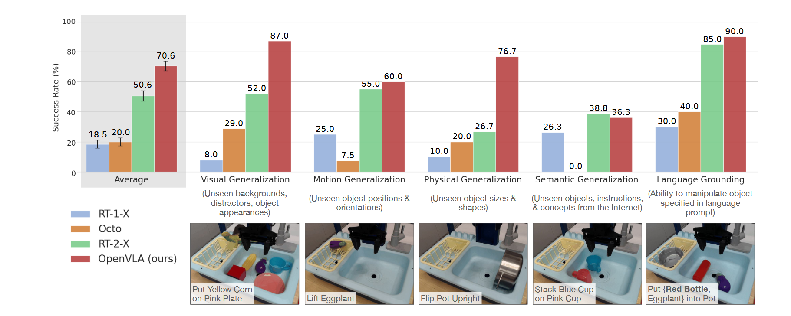

# OpenVLA: An Open-Source Vision-Language-Action Model

## 11.17-11.23周报.md

+ Motivation：在论文最开头其实就提出了OpenVLA的设计动机，第一个是当前的VLA的研究基本无法复现，闭源非常的严重，整个研究社区无法验证，公开比较，也无法进一步推进这个研究方向。第二个是目前缺少VLA的统一的baseline，因为每个实验室的action，视觉backbone，multimodel alignment都是自定义的，模型之间的可比性不强，Policy quality的质量很难客观的估计。第三个是现有工作没有提供部署和调整 VLA 以适应新机器人、环境和任务的最佳实践。
+ 所以说简而言之，OpenVLA的核心工作是把RT-2中提到的所有模块给工程化，完成了一个完整的开源模型。
+ Architecture：
    - DINOv2/SigLIP：视觉 encoder 将 RGB 图像映射到 token 序列：$ I→V=f_{vision}(I)∈R^{N×D}  $。
    - MLP Projector：Llama2-7B的 embedding 空间维度一般是4096 dim。DINOv2 / SigLIP 输出是 768 或 1024 dim。主要是为了做一个视觉和语言的对齐。
    - Llama Tokenizer：维度与 visual tokens 一致，才能喂给同一个 LLM。
    - Llama2 7B： VLA Backbone。
    - Action Tokens：LLM 输出的是离散 token，不是 continuous control。每次输出一个 token，最后形成一个有限长度的 action sequence。
    - Action De-Tokenizer： Lookup Table+ 量化区间中心值恢复 ，简单的一个解码。

+ Limitation： OpenVLA本质是开源 RT-2 的架构，让学术界能复现视觉-语言-动作模型。 局限和RT-2基本一样。
+ 下面是一张该实验结果展示的图：似乎其实在Github上OpenVLA的开源实现是更早的，比Octo更早，但是这个文章写的比较晚，反正在arvix上的发布实现是晚于Octo的。

