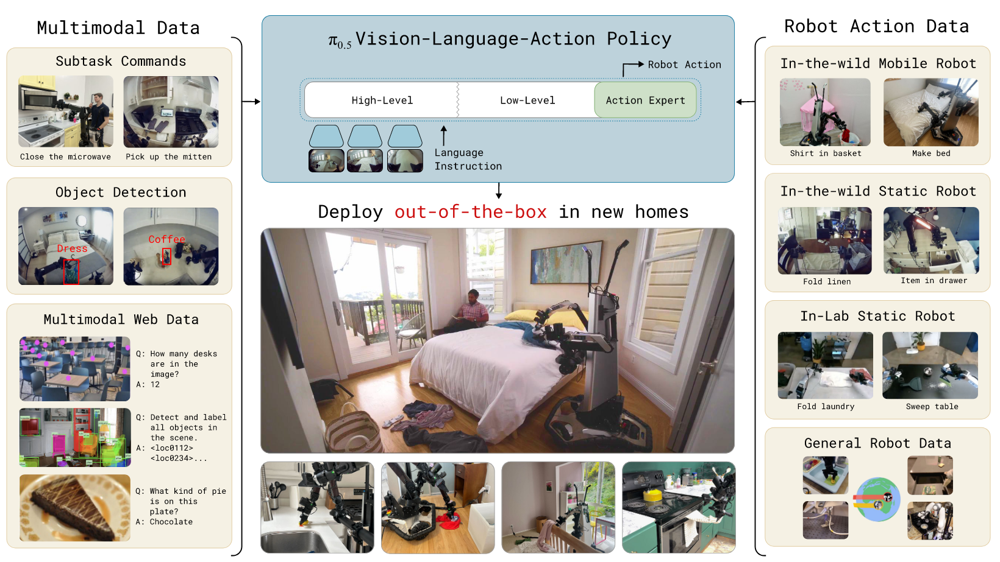
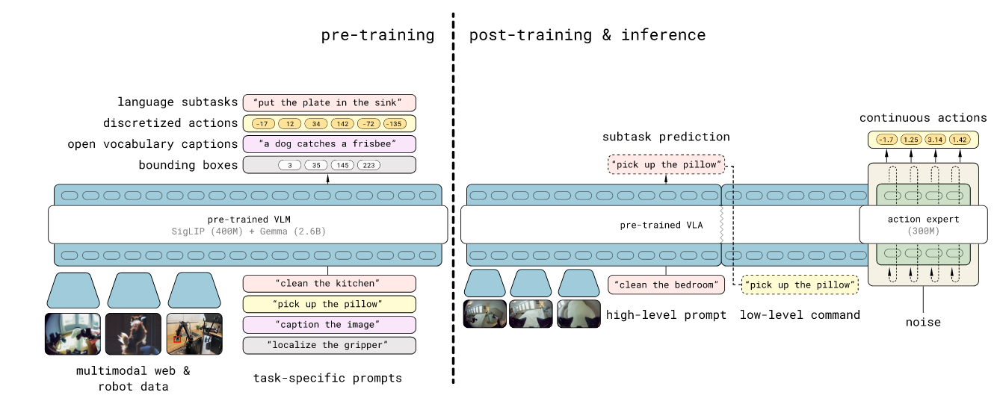
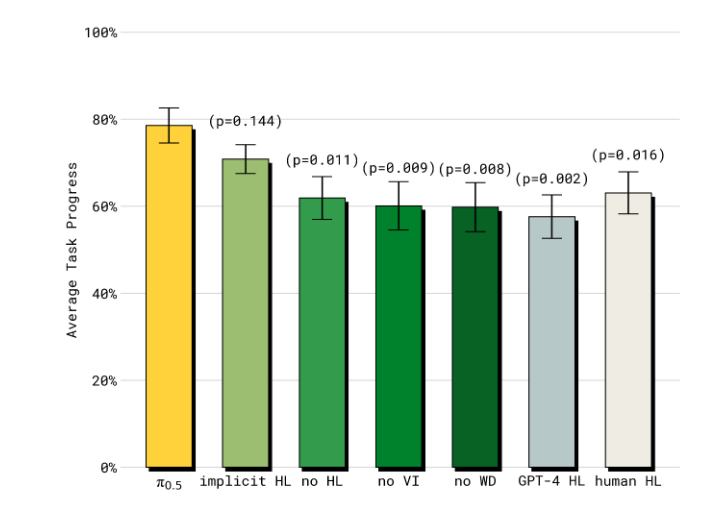

# π0.5: A Vision-Language-Action Model with Open-World Generalization

## 11.31-12.07周报.md

+ Motivation：
    - 就我理解的World Model是通过对环境建模（State Representation + Dynamics）来进行规划或推理，从而实现样本效率和泛化。
    - 但是目前的 VLA (如 OpenVLA, Octo, 甚至$ \pi_0 $大多是直觉反应的模式：$ \pi(a_i,o_i,l) $直接从像素映射到动作。这种端到端在“熟悉的分布内”非常强，但在 Open-World（完全没见过的厨房、没见过的物体）中，模型缺乏对场景的语义理解和长程规划能力。
    - 所以引出来本文的动机：是将 World Model 的“抽象推理”能力显式地注入到 VLA 中。
        * Semantic Grounding : 仅仅见过机器人数据是不够的。为了在没见过的厨房里找到某物品，模型必须利用 Web Data（VQA, Captioning）建立的通用世界模型知识。
        * Hierarchical Reasoning: 面对 Clean the kitchen这种 10 分钟的长任务，直接预测 50Hz 的动作是不可能的。引入了 High-Level Subtask Prediction（类似于 World Model 中的 Goal Proposal 或 Option），作为CoT来指导低层动作。
        * Heterogeneous Transfer: 既然人可以通过看书学会做饭，机器人也应该能通过看静态机械臂的数据、Web 数据来学会控制移动底盘。
    - 这里专门来对比一下$ \pi_0 $和$ \pi_{0.5} $
        * $ \pi_0 $：核心定位是灵巧性，为的是高频、平滑、高精度的动作生成。动作建模是利用Pure Flow Matching，核心架构是VLM Backbone + Flow Head。
        * $ \pi_{0.5} $：核心是专注于泛化性，专注于在新场景、新物体、长任务上的表现。该架构使用了两阶段训练，分为预训练阶段，和Post-Training阶段，模型整体架构主要是Backbone + Task Head (Text) + Flow Head (Action Expert)，来详细介绍一下Architecture：
+ Architecture：
    - $ \pi_{0.5} $ 的架构是一个两阶段的混合体，下面是两张核心的图。

    - 模型backbone：
        * Base是类似于 PaliGemma (SigLIP Vision Encoder + Gemma LLM)。
        * 输入是多模态序列（图像 Patch Token + 文本 Token + 机器人本体感知 Token）。
    - 两阶段训练，这是核心的创新点：
        * Stage 1: Pre-training with Discrete Tokens (The Scaling Phase)
            + Action Representation: 使用 FAST tokenizer (类似于 VQ-VAE 将连续动作离散化)。这里就是world model的核心思想，用VAE来拆解这个动作的逻辑。
            + Data: 这里的混合数据含量非常大且混杂：包含了Robot Data各种形态的机器人的数据，Web Data如VQA、Captioning、Bounding Box Prediction这是VAE的建立逻辑，模型建立世界模型一样的物体识别能力。最后还有High-level Tasks预测一些难度更高的文本子任务。
            + 这里提到了为什么要用离散的Token，因为这样的Token训练的速度更快，完美的融合Web文本数据和机器人的动作数据，利用LLM的Next-token prediction 范式进行大规模知识压缩。
        * Stage 2: Post-training with Action Expert (The Precision Phase)
            + 在这个阶段，我们已经得到了一个很好的预训练的世界模型，这个时候丢弃 FAST 离散头，换上$ \pi_0 $的 Fow Matching Action Expert。
            + 此时的Data也专注在Mobile Manipulaiton的高质量数据。然后同时优化High-level text generation (Subtask) 以及Low-level continuous action (Flow Matching)。
            + 同时这里有一个细节：Action Expert 可以看到 Image 和 Text，但是 VLM 不需要看到 Action Expert 的嵌入。这是单向信息流。
        * 最后的一张图片给出了完整的推理流程：
            + 观察: 看到当前图像。
            + High-Level: 模型先输出文本 Subtask，例如 "Open the drawer"。
            + Low-Level: Action Expert 根据图像 + "Open the drawer" 的 Prompt，利用 Flow Matching 生成连续的轨迹块。
            + 执行完 Chunk 后，重复步骤 1。
+ Advantage：
    - True Open-World Generalization: 实验证明，$ \pi_{0.5} $可以直接被扔进一个完全没见过的场景，完成Clean the Kitchen这种任务。这是之前的 OpenVLA 或 RT-2 很难做到的（通常只能泛化物体，不能泛化整个场景布局）。（这就是世界模型的优秀的泛化能力）
    - Long-Horizon Capability**:** 能够执行 10-15 分钟的任务。这归功于 Hierarchical Inference。如果不预测 Subtask，模型很容易在长任务中忘记自己做到哪一步了。
    - Best of Both Worlds: 结合了 Discrete Token 的训练效率/多模态融合能力和 Continuous Flow Matching 的动作平滑/精度能力。
+ Thinking：
    - $ \pi_{0.5} $ 并没有训练一个显式的 $ P(s_{t+1}|s_t, a_t) $ ，但它训练了一个 **Semantic World Model**。通过 Web Data (Captioning/VQA) 的训练，它学会了是什么。通过 High-Level Subtask Prediction，它学会了为了完成任务，下一个状态应该是什么（High-level Planning）。
    - $ \pi_0 $ 是极强的 System 1（小脑），$ \pi_{0.5} $ 则是加上了 System 2（大脑皮层）。论文中的 Figure 13 非常重要：如果把 High-Level Subtask 去掉，性能会显著下降。这暗示了未来的方向：VLA 不应只是一个 Policy，而应该是一个 Agent。它需要内部思考来指导行动。

