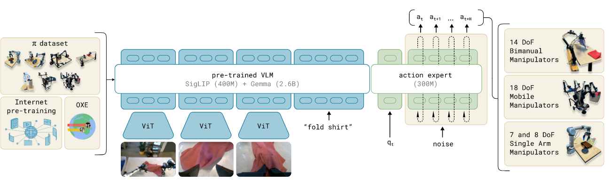

# π0: A Vision-Language-Action Flow Model for General Robot Control

## 11.17-11.23周报.md

+ Motivation：
    - 过去的 VLA 体系（RT-1、RT-2、OpenVLA、Octo）在动作生成层面主要依赖两类方法：(1) MLP 直接回归动作、(2) Diffusion 逐步去噪生成动作。这两类方法要么平均动作、要么推理过程过于缓慢，不适合实时控制。π₀ 的核心动机就是想找到一个既能表达复杂动作分布、又能实时推理的方法。因此引入了在生成模型中非常流行的 Flow Matching思路。它不像 Diffusion 那样需要几十步迭代，而是让模型直接学会动作应该往哪个方向演化，从而单次前向推理就能给出一个高质量的动作轨迹。
    - 另一个动机是找到一种能够在多机器人、多任务、多场景下保持稳健的控制策略。不同于 Octo 依赖一个巨大dataset 统一模态，π₀ 更强调模型层面的泛化能力，通过流模型学习轨迹的演化结构，而不是对每条 demo 的动作逐点拟合。
+ Architecture  ： 整体架构包含三个关键模块
    -  Multimodal Tokenizers ：这一部分和之前的VLA模型相差不大， 使用单独的 encoder 处理语言与视觉，将指令文本和视频帧提取成紧凑的 embedding 表示。语言部分一般是 T5 系列，视觉部分仍是 ViT 或浅层 CNN。
    -  Flow Matching Transformer ：这是 π₀ 最具有创新性的部分，与 Octo 完全不同。Diffusion 的基本逻辑是先加噪声，再一步步去噪生成动作。而 Flow Matching 的思路是：直接学习动作从粗糙状态流向目标轨迹的方式。本质是学了一个向量场vector field， 直接拟合从prior→target distribution的最优流， 通过一次前向 ODE 解算生成动作序列 。
    -  Readout + Action Flow Head ： 类似 Octo 使用 readout 将所有模态压缩到一个 compact latent，π₀ 也将视觉 token、语言 token 聚合成一个 context embedding。 将 z 作为条件 c，驱动 Flow-based Action Head 输出整个动作。

+   Limitation：π₀ 仍然存在的一些限制
    -  缺乏显式规划：由于 π₀ 仍然基于 reactive policy，没有显式 world model 或 high-level planning。
在long-horizon, multi-stage下仍有困难。
    - 感觉对数据质量敏感，Flow Matching 的监督形式要求动作轨迹具有良好的smoothness、consistency。低质量 demonstrations 会直接扰动流场，使训练不稳定。
    - Flow Matching 模型对 batch size 和多模态 context 的依赖非常强。相比 Octo 虽然推理快很多，但训练 compute 依然昂贵。
