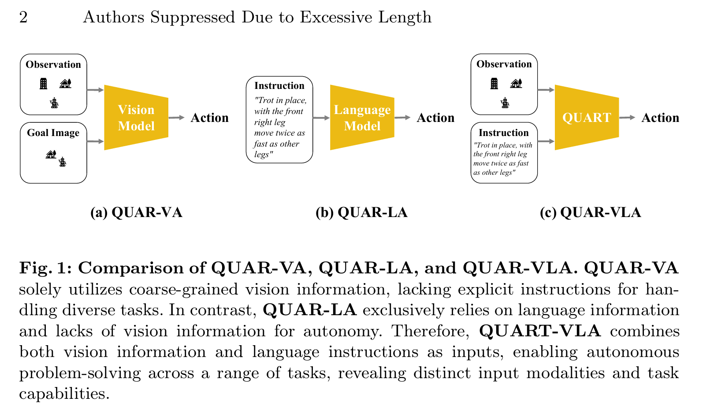
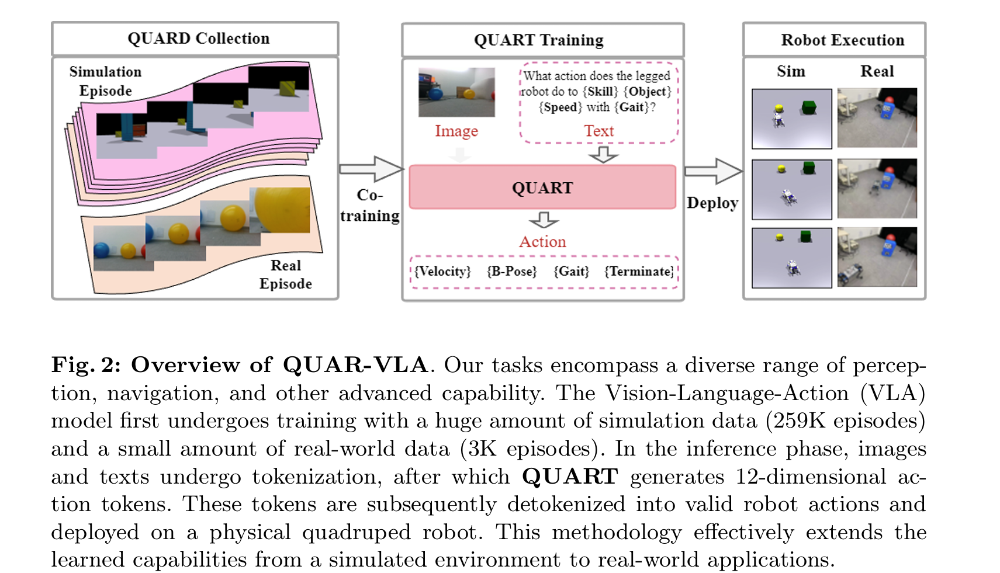
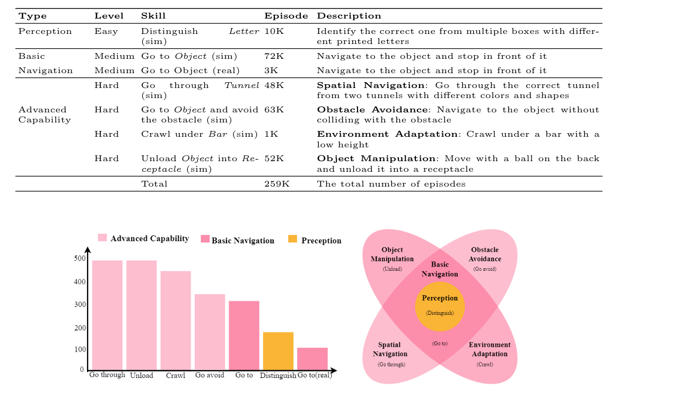

# QUAR-VLA: Vision-Language-Action Model for Quadruped Robots

## 3.2-3.9周报.md

+ Motivation
    - 这个文章主要让让四足机器人同时利用第一视角视觉观察和自然语言指令，直接生成可执行动作，也就是典型的VLA。作者还特别的在引言中把既有任务设定概括为 `QUAR-VA` 与 `QUAR-LA` 两类，并指出前者过于依赖粗粒度目标图像，后者缺少视觉感知，都会削弱感知、规划、决策和执行的协同。
    - 作者强调了两个主要缺口。第一，社区缺少面向四足机器人多任务预训练的大规模数据集，而真实采集代价高。第二，四足机器人的动作空间难设计：如果像二维导航那样只输出少量速度指令，表达力不够；如果直接输出低层关节控制，则频率要求过高，不利于大模型部署。
    -

+ Technology
    - 任务设定
        * 任务定义：作者在 `Sec. 3.1` 把目标写为学习条件策略 `μ: S × W → A`，输入图像观测 `s` 与语言指令 `w`，输出动作 `a`，用于闭环机器人控制。
        * 输入 / 输出：输入至少包括机器人第一视角 RGB 图像和自然语言任务指令。输出是 `11` 个高层控制量加 `1` 个终止信号，有速度、步态、步频、机身高度、俯仰、足宽、足高和终止动作。
        * 关键假设：模型不直接输出关节级电机控制，而是输出高层命令，再交给预训练的低层 `command-tracking controller` 执行。主文还把所有连续动作维度离散为 `256` 个均匀 bin，以降低动作搜索复杂度并提高训练稳定性。
        * 评测设置：主指标是 `success rate (SR)`。评测包括 `seen multiple task` 、`unseen object`、`unseen verbal instruction` 和 sim-to-real scaling。主文写明总体评测超过 1500 个 episode，并分别列出 `Go to 425`、`Go avoid 500`、`Go through 150`、`Unload 100`、`Distinguish 100`、`Crawl 75`。
    -

    - 端到端的pipelinePipeline
        * 第一步：作者先构建多任务四足机器人数据集 `QUARD`。主文给出 `259K` 仿真 episodes 和 `3K` 真实 episodes，覆盖 `Go to`、`Go avoid`、`Go through`、`Crawl`、`Unload` 等任务。这个数据集的作用，是为后续 VLA 模型提供跨任务共享的训练分布。
        *

        * Pipeline 第二步：定义高层动作空间。论文没有让模型直接输出关节动作，而是定义了 `11` 个高层控制量加 `1` 个终止信号，内容包括速度、步态、步频、机身高度、姿态和足端相关参数。这样做的目的是在“动作表达力”和“部署可行性”之间找到平衡。
        * Pipeline 第三步：把连续动作离散化。作者把每个连续动作维度都离散成 `256` 个 bin，把原本的连续控制问题改写成 next-token prediction 问题。这样，大模型就可以像生成文本 token 一样生成动作 token。
        * Pipeline 第四步：把图像和语言统一 token 化。图像观测和文本指令先经过 tokenizer，变成统一 token 序列，再送入模型主干。这样视觉和语言就共享了一个统一的序列建模接口。
        * Pipeline 第五步：用 `QUART` 预测动作 token。`QUART` 是基于预训练 VLM/MLLM 的 `decoder-only transformer`。它根据图像和语言 token，自回归地预测离散动作 token 分布。
        * Pipeline 第六步：把动作 token 还原成机器人可执行命令。模型输出的离散动作 token 经过 `Detokenize` 还原成连续高层控制量，再交给已有的 low-level `command-tracking controller` 执行。
    - 训练目标与学习过程：训练本质上是 imitation learning。监督目标是动作 token 的 `categorical cross-entropy`，并使用 `causal masking` 做自回归预测。作者依靠这种设计，把机器人动作学习转成了标准的大模型 next-token 学习问题。
+ Advantage
    - 它设计了适合四足机器人部署的高层动作接口，所以模型既能表达 crawl、unload 这类复杂动作，又不用直接承担高频关节控制。
    - 同时把视觉和语言被统一建模后，模型在复杂任务和语言泛化上的表现明显优于常见 baseline。从原文看，`QUART` 在 seen 和 unseen 两类评测的 `8` 个指标上都优于 `CLIP`、`R3M`、`VC-1`。
+ Thinking
    - 提出 `QUAR-VLA`，把第一视角视觉和语言指令统一到四足机器人动作生成中，而不是只做视觉导航或只做语言控制。同同时定义了适合四足机器人部署的高层动作空间，避免动作过于简单或控制频率过高。这两点可能是该文章成功的关键。
    - 几个以往没有注意到的点：动作以 token 序列方式生成，允许模型学习高度、步态、足宽、速度等动作维度之间的依赖，这一点在 `Crawl`、`Unload` 等复杂机体动作上最明显。同时输出高层命令而不是低层电机控制，降低了部署频率需求，使 8B 级模型可以落地到真实四足机器人。
