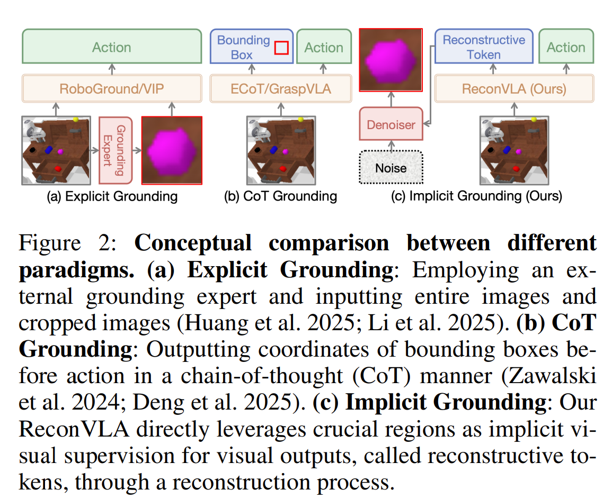
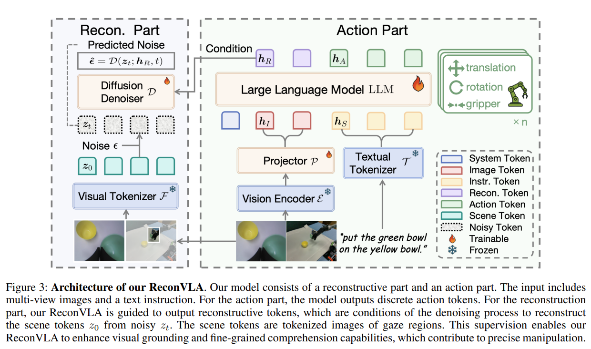
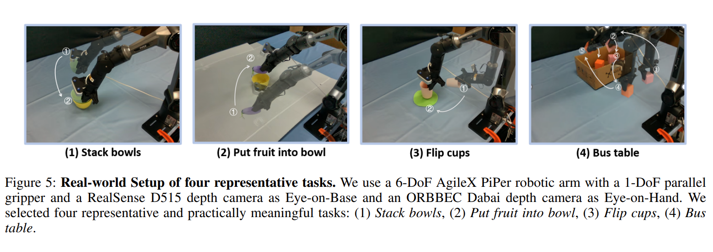

# ReconVLA: Reconstructive Vision-Language-Action Model as Effective Robot Perceiver

## 1.19-1.26周报.md

+ Motivation：
    - **VLA 模型视觉注意力分散：**现有的 Vision-Language-Action（VLA）模型虽然能从视觉和语言输入生成动作，但 **视觉注意力往往分散在整个图像上**，无法集中在任务相关目标区域，导致操作不精确。
    - **显式视觉 grounding 的局限：**传统显式 grounding（例如先用目标检测获得物体位置再用于动作生成）依赖外部检测器/分割模型，这 **没有从根本上提升 VLA 自身的视觉理解能力**。
    - **隐式视觉基础的潜力**：人类在做复杂视觉任务时会“凝视（gaze）”关键区域，而 peripheral 视觉只是辅助。论文提出：**用重构目标区域作为监督，让模型自己学会聚焦 task-relevant 信息**，而不是人工指定 detection 输出。
    - **提高精细操作和泛化能力**：这种隐式 attention 引导不仅有望提升单次操作精度，还能增强在不同场景、未见物体上的泛化能力。为了支撑这一目标，作者还构建了一个大规模预训练机器人数据集（10万+ trajectories, 200万+ samples）。
    -

+ Technique：ReconVLA 的核心在于引入一种 **隐式 grounding paradigm**，通过辅助的视觉重构任务倒逼 VLA 更好地学到 task-specific visual representations。下面分模块解释它的原理：
    - 基础 VLA 架构：ReconVLA 继承了常见的 VLA 结构：输入包括 **多视角图像观察 (I)** 和 **自然语言指令 (S)**；视觉编码器和视觉-语言模型（如 LLaVA-7B / Qwen2）将 (I,S) 编码为 joint representation；Decoder 生成机器人动作序列（或离散动作 tokens）。这样做的目标是从输入直接推理动作：$ p(A \mid I,S) $其中 (A) 是机器人动作 token 序列。
    - 隐式视觉 grounding（核心创新）：**重建gaze region**：图像中与当前指令最相关的目标物体区域。与其显式输出边界框或 segmentation map，不如让模型通过学习生成该 region 来做 supervision。
        * 从原始图像中裁剪出与目标相关的 **gaze image (I')** 作为训练目标；
        * 用冻结的 tokenizer（例如 VAE encoder）将 (I') 编码为 **target scene tokens (z_0)**；
        * ReconVLA 在 forward 时生成 **reconstructive tokens (h_R)**，它们被用于条件化一个 **扩散 transformer diffuser**；
        * diffuser 的任务是从噪声空间重构 (z_0)（即从随机噪声 (z_t) 去噪到正确的 gaze latent）
    - 重构过程通过噪声预测 loss 进行优化：$ \mathcal{L}^{\text{visual}}_{\text{VLA}}(h_R, I') = \mathbb{E}\big[|D(z_t;h_R,t)-\epsilon|_2^2\big] $,这个 loss 引导 ReconVLA 内部表征必须包含对目标区域的细粒度信息。
    - 双目标联合训练：ReconVLA 在训练时同时优化两个目标：**动作预测 loss**（例如动作 token 的交叉熵 loss）：$ \mathcal{L}^{\text{action}}_{\text{VLA}} $**。视觉重构 loss**（上面提到的扩散重构 loss）：$ \mathcal{L}^{\text{visual}}_{\text{VLA}} $。整体损失合并为：$ \mathcal{L}*{\text{ReconVLA}} = \mathcal{L}^{\text{action}}*{\text{VLA}} + \mathcal{L}^{\text{visual}}_{\text{VLA}} $这让视觉重构不仅是辅助任务，还直接影响 backbone 的 attention 和表示学习，使得 action 模块能利用更精细的视觉信息。
    - 指令前置与注意力机制：为确保语言信息能有效引导视觉编码，作者在输入排布上采用 **instruction 前置** 的做法，让图像 tokens 在注意力计算中能够更直接地与语言信息融合集成，这提高了视觉理解的 task awareness。
    - 大规模预训练支撑泛化：单靠单任务数据训练很难让模型学到稳定的视觉重构能力，因此作者构建了一个大型的机器人预训练库（100k+ trajectories, 2M+ samples），这是 ReconVLA 在多样环境中泛化能力强的根本数据基础。

+ Advantage
    - 隐式 attention grounding 有效聚焦目标：重构目标区域这一 supervision 直接让模型内部表示更多包含 task-relevant cues，从而改善视觉 attention 分布。
    - 不依赖外部 detector/分割器：与显式 grounding 相比，这种隐式范式没有依赖外部专家模块，大大减少了 pipeline 复杂性和对 detector quality 的依赖。
    - 训练稳定、易泛化：结合大规模机器人预训练数据，让视觉重构和动作预测同时学习，可以在 cluttered 或 long-horizon tasks 中表现出更稳定的 attention 和更高的成功率。
    - 真实机器人验证：实验不仅在 simulation 展示效果，在真实机器人平台也验证了隐式 grounding 提高精细操控的结论，尤其在 unseen objects / novel scenes 下的泛化上效果明显。

