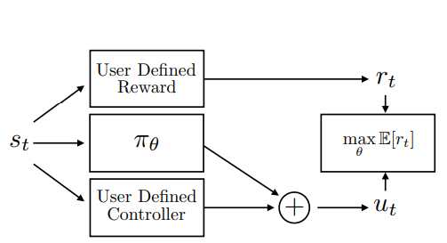

# Residual Reinforcement Learning for Robot Control

## 2.9-2.23周报.md

+ Motivation
    - 现实系统里最难的部分往往不是整体控制，而是少数几个难建模环节，例如接触、摩擦、柔顺、或执行器非线性。传统控制在大部分情况下足够可靠，但在这些环节会显著掉性能；纯 RL 又需要大量真实数据或高风险探索。
+ Technology
    - Residual RL 的核心结构是 u = u_base + u_residual：保留一个稳定的控制主干，让学习只去补那一小段残差。这样即便 residual 还没学好，系统也不会完全不可用；当 residual 学到位后，性能提升通常集中在不确定性很强的那部分。
+ Thinking
    - 它更像一个工程策略：先把控制链路里哪些部分必须稳找出来，作为主干固定住；再把最难对齐、最影响性能的那几个环节列出来，作为 residual 的学习目标。这样 sim2real 的问题就从整个策略能不能迁移，变成残差能不能补上真实偏差，问题更可控，也更容易做对照实验与归因。
