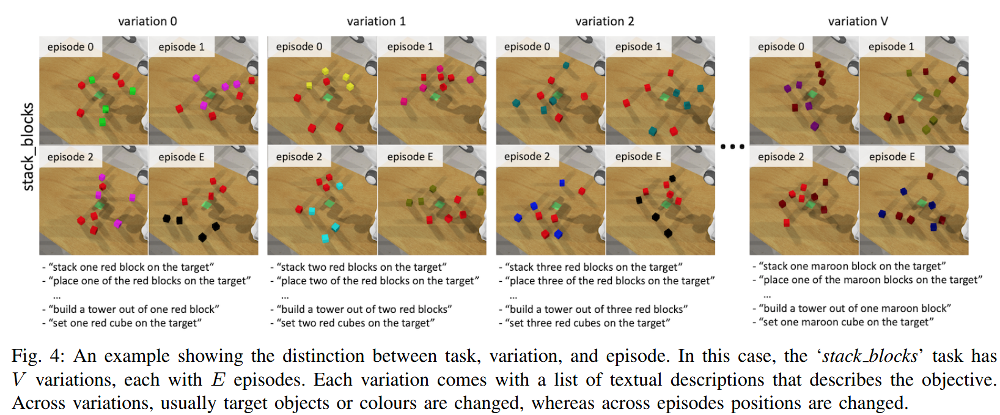

# RLBench: The Robot Learning Benchmark & Learning Environment

## 2.2-2.9周报.md

+ Motivation
    - 本文工作之前，大量工作仍停留在单任务或少量任务的实验范式中，不同论文往往各自定义任务、环境和评测方式，导致实验结果高度不可比，也难以系统性地研究泛化能力。更重要的是，许多 benchmark 在设计时隐式偏向某一种学习范式（例如强化学习或模仿学习），使得 benchmark 本身成为方法选择的约束，而非中立的评测工具。
    - RLBench 的核心动机，并不是再提供一个新的仿真环境，而是构建一个**任务本身具有分布结构、能够系统评估跨任务泛化能力的 manipulation benchmark**，从而推动机器人学习从“单任务性能比较”转向“跨任务、跨场景能力评估”。
+ Benchmark的主要内容
    - 机器人形态：固定为七自由度机械臂加夹爪
    - Benchmark 提供了一百余个 manipulation 任务，、覆盖了抓取、放置、推拉、开关、插入、堆叠以及多阶段顺序操作等典型操作技能空间。每一个任务都被设计为一个可参数化的 task family。
    - 观测空间支持多视角 RGB、深度、机器人本体感知以及低维状态信息，动作空间主要采用末端执行器位姿控制加夹爪开合，使得不同学习范式可以在同一接口下进行对比
+ Benchmark的构建逻辑：
    - RLBench 构建的是一个可程序化生成 manipulation 任务的task space。
    - 然后明确说明三件事情：环境怎么初始化，允许什么交互，以及成功的条件
    - 同时由于RLBench的设置方式是说，每一次的reset本质上都是一个新任务的实例，task程序会重新随机采样参数。
    - RLbench提供expert demonstration，但是专家示范不是benchmark的核心，只是用来训练的方法之一，RLBench为每一个task写了一个scripted expert，expert 用 motion planner，也就是用它来生成 imitation 数据，或者是作为curriculum。
    - RLBench的评测规则：给定一个task，给你若干次rollout，每一次的rollout都是新的随机实例，最后统计success rate，对于无论什么算法，他的测评方式都完全不变。
