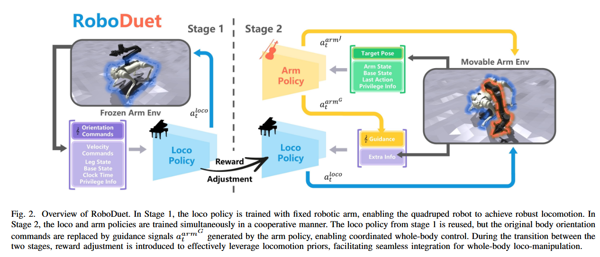
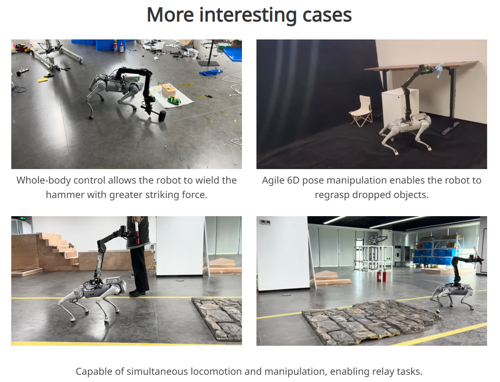

# RoboDuet: Learning a Cooperative Policy for Whole-body Legged Loco-Manipulation

## 来源周报

- 1.26-2.2周报.md
- 2.2-2.9周报.md

## 1.26-2.2周报.md

+ **Motivation**
    - RoboDuet 的研究动机并不复杂，本质上来自一个在真实机器人系统中反复出现的问题：**四足机器人一旦开始“边走边用手臂干活”，原本稳定的系统就会迅速变得不可靠**。
        * 传统的四足行走方法通常假设机器人只需要关心腿和身体姿态，而操纵任务则默认底座是固定的。当这两个假设被同时打破时，手臂运动带来的重心变化和惯性扰动会直接破坏步态稳定性。
        * 如果尝试用一个端到端的强化学习策略统一控制所有自由度，训练空间会变得极其庞大，奖励也高度稀疏，往往既难收敛也难复现。、
    - 因此，RoboDuet 的核心动机可以拆解：希望在不引入复杂动力学建模的前提下，实现可用的全身运动–操纵协同；同时避免端到端全身策略带来的训练不稳定问题；也就是在工程上找到一种的折中方案，而不是追求理论上的最优统一模型。
+ **Technology**
    - RoboDuet 采用协同策略的设计思路，将全身控制拆分为**行走策略和操纵策略**，而不是使用单一策略同时学习所有行为。这种拆分的核心目的是降低学习难度，并减少不同控制目标之间的相互干扰。
    - loco policy：专注于稳定步态的生成，它根据腿部状态、机体姿态和目标速度指令进行控制，不直接感知具体的操纵任务，始终围绕稳定行走这一目标进行优化。
    - arm policy：负责末端执行器的 6D 位姿跟踪，主要关注手臂自身状态和目标位姿。同时，它被允许调整机体的俯仰和横滚目标，使操纵动作能够主动请求身体姿态的配合，而不是被动适应行走策略。
    - 在训练流程上，RoboDuet 采用两阶段训练：第一阶段只训练行走策略以获得鲁棒步态，第二阶段再引入操纵策略，通过联合奖励引导两者学会协同而非相互破坏。
+ **Advantage**
    - 策略拆分显著提升了训练稳定性，使得行走和操纵各自的学习目标清晰可控，降低了端到端全身学习中常见的训练崩溃和奖励失效问题。
    - 整体方法不依赖精确的动力学模型，也不需要复杂的优化控制器，在工程实现上较为轻量，容易集成到现有的四足强化学习框架中。
    - 实验结果表明，该方法在多种运动操纵任务中相较基线具有更高的成功率，并在外部扰动下保持了良好的自我稳定性。
    - RoboDuet 还展示了在相似形态四足机器人之间的 zero-shot 迁移能力，说明其学到的协同行为具有一定的泛化性
+ **Thinking**
    - 文章看似有点晦涩，有一些莫名的公式，但是实际上本质上就是分层训练的逻辑，然后设置了一个联合奖励，引导两层训练协同，防止前面训练的策略会因为解冻机械臂而被破坏，我后序在改进的时候，也是用的这个方式来完善模型的训练。

## 2.2-2.9周报.md

+ 此文章之前已经阅读过，这一次从benchmark的角度来看看，基本逻辑其实就是：现有 benchmark 无法评测whole-body coordination这一能力，而 RoboDuet 尝试通过一组系统任务把这个能力显式化。
+ Benchmark的主要内容
    - A：极端 6D 末端位姿跟踪：5 个目标 pose；其中一些靠近地面并与腿部空间重叠，一些显著高于训练采样范围，另有高度病态、不可解的配置用于压力测试。
    - B：跨高度物体转运（Object Transfer Across Different Heights）：论文在真实实验中还设计了doll transfer任务，并明确了 4 个高度层级：地面 0 cm、露营椅 20 cm、柜子 60 cm、站立桌杯架 100 cm。判定成功的标准也写得很清楚：必须完成拾起并转运到下一高度，且在整个过程中不能掉落。
    - C：零样本跨平台部署（Zero-shot Transfer）： 论文把在 Go1+ARX5 上训练的策略，直接部署到 Go2+ARX5，并指出 Go2 相比 Go1 有约 14.7% 的重量增加，仍能保持稳定 whole-body 控制与 6D 跟踪表现。
    - 项目主页在Real Experiments里单列了 Door Opening：在开门任务中演示移动中操作，并明确给出门把手高度为 100 cm。
    - 项目主页还展示了在保持机械臂目标位姿的同时穿越坡面、碎石等复杂地形，甚至后退穿越的演示。
+ Benchmark的构建逻辑：
    - RoboDuet：任务并不是通过程序化参数化大规模生成的，而是人工挑选具有代表性的场景，用来刻意触发 locomotion 与 manipulation 的耦合冲突。在这一意义上，RoboDuet 的benchmark 构建更接近一种capability-driven task design：先定义一种whole-body cooperation的能力，再反向设计任务去检验这种能力是否存在，而不是追求任务数量或分布覆盖。这也是它与传统 benchmark 的本质区别。
