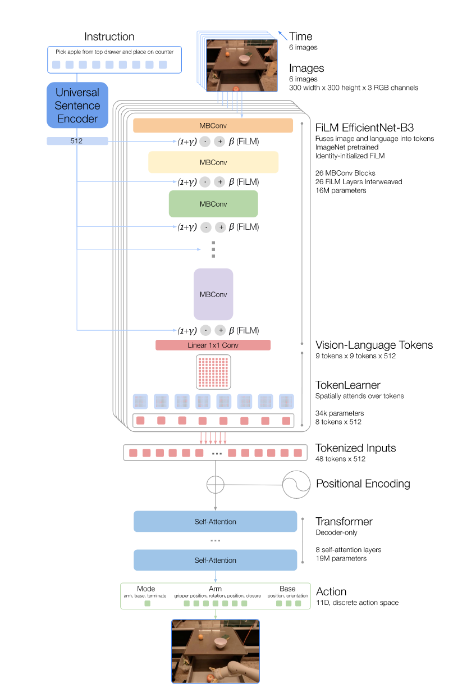

# RT-1: Robotics Transformer for Real-World Control at Scale

## 11.17-11.23周报.md

+ Motivation：Robotics缺乏一个类似NLP的Foundation Model，机器人的real world demos非常的昂贵，现有的技术都是围绕着pick-only and lab-only，于是想要提出一个多模态的通用机器人基础模型。Transformer的成功给了Robotics大模型提供了一个方向，就是用Prompt+Vision配合Transformer从而学出机器人的策略，但是Transformer本身是$ O(Token^{2}) $，而图像输入是一个非常高维的数据，计算量非常之大，机器人很难Real time的运行，所以提出了一个Robotics Transformer的办法，来让这种范式可以成功落地。所以本质上并不是提出了一个solid trick，而是做了一个Architecture engineering。
+ Architecture：感觉巨幅工作都是在特征抽取和降低Tokens数
    - 输入两个部分：一个部分是Instruction（用USE做的指令提取），然后是一个Images。
    - 第一步是用FiLM EfficientNet-B3做特征提取。其实是先用CNN做feature的提取；抽取之后接了一个FiLM: [_FiLM: Visual Reasoning with a General Conditioning Layer_](https://arxiv.org/abs/1709.07871)_ _粗读了一下这个论文，本质是学了两个MLP，对CNN提取出来的feature map做一下仿射变换，用来强化某些特征$ F′=γ(i)F+β(i),~ \gamma ~and~ \beta ~are~ the~ MLPs $。
    - 第二步是自上述提取的$ 9*9*512 $的Feature Map中，进行Tokens的压缩，利用TokenLearner，学一个特征权重的Masks（[TokenLearner: Adaptive Space-Time Tokenization for Videos](https://arxiv.org/abs/1709.07871) TokenLearner原论文是说用 $ Conv → GELU → Conv → Sigmoid $），然后对原Feature map做一个加权求和，求和之后把Tokens压缩到了$ 8*512 $，感觉这个方法有点像是基于特征维度的pooling。
    - 第三步是Transformer，因为机器人的视觉是单帧采集的，多帧堆叠才能看到一个短时动态，所以说RT-1每六帧堆叠在一起输入，也就是$ 48*512 $的Tokens，输入到一个Decoder Only的Transformer里面，使用Decoder Only主要是机器人控制本质是一个自回归的逻辑，Decoder Only最快且最轻便（RT-1中的Transformer只有19M）。
    - 最后Transformer输出的值，是一个11个动作维度（7D arm, 3D base, 1D gripper），每维256个离散的token。

+ Thinking：
    - Advantage：RT-1是第一个证实了**Transformer+大规模真实数据**在真实机器人控制中可以成功落地的模型。** **核心的两个成就：一个是证实了机器人控制的Scaling Law（多场景，多任务，多技能组合），另一个就是Transformer在机器人身上以 <100ms 的速度执行策略推理，让整个模型做到了可以真实部署。感觉为后面的VLA的发展奠定了一个基本的范式。
    - Limited
        * 第一个是：这种训练方式感觉本质上还是这个Supervised Training，所以还是只能在demo distribution内泛化，同时需要巨大规模的数据和训练强度，我看他最后用了17个月，13台机器人，130k demonstration，感觉基本不可能复现出这样的成果。
        * 第二个是，每一次就用6 frames堆叠，只能学到一个很短时的策略，如果有复杂的抓取动作，或者长轨迹的运动感觉难以学出来。
        * 第三个就是，可能从现在来看，RT-1使用的视觉和语言的表征太粗糙了，包括用USE作语义提取， 用EfficientNet做图像的处理，用Tokenlearner直接压缩Token，感觉损失的细节是比较多的。
