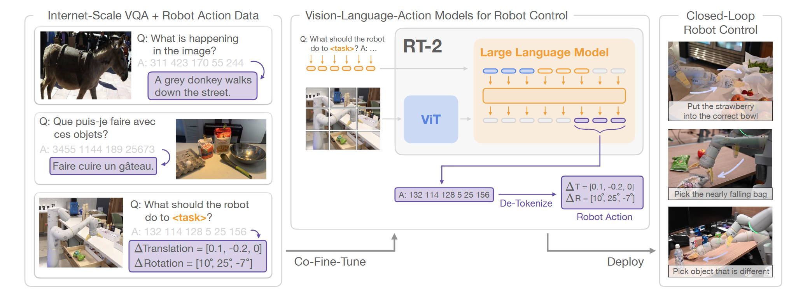

# RT-2: Vision-Language-Action Models Transfer Web Knowledge to Robotic Control

## 11.17-11.23周报.md

+ Motivation：VLM的提出又给Robotics带来了全新的思路，RT-1中将Instruction和Vision分开识别提取特征，然后再由Transformer解码的思路，损失了太多的颗粒度，导致视觉和语言完全割裂。所以RT-2直接把VLM内嵌进这个模型，让Vision和Language直接融合。这样还可以很大程度的减少RT-1那种纯BC学习带来的泛化性差问题。
+ Architecture：整张模型图大致将RT-2分为了三个部分，最中间是模型的主要框架：
    - 图像信息输入给视觉的backbone ViT，将Vision信息进行解码，然后将Vision信息和Prompt的信息整合在一起，输入给VLM，VLM经过计算处理之后，得到的是Action Tokens的序列，将其做好De-Tokenize之后得到完整的Robot Action的信息。
    - 另一个核心的部分，是训练数据，这也是RT-2相比于RT-1在框架上做的最大的改进，同时采用WebScale的VQA加上已有的Robot Demos，组合为完整的Dataset，使用混合监督微调的方式，将图片和Prompt混合训练，这样做的好处是将Action作为训练数据加入到了训练的词表里面，但是同时又包含了对视觉图像的理解能力，这也更加有效的利用VLM的能力。
    - 最后是真机部署，实现了在Robot上的一个Closed-Loop Robot Control，因为VLM+Co-Fine-Tune，解决了RT1中简单帧堆叠导致的短时控制和短运行轨迹，给整个网络提供了很好的理解推理能力。

    - Thinking：RT-2是真正意义上提出了Vision-Language-Action（VLA）的概念，将视觉语言的VQA和机器人的动作规划，都作为训练数据输入，让机器人在理解视觉信息的同时，针对视觉信息做出动作的调整，实现了三者的融合。这样一种模型架构，带来了这样几点好处：
        * 第一个是避免了RT-1的纯模仿学习机器人demos的套路，原先的方式不仅带来了非常糟糕的泛化能力，而且机器人demos过于昂贵。RT-2引入VLM，有效解决了Robot的理解能力，同时也将训练数据扩展到了Web级的。
        * 第二个是RT-1使用了一个Transformer作Policy Net，但是在RT-2中ViT仅仅用作图像信息的处理，更多的推理和策略的学习是用VLM完成的，这很大程度上实现了一个有效的记忆力和长效的推理能力，不仅带来了更好的准确度，还可以实现一个长轨迹的推理和长时间的规划。
    - Limitation：我认为虽然RT-2相对于RT-1已经有了一个非常好的设计改进了，但是还有很严重的问题：
        * 第一个就是输出的Action Token还是discrete，对于机器人的精准控制误差是有影响的。
        * 第二个是现在使用的VLM虽然存在**隐式**的记忆能力，但是没有一个结构化的一种记忆方式，感觉比较黑盒，还是要有一个Planning一样的模块更好。
        * 第三个是RT系列的本质还是监督学习的范式，没办法做真实世界的预估的，他的因果推理和物理层面的逻辑是完全无法比拟强化学习的，感觉或许可以进一步引入强化学习改进这个方面。
