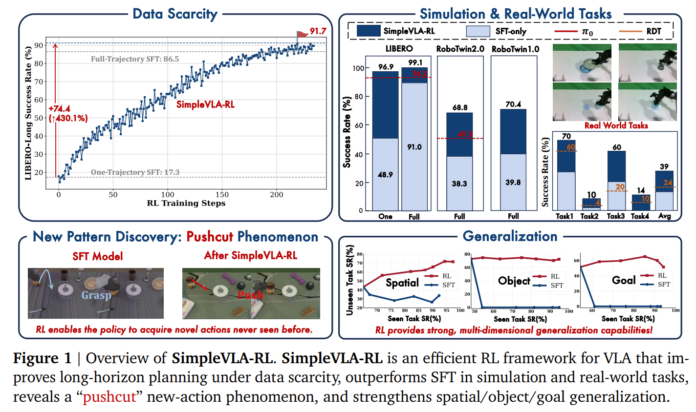
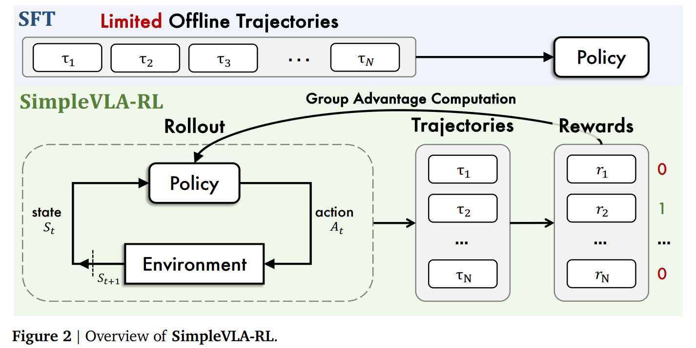

# SimpleVLA-RL: Scaling VLA Training via Reinforcement Learning

## 1.19-1.26周报.md

    - Motivation
        * 当前 VLA 模型主要依赖 **SFT（监督模仿学习）**，在规模化时面临两个根本瓶颈：**数据不可扩展：**高质量机器人轨迹昂贵且难以获取，SFT 的性能上限直接受制于人类示范数量。**泛化与长时规划能力不足**：SFT 强依赖演示分布，面对任务组合变化、长时序任务或 sim-to-real 时容易失效。
        * 所以作者提到：**LLM 中基于 outcome reward 的 RL（如 DeepSeek-R1）可以在极少监督下涌现复杂推理能力。**于是提出核心问题：**是否可以用仅基于任务成功与否的 RL，来训练 VLA 的长时序动作规划能力？**

    - Technique
        * 交互式 VLA Rollout：与 LLM 最大不同在于：LLM rollout：**一次性生成 token 序列；**VLA rollout：**必须与环境反复交互。**作者做了三件关键设计：**动作 token 化（Action Tokenization）** 只选择“能输出概率分布”的 VLA（如 OpenVLA-OFT），避免 diffusion / regression action，保证 PPO / GRPO 可用。**Chunk-level 动作生成** 一次生成 k 个 action tokens，再执行，减少推理-仿真交替开销。**多环境并行渲染（Multi-env Parallelism）** 在 rollout 阶段并行多个仿真环境，否则 RL 成本不可接受。

        * Outcome-only Reward（极简但关键）：作者完全放弃传统机器人 RL 的 dense / shaping reward，只保留：$ R(\tau) = \begin{cases} 1, & \text{task success} \\ 0, & \text{otherwise} \end{cases} $并将该 reward **广播到整条轨迹的所有 action token**。这样不依赖任务特定 reward 设计，避免 reward hacking，强制模型学“完整成功策略”，而非局部技巧。
        * GRPO（无 critic 的 PPO 变体）：SimpleVLA-RL 使用 **GRPO（Group Relative Policy Optimization）**，其本质是：不训练 value function，同一初始状态 rollout 多条轨迹，用 **group 内相对回报** 构造 advantage。$ \hat{A}_i = \frac{R_i - \mu(R)}{\sigma(R)} $
    - Advantage
        * **极强的数据效率：**单条演示 + RL ≈ 全量 SFT，LIBERO-Long：17% → 91%
        * **真正的策略发现能力**：出现 **pushcut**：SFT：学到抓-放；RL：学到推即可完成任务。
        * **显著泛化能力提升：**空间 / 物体 / 目标任务泛化均明显优于 SFT，SFT 出现 catastrophic forgetting，RL 不会。
    - 与现有工作的差异：**LLM RL**：现有工作聚焦推理任务（如数学、代码），依赖文本 token 生成；SimpleVLA-RL 针对机器人交互场景，需环境动态反馈与连续动作生成。**VLA 模型**：主流 VLA 采用 “预训练 + SFT” 的模仿学习范式，依赖大规模轨迹数据；SimpleVLA-RL 是早期系统性探索 VLA 在线 RL 的工作，且首次验证 RL 在真实机器人任务中的有效性。**VLA RL 相关工作**：SimpleVLA-RL 采用简单规则化结果奖励，更易扩展且无需额外标注。
