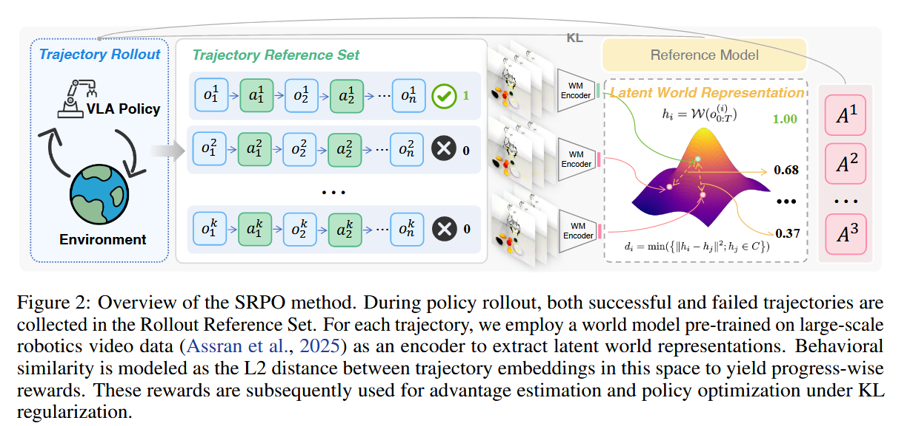

# SRPO: Self-Referential Policy Optimization for Vision-Language-Action Models

## 12.25-1.6周报.md

+ Motivation:
    - VLA+SFT的繁华性问题：主流 VLA 主要靠专家示范做 SFT，容易过拟合小规模下游数据，形成 demonstration bias，性能上限被人类示范质量卡住。
    - VLA-RL 的核心瓶颈是奖励极稀疏：很多 VLA-RL基本只用是否成功的二值终局奖励，导致失败轨迹信息被浪费、训练效率低。
    - 做更密的过程奖励很贵且不可扩展：手工设计过程监督往往依赖专家分解与标注，任务迁移成本高，违背自主学习可扩展的目标。SRPO 的动机就是：不额外要专家/不手工写 reward，也能把失败轨迹变成有效学习信号。
+ Technology：
    - SRPO 的技术栈可以概括成两块：(A) 自参照的 progress-wise reward + (B) 基于该 reward 的 SRPO 优化目标。
        * Self-reference：用同一批次里成功轨迹给失败轨迹打分
            + 一次 rollout 采样一批成功/失败轨迹，成功由环境终局成功信号判定；把它们都放进一个 rollout reference set。
            + 用预训练 world model 的 latent 表征来表示轨迹：作者用大规模视频预训练的 latent world model V-JEPA 2 作为编码器，把观测序列压到可迁移的 latent 空间
            + 对成功轨迹的 latent 轨迹嵌入做聚类（DBSCAN），得到若干成功行为原型中心
            + 失败轨迹的 progress reward = 到最近成功原型的距离函数：用 L2 距离度量行为相似度，距离越小表示越像在走向成功，reward 越大；并做归一化/激活把值映射到合理区间，从而得到 progress-wise 的密集信号。
        * SRPO：把 progress reward 填进组内相对优势的策略优化
            + 优化形式上作者沿用 GRPO 的 group-relative / clipped surrogate + KL 正则框架，只是把原本稀疏的 outcome reward 换成上面的 world-latent progress reward 来做 advantage 与组内统计量。
+ Advances
    - 极高的样本效率与性能：跑分似乎都很高。
    - 奖励设计上更可扩展：相比只靠终局二值奖励，以及需要任务分阶段/调参的手工过程奖励，SRPO 用“自参照 + world latent”给出更通用的过程信号。
    - 泛化/鲁棒性提升更明确：在含 7 维扰动的 LIBERO-Plus 上，Online SRPO 相比 one-shot baseline 有显著提升；论文也强调 SRPO 的在线交互带来更强轨迹多样性，从而能超过 full-shot SFT。
+ Thinking：
    - 这个文章的progress-wise还真和我之前想的用world model做模拟采样的想法有点类似，本质是改善一下奖励的稀疏性，让模型有更好的long-horizon的能力。
    - 至于这个GRPO感觉引入的比较牵强，有点像是为了用而用。
