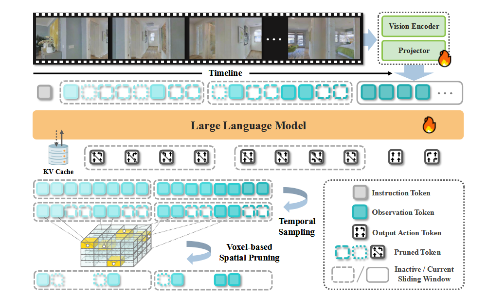

# StreamVLN: Streaming Vision-and-Language Navigation via SlowFast Context Modeling

## 11.24-11.30周报.md

阅读这篇文章的时间不足了，所以简要的写一些粗读的内容：

+ Motivation：现实 VLN 需要对连续视频流进行实时理解，但现有 Video-LLM 导航方法在细粒度视觉理解、长时序记忆与计算效率之间存在冲突。其 KV Cache 会随对话步骤线性膨胀，使推理延迟过大。StreamVLN 的动机是构建一个能持续处理视觉流、保持长期语境、同时保持低延迟的 VLN 框架，通过 Slow–Fast 混合记忆机制来实现高响应性与稳定推理。
+ Architecture： StreamVLN 基于 Video-LLM（LLaVA-Video）扩展为一个 interleaved Vision-Language-Action 模型，每个导航 episode 被视为多轮对话：输入连续观察 $ o_i $，模型自回归生成动作$ a_i $。框架的核心是 Slow–Fast 双路径上下文建模
    - Fast-streaming context（快速流）：使用固定大小的 sliding-window KV cache，仅缓存近期对话，使下一动作生成仅需前一窗口的 KV；避免对整段历史重新 Prefill，从而实现毫秒级响应。
    - Slow-updating memory（慢更新记忆）：对窗口外的历史视觉 tokens 进行 temporal sampling 与 voxel-based 3D 空间剪枝，保留关键场景信息但丢弃冗余 patch，使长期视觉语境保持在可控规模，同时支持 KV Cache 的有效复用。
    - 动作生成时，LLM 接收：(1) 最新 observation、(2) 当前窗口 KV、(3) 剪枝后的长期视觉 memory，进行自回归解码。这种结构确保模型在长视频导航中保持低延迟、稳定记忆与强时序推理能力。

