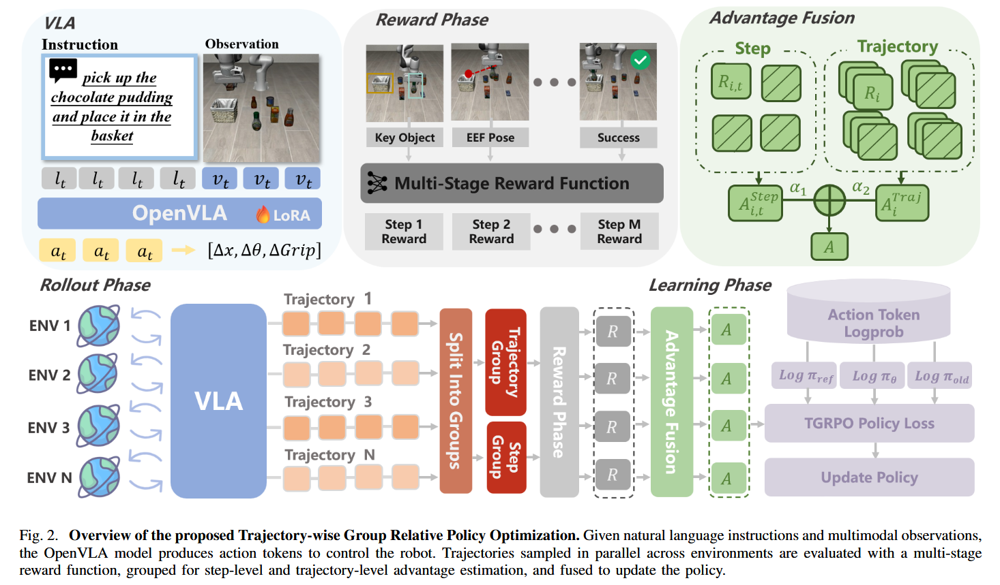

# TGRPO: Fine-tuning Vision-Language-Action Model via Trajectory-wise Group Relative Policy Optimization

## 12.25-1.6周报.md

+ Motivation
    - 第一个核心问题还是老生常谈的BC 的瓶颈：VLA 的常见训练范式仍以人工收集的成功示范做监督微调为主，缺少环境交互与在线反馈；因此在 OOD 场景或存在执行偏差时，适应性差。
    - 然后是RL 的现实困难：虽然 RL 提供闭环试错—反馈—优化，但在机器人长时序任务里常见奖励稀疏、方差高、优化不稳定（尤其多阶段子目标奖励尺度不一致时更严重）。
    - 核心目标：提出一个面向 VLA 的在线 RL 后训练框架，既能用更密的反馈改善 credit assignment，又能在不引入 critic 的前提下稳定优化
+ Technology
    - TGRPO = LLM 自动构造多阶段稠密奖励 + 类似GRPO 风格的组内相对优势？ + 把优势从 step-level 扩展到 trajectory-level 并融合，整体是 critic-free 的在线 RL 微调框架。
    - 作者用 Claude 3.7 Sonnet 将自然语言任务自动拆成若干阶段（例如接近/抓取/移动/放置）(这一个和之前的ODYSSEY有点像)，并基于仿真环境可获得的关键物体空间信息与末端执行器位姿在运行时判定当前阶段、发放阶段性奖励。 论文明确把每步奖励写成由两类信息驱动：关键物体信息与示范参考位姿。
    - 训练时在多个并行环境中从相同初始状态执行同一任务，逐步采样动作直到success或达到最大步数；然后让所有轨迹对齐为相同长度以便做 group 统计。然后就是GPRO那一套了：
        * Step-level group：把同一timestep 上、不同轨迹的step分到一组，计算step-level 相对优势（组内标准化+相对比较）。
        * Trajectory-level group：把整批轨迹当作一组，按每条轨迹的总回报计算trajectory-level 相对优势。
        * 用两个权重超参把 step-level 与 trajectory-level 的优势线性融合到每一步的最终优势上。
        * 最终优化仍是 GRPO 风格的 importance ratio + clipped surrogate，并加入 KL 正则项（论文还给了一个无偏 KL 估计器）。
+ Advantage：
    - 第一个应该是一定程度上解决长时序的问题： trajectory-level 优势提供全局进度信号，step-level 优势提供局部动作质量信号；融合后能同时照顾子目标推进与最终成功。
    - 第二个是本质不依赖critic，训练稳定性应该是更好的：避免了 PPO 类方法里 critic/GAE 带来的额外训练不稳定来源；方差信号更多来自组内标准化。
+ Thinking：
    - 首先就是面对的问题也是GRPO的这种东西，他并行采样的成本太高了，估计真机更明显。
    - 更核心的他这GRPO和我想的还不太一样，他这个主要是解决的在线 RL 微调不稳定的问题。多任务的联合泛化训练还不是贡献点，感觉multi-task是更加重要的工作。

****
