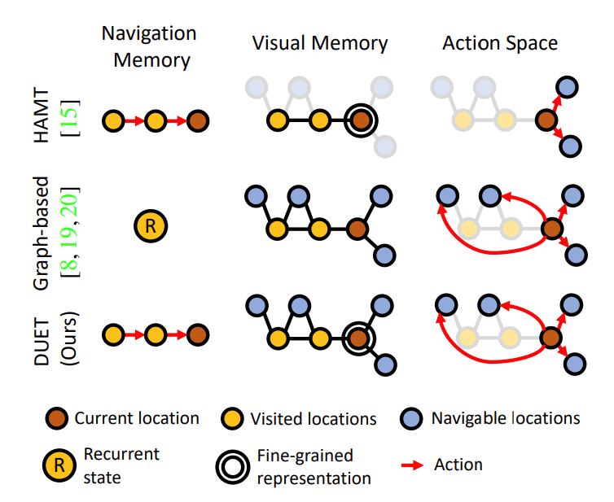
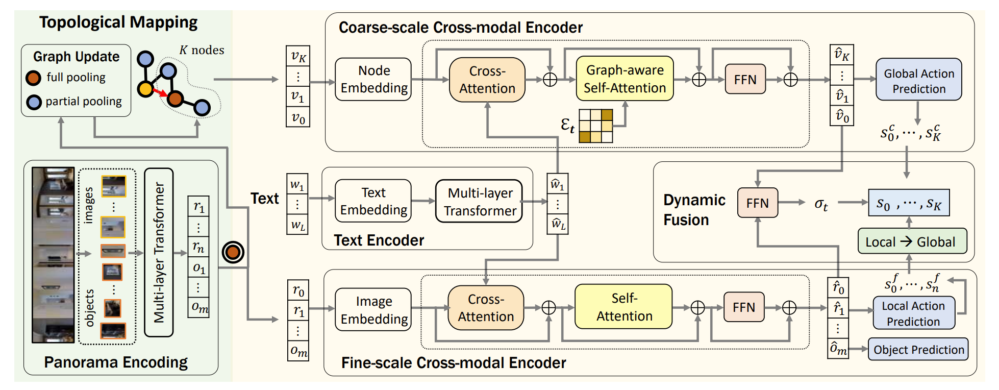

# Think Global, Act Local: Dual-scale Graph Transformer for Vision-and-Language Navigation

## 11.24-11.30周报.md

+ Motivation:传统 VLN 模型大多基于 single-scale Transformer，输入是当前的vision和指令，输出是下一步的动作，这个问题其实在VLA中也有体现，本质上还有没有做到一个Long-term planning，尤其是对于Navigation这样的话题，对长轨迹规划是非常重要的。
    - 大多数 VLN 方法存 memory 用 LSTM，把整个 long-horizon 轨迹塞进一个 vector ，导致空间结构被压缩丢失，无法真正知道房子结构**。**
    - 细粒度语言理解与视觉基础：智能体需要理解自然语言指令中的细微差别，并将其与视觉场景中的细节相匹配，而这个很多模型都没办法做到。
+ 关于VLN：
    - 首先是问题的定义： 严格的 VLN 任务都使用离散可导航空间，环境被表示为一个无向图 ，其中$ V = viewpoint set $（视点节点集合），$ E \subseteq V \times V=edges $（无向连接边）。
        * 在时间步 (t)，智能体状态为$ s_t = (v_t, \theta_t) $, 当智能体处于 $ (v_t) $ 时，它观测到一个全景视图：$ o_t = \{ I_{t,1}, \dots, I_{t,36} \} $包含了可导航方向$ (\mathcal{A}(v_t)) $和物体检测框 $ ({o_{t,1}, \dots, o_{t,m}}) $。
        * 智能体的目标是根据指令 (X) 在图中生成轨迹：$ \tau = (v_0, v_1, \dots, v_T) $并满足：**导航任务**：到达目标位置 $ (v^\ast) $或者是**对象定位任务（如 REVERIE）**：在 $ (v^\ast) $找到目标对象 $ (o^\ast) $
    - 下午展示了从HAMT到Graph-based再到DUET的对比：
        * HAMT（仅序列记忆）：只有一条线性序列，根据历史token（序列）来记忆过去轨迹， 无法表达空间拓扑关系。同时没有显示图结构，然后Action Space也只有简单二等局部方向。
        *  Graph-based 方法（显式 topology，但记忆粗糙）： Navigation Memory只有一个黄色的Current State，历史信息被RNN压缩为一个向量ht，丢失了路径的fine-grained信息，针对Visual Memory节点还是pooled features粗糙、不细致。 Action Space也缺少细粒度视觉对象。
        *  DUET：双尺度融合（Sequence + Graph）： 同时拥有：① 序列轨迹记忆（fine-grained sequential memory）② 局部+全局可导航拓扑图（topological graph）
组成 Dual-scale Memory，这也是 DUET 的名字来源。
    - DUET的 Topological Mapping 的构建方式主要是：
        * 节点构建（Node Construction）： 每个节点的表示来自 panorama 编码器，对1当前视点使用full pooling，对可导航方向使用partial pooling，只聚合相关方向的区域token。
        * 图结构的更新（Graph Update）：在每个时间步 t，DUET 执行：
            + 首先将当前节点加入 visited 集合：$ V_{t+1} = V_t \cup {v_t} $
            + 然后计算 navigable neighbors（蓝色节点）： 通过 dataset 原生导航网格获得
            + 再然后建立边连接关系：$ E_{t+1} = E_t \cup { (v_t,v_k) : v_k \in \text{neighbor}(v_t)} $
            + 最后对旧节点特征融合： 使用 EMA / GRU 方式更新已访问过节点的 embedding
        * 图结构感知注意力（Graph-aware Self-Attention）:
            + 在 coarse-scale encoder 里，DUET 将邻接矩阵引入 self-attention：$ \alpha{ij} \propto \frac{(W_q v_i)^T (W_k v_j)}{\sqrt{d}}+B{ij}, $
            + 其中：$ B_{ij} = b_1 \, (i,j)\in E_t \\
B_{ij} =  b_0,  \text{otherwise}  $ 对邻居节点加 bias → 更可能互相交换信息, 对不相邻的节点降权或 mask。
        * 这让 DUET 能在地图上进行：结构化推理，路径规划，全局目标定位。
        *

+ Architecture：下面这样图是完整的DUET-VLN的模型架构：
    - 架构最左边是编码的两个部分，分别是DUET的拓扑建图方式和Panorama编码
        * 拓扑建图方式： 这一块是 DUET 的全局地图构建器。  这个部分的update和建构逻辑上面已经表明了。
        * 全景编码逻辑： 当前视点的 panorama 图像和基于检测得到的 objects作为输入，由 先用 CNN / Faster-RCNN 之类拿到初始视觉特征 ，然后再丢进一个 Multi-layer Transformer 做上下文建模，其实就是把当前看到的 360° 场景 + 物体编码成一堆细粒度 token。
    - 架构的右边是模型处理的部分
        * 上半部分是粗粒度跨模态编码：先做Node Embedding， 把节点特征做线性映射 + 位置编码（比如图距离、step index）得到node embedding。然后使用Cross-Attention，在节点与文本之间作注意力计算，这里的Query是图节点，相当于每一个节点找寻高度相关的指令的词语。 再然后**图结构感知自注意，**这是DUET最关键的设计， $ \alpha_{ij} \propto \frac{(W_q u_i)^\top (W_k u_j)}{\sqrt{d}} + b_{ij}, $在计算Attention score的时候，对不相邻的节点施加惩罚，从而获得逻辑感知。然后接一个FFN最后得到全局动作预测序列。
        * 中级部分是文本编码器：输入是文本的指令，处理是用Text Embedding和Multi-layer Transformer作上下文的建模。
        * 下半部分是细粒度跨模态编码：首先是Image Embedding，把全局视觉作一层投影得到视觉的Embedding，然后用Cross-Attention，用语言去选择和强调关键的视觉token，再然后建立一个Self-Attention，在不同的region/object之间互相的交流，在然后输出到FFN层，最后得到了一个local Action序列。
    - 架构的最右边是DUET的核心：动态融合&Local->Global
        * Local 分支得到的是当前视点周围 n 个方向的分数：$ (s^f_0,\dots,s^f_n) $
        * Global 分支是在整个图上的 $ (K{+}1) $ 个节点分数：$ (s^c_0,\dots,s^c_K) $
        * 需要一个 **mapping**：把 local action 对应到图节点 index 上（哪个 local 方向连到哪个 graph node）。这就是图里的 `Local → Global` 方块：$ s^{f}*{k} \longrightarrow s^{f}*{\text{node}(k)} $，从而在同一个节点上具有全局策略和当前的局部视觉的score
        * 再接着是一个动态门控， Dynamic Fusion 模块从 cross-modal 表达里抽取一个上下文向量，通过一个 **FFN** 输出一个标量或向量$ \sigma_t $：
            + $ \sigma_t = \text{FFN}(\text{context}) \in [0,1] $
            + 然后对每个节点做加权融合，$ s_k = \sigma_t \cdot s^c_k + (1 - \sigma_t) \cdot s^f_k $，对于$ \sigma_t $如果偏于1，就偏向了全局图策略，如果接近0，就偏向局部视觉策略
    -

+ Thinking：
    - 过去的 HAMT/Seq2Seq 模型强调 language–vision alignment，但缺乏 explicit spatial structure，使得模型缺乏全局规划能力。Graph-based 方法虽然引入拓扑图，但隐藏轨迹记忆、视觉信息粒度不足。DUET 让我意识到：fine-grained sequential memory + explicit topological graph 才是 VLN 任务的真正本质，因为 VLN 本质上是一个带语言条件的 partial observable planning problem
    - DUET 的拓扑建图并不是传统 SLAM，而是利用 visual token pooling → node embedding → graph-aware attention生成一种可学习的空间图。
在 VLA 或 Robotics 里，完全可微、端到端学习的Map Module 可能是未来方向，比经典 SLAM 更适合 multimodal foundation model。这与世界模型（World Model）思想也高度一致：在 latent space 里构建结构化空间表征。
+ Limitation：
    - 图构建仍依赖环境提供的可导航邻接关系：DUET 的 graph update 使用的是 Matterport3D 提供的邻接矩阵，并不是真正从视觉估计可通行性。缺乏 generalization 到未知环境的能力
    - 拓扑图节点特征虽然 fine-grained，但仍然是 pooling： Full pooling 将 panorama 中的 region–object token 聚合为一个 node embedding，会损失细节吧，导致 node 对语言的对齐能力不足？
    - Coarse-scale graph reasoning也是local-GNN-style，缺少 long-range planning capability也就是说还是一种局部信息的passing，并非真正的全局的Planning。
