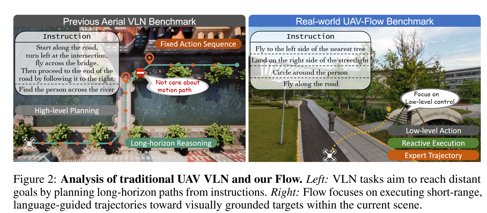
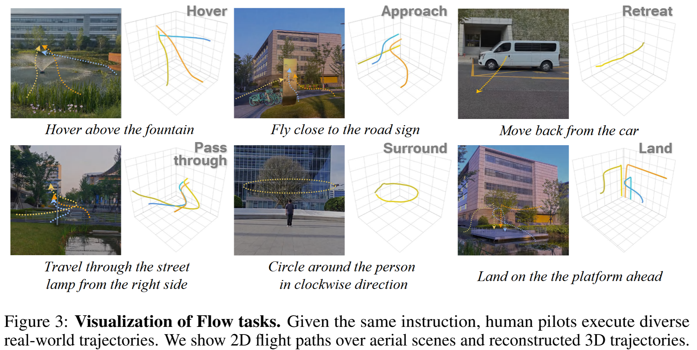
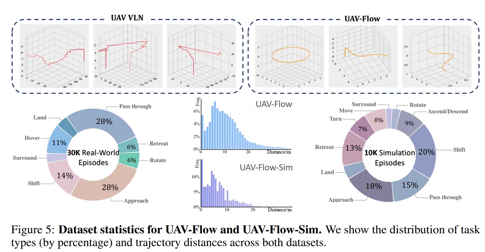

# UAV-Flow Colosseo: A Real-World Benchmark for Flying-on-a-Word UAV Imitation Learning

## 2.23-3.2周报.md

+ Motivation：本篇文章本质上是UAV的一个benchmark，动机主要是无人机领域的大多数工作都是基于仿真的环境，而且语言的驱动都是离线的规划和视觉导航，没有一个真实世界环境下的语言条件无人机控制的Benchmark。本质上，这篇论文的核心贡献是构建了一个真实世界的 UAV 语言条件模仿学习 benchmark。

+ benchmark的主要内容：
    - 作者把问题定义成 Flying-on-a-Word (Flow)：不是传统 VLN 那种根据指令飞到很远的目标点，而是在当前可视范围内执行短程、动态的飞行动作。
    - 核心任务输入/输出（Flow task instance）：每个时刻给三种输入：自然语言指令，无人机 6-DoF 状态，第一人称视角视觉观测（FPV）。输出是低层控制动作序列，要求轨迹语义满足指令、同时动态可行。
    - 论文明确把 Flow 指令分成两类，对应两种能力：
        * Primitive motion commands： 用来测 **motion intent understanding**（理解并执行基本机动语义）例子包含：起飞、平移、旋转、俯冲/下潜等。
        * Object-interactive commands：用来测 **spatial context grounding**把语言里的空间关系落到当前视觉场景上，例子包含：接近某物、绕某物盘旋、从某物旁穿过、在某物旁/上方悬停等。
    - 论文提到了包含的dataset——UAV-Flow 数据集  ：
        * 场景主要是三处大学校园环境，总面积约 5.02 km²，语义元素丰富，用于提供多样视觉语境。
        * 轨迹通过专业飞手采取，同时用时间戳把视频帧与 6-DoF 状态对齐，并把 GPS 转到以起点为原点的局部坐标；视频按 5 Hz 采样形成序列
        * 平台使用商用级无人机，4K 相机 + RTK GPS。 规模：真实数据集包含 30,692 条轨迹，覆盖 8 类主要 motion types，多数轨迹长度在 20m 内。
        * 指令标注：人工标注团队先筛掉语义不清和行为不连贯片段，再为剩余 clip 写精确的指令描述。 另外还构建了 Fixed Command Set+ 用 LLM 做语言多样化，用于提升语言表达覆盖面。
+ Thinking：
    - 我看到的比较关心的一些内容：
        * real部署的内容：因为无人机的算力是不足的，所以 UAV 通过 **RTSP** + **MAVROS** 把 FPV 视频和状态传到地面站，地面站推理后回传低层控制。这里面就存在一个延迟的问题，也就是停下来推理，还是持续运动推理。文章中提出一种带 look-ahead 的 chunk 预测与对齐策略用于减轻延迟导致的控制错配。
        * sim的内容，提供了一个仿真的数据集，**UAV-Flow-Sim**（UE + UnrealCV），控制接口尽量贴近真实遥控器的 position-mode。仿真数据集 **10,109** 条轨迹；并额外构建了一个包含 **273** 条标注轨迹的仿真 test set，覆盖主要动作类型用于系统评测。

