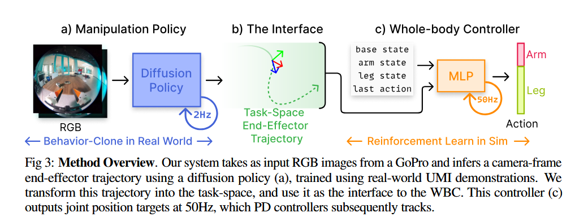

# UMI on Legs: Making Manipulation Policies Mobile with Manipulation-Centric Whole-body Controllers

## 1.26-2.2周报.md

+ Motivation
    - 这篇工作的出发点：高质量的操纵策略数据很难在真实移动机器人上规模化采集。真实机器人采数据成本高、风险大，而且数据往往和具体机器人强绑定，一旦换形态就失效。
    - 与此同时，仿真虽然可以高效训练运动控制和全身控制，但在操纵任务上很难真实建模复杂物体、接触和任务奖励，这使得“在仿真中学会操纵”这条路成本同样很高。
    - UMI on Legs 的核心动机，是希望把操纵技能学在哪里和身体怎么动这两件事彻底解耦：操纵技能可以用最便宜、最灵活的方式学，而身体控制则交给擅长处理动力学和稳定性的仿真强化学习。
    - 从更宏观的角度看，这篇工作关心的并不是某一个具体任务，而是：已有的大量操纵策略，能不能不重训就走起来。
+ Technology
    - 整个系统由两个层级清晰分离的模块组成：一个是基于真实世界演示训练的操纵策略，另一个是完全在仿真中训练的全身控制器。二者之间不共享低层动作，而是通过一个非常明确的接口进行通信。
    - 高层的操纵策略来自 UMI 系列工作，使用手持夹爪采集人类演示数据，并通过扩散策略预测一段未来的末端执行器轨迹。这一策略对机器人形态基本无感，只关心“末端该怎么动”。
    - 低层的WBC完全在仿真中训练，它的任务不是完成操纵本身，而是稳定地跟踪给定的末端轨迹。关键在于，作者让 WBC 在ask frame中追踪末端轨迹，而不是在机体坐标系中追踪，从而主动抵消身体晃动对操纵精度的影响。
    - 这种轨迹作为接口的设计带来了一个自然的异步结构：操纵策略低频运行、给出意图性的未来轨迹，而全身控制器以高频运行，实时处理平衡、支撑和扰动补偿。
    - 在实现层面，作者刻意避免在仿真中搭建复杂操纵任务，只训练“轨迹跟踪”，从而绕开了操纵仿真最难的问题，同时仍然学到了非常丰富的全身协调行为。
+ Advantage
    - 这一框架最大的优势在于**数据与控制的彻底解耦**：操纵数据可以完全脱离机器人采集，而身体控制则可以在仿真中大规模并行训练，两者各自走最适合自己的扩展路径。
    - 任务坐标系下的末端轨迹跟踪，使得系统在真实世界中对扰动非常鲁棒。无论是动态抛掷还是高摩擦推物，控制器都能通过身体姿态和步态调整来兜住操纵误差。
    - UMI on Legs 展示了非常强的 plug-and-play 能力：作者直接将原本为固定底座机械臂训练的操纵策略，零样本部署到四足平台上，并取得了较高成功率，这在以往的四足操纵工作中非常少见。
