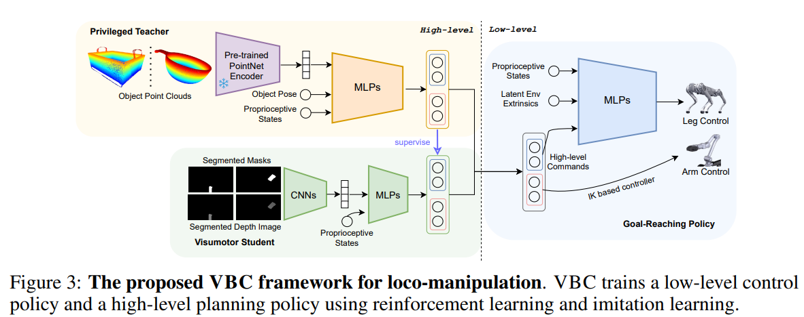

# Visual Whole-Body Control for Legged Loco-Manipulation

## 2.2-2.9周报.md

+ Motivation
    - 这篇文章关注：如果机器人只能依赖低维状态或精确感知（如位姿、标签），那在真实环境里基本跑不起来。
    - 许多已有的全身控制方法假设机器人已经知道目标在哪里，但在真实世界中，机器人往往只能看到 RGB 图像，而没有完美的位姿或物体标签。
    - 因此，作者的动机可以理解为：能不能让四足机器人直接看着环境，一边走、一边用手臂完成操纵任务，而不是先做复杂的感知-建图-规划流水线。
+ Technology
    - 核心做法是把视觉直接引入全身控制策略，让一个统一的策略同时处理行走、身体姿态和手臂动作。
    - 模型以视觉输入（RGB 图像）为主，结合机器人自身状态，通过强化学习学到一个端到端的全身控制策略，输出腿和手臂的联合动作。
    - 与传统的：**先感知、再规划、再控制**的分层系统不同，这种方法强调从视觉到动作的直接映射，让模型自己学会如何在视觉变化下保持稳定并完成操纵。
    - 从方法定位上看，它更接近觉驱动的全身控制器，而不是高层任务规划或语言驱动模型。
+ Advantage
    - 最大的优势是系统结构简单：不需要额外的物体检测、精确定位或人工设计的中间表示。
    - 由于控制策略直接对视觉变化做出反应，在一定程度上具备对环境扰动和感知误差的鲁棒性。
    - 实验表明，方法可以在多种行走+操纵任务中稳定工作，说明视觉信息本身就足以支撑一定程度的全身协调。
    - 对于希望减少系统复杂度、避免重感知工程的场景，这种方法具有较强吸引力。
+ Thinking
    - 这种端到端视觉控制在工程上很直接，但也意味着泛化能力和可解释性主要依赖训练数据分布。
    - 可以把它看作是一种视觉版的全身控制基线：在此之上，未来可以叠加语言、高层规划或世界模型，而不是与它竞争。
