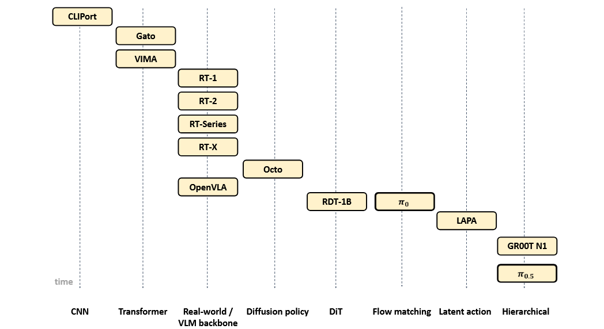
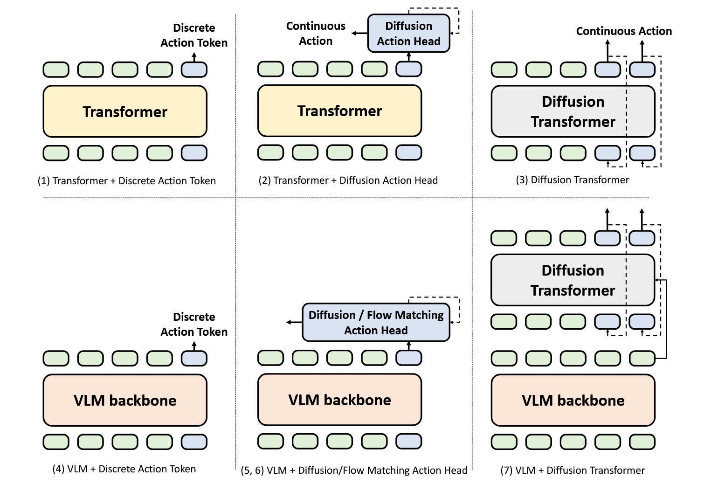
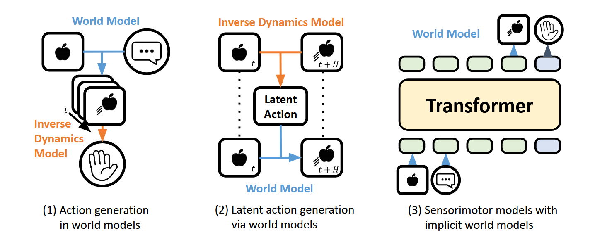
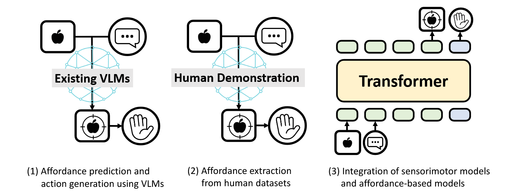
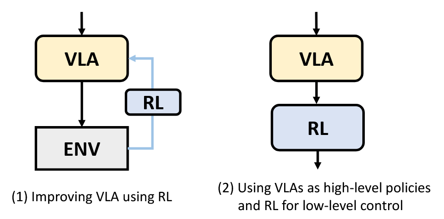

# Vision-Language-Action Models for Robotics: A Review Towards Real-World Applications

## 11.24-11.30周报.md

这是一篇看了之后收获非常大的论文，虽然说整个综述的篇幅很长，但是将VLA这个领域介绍的非常全面并提出了很多高度有建设性的研究建议。

+ **Section I**：开宗明义，先给VLA（Vision-Language-Action）下了一个完整的定义：_A Vision-Language-Action (VLA) model is a system that takes __**visual observations and natural language instructions**__ as required inputs and may __**incorporate additional sensory modalities.**__ It produces robot actions by directly generating control commands. Thus, models in which a high-level policy (e.g., a vision-language model backbone) merely selects an index from a set of pre-trained skills or control primitives are excluded from this definition._ 最后一句话就概括下了，自RT-1之前的机器人控制理论的主要思路：此前的控制模型会建立一个预定的动作控制库，通过视觉识别和指令识别，从这个动作库中选取既定动作序列传输给机器人。
+ **Section II**：介绍了当今VLA模型的几大重要挑战：
    - 第一个挑战是**数据的要求和稀缺性**：VLA本质上是一个条件分布$ \pi_{\theta}(a|o,l) $但是同时包vision，Language，action三模态的高质量数据集太少了。vision-language的数据集没有动0作a，Robot-demos数据集的任务分布太少了。所以说没有合适的高质量的数据集。
    - 第二个挑战是**具身挑战**：不同机器人的不同身体的Action space差距太大，DoF不一样、joint configuration不同、sensor modalities等等很多方面，所以很难构造一个单一的generalist VLA policy在所有的work上都能工作。所以也导致Robot-to-Robot transfer & Human-to-Robot transfer都差别非常大，很难做完整的迁移。
    - 第三个挑战是**算力挑战**，分两个方面来谈：
        * 第一个方面是训练阶段的挑战，VLA的输入是高维、多模态的内容，大多数的SOTA架构是Transformer-based Sequence model，简单计算一下，假设一条 trajectory 长度是 $ T $，每帧图像提成$ N_v $个视觉 token，语言部分$ N_l $，动作部分$ N_a $,输入序列的长度大约为：$ L≈T(N_v+N_a)+N_l $，标准的Transformer的复杂度是$ O(L^2 d) $，都是二次以上的增长，即使是用预训练的VLM backbone也很耗费算力。
        * 第二个是推理阶段的挑战，在真机上的latency&memory问题，机器人平台式是resourced-constrained，GPU和显存都不符合实际要求，导致控制很难达到既定频率，同时很难实时的更新决策。
        * 所以这篇文章也指出基于此的后序发展方向，比如高效架构，或者模型压缩/distillation/LoRA等。
+ **Section III**： Design Strategy and Transition 本文将VLA的历程划分为了以下的主要阶段：

    - **Early CNN-based end-to-end architectures **：完全基于 CNN（ResNet、UNet），同时视觉特征与语言 embedding 用简单的 concat 或 FiLM 融合 ，输出也是特定任务的action。整体模态融合差，任务泛化也存在问题。
    - **Transformer-based sequence models **：VIMA、Gato 的核心思想是：把视觉、动作、语言都序列化（tokenization），然后让 Transformer 做自回归学习。非常严重的一个问题是token数量极大，而且很难大规模的训练。
    - **Unified real-world policies with pre-trained VLMs**（RT 系列 / OpenVLA）：RT-1应该是从Sequence Models向VLM-backbone的核心过渡模型。这一类模型的本质是让感知理解和控制动作解耦，把感知+语言理解托管给一个大 VLM-backbone，动作头只是个 adapter，成为现在 VLA 的主流 blueprint。
    - **Diffusion policy ：**代表作就是Octo， 把 Diffusion 模型作为Action head，挂在 Transformer 后面，解决离散 token 行为不够平滑的问题。
    - **Diffusion transformer architectures（DiT 做 Backbone）：** 不再只是把 Diffusion 用到动作头，而是直接用 Diffusion Transformer (DiT) 做控制 backbone，引入 Alternating Condition Injection交替用图像 token / 文本 token 做 query，减轻过拟合并强化多模态条件。
    - **Flow matching policy architectures （**$ \pi_{0} $**） ：** 基于 PaliGemma 之类的多模态模型, 新增一个 Action Expert 模块， 用Flow Matching生成动作 ，类似于逆扩散的过程，相比 Diffusion，Flow Matching 更高效。
    - **Latent action learning from video ：**这一部分应该标志着 **World Model **加入了VLA的研究路线了， 主要思路是从无标签视频中学 **Latent Actions**，作为 VLA model 的动作空间， patch embedding + spatial transformer + causal temporal transformer这是综述中提到的核心思路。更重要的意义是让机器人能够学习人类视频，学习可迁移的 latent 行为表示；
    - **Hierarchical policy architectures ：**这个部分的模型几乎是现在的最新的模型内容，包括$ \pi_{0.5} $，以及GR00T N1，本质是做多层策略的管理，上层做语言空间规划，下层做连续控制空间执行。
+ **Section IV**： Architecture and Data Modality  这一个节介绍了VLA的核心五大部分：
    - ** Sensorimotor Architectures（传感–动作架构）** ：这是最核心的 VLA 架构类别，即直接从视觉+语言 → 动作，学习一个 sensorimotor policy $ π(aₜ | oₜ, l) $，论文中又把这个部分分为七大核心类别
        * Transformer + Discrete Action Tokens ： RT-1 的早期版本， 把动作量化成多个 token（例如 7–15 个 action tokens），Transformer 自回归预测这些 tokens，等价于“语言式”预测动作序列。
        * Transformer + Diffusion Action Head  ： Octo是最经典的代表作，动作建模从 regression -> **generative**，能产生平滑连续动作序列。
        * Diffusion Transformer ：RDT-1B 是一个代表作。 将“Diffusion”内化到整个 Transformer backbone（而不是只做 head），模型本身是一个 DiT，直接在隐空间中扩散生成动作（最后用 MLP 输出）。
        * VLM Backbone + Discrete Actions Tokens： RT-2 以及OpenVLA的 continuous action 版本， 视觉+语言编码进 Transformer 得到语义 embedding， 用一个 MLP 回归 Δpose 或 joint command。
        * VLM Backbone + Diffusion Action Head：GR00T-N1（部分阶段）， 冻结或半冻结 VLM 作为视觉+语言语义理解，动作生成完全由 **Diffusion Head **完成（生成式连续控制）。
        * VLM Backbone + Flow Matching Action Head ：π₀（Flow Matching） ， 高层语义由 VLM backbone 提供，低层动作由 **生成式模型（Flow Matching）** 直接生成，能适应复杂操控。
        * VLM Backbone + Diffusion Transformer ：GR00T-N1（完整 hierarchical pipeline）是这个部分的集大成模型。上层：VLM backbone 做视觉-语言理解、生成高层语义或 latent 表示；下层：DiT作为低层控制器生成连续动作。

    -  **World Model Architectures（世界模型）** ：介绍了世界模型相关架构在VLA中的相关的贡献。
        * Action generation _within_ world models ：世界模型负责预测未来视觉帧，动作由另一个模型从预测画面中反求出来。直接学$ π(a|o,l) $很难，尤其是长时序、复杂 manipulation。 但是预测未来图像与轨迹相对更容易。利用世界模型生成未来可能场景，再用 inverse kinematics找出动作，这让机器人具有可视化的规划能力，和更好的长时序执行。
        * Latent action generation _via_ world models ： 世界模型从视频中学习动作 latent tokens，然后 VLA 用这些 latent action 作为自己动作空间。 这是从视频中挖掘动作语义的路线。机器人示教数据很贵，所以利用人类视频，让世界模型先从图像的变化中学出来Latent action，然后将生成的潜在标记用于 VLA 训练从而合并人类视频数据集。
        * World model + Sensorimotor policy（implicit world model） ：VLA 同时预测动作 + 未来视觉（世界模型内置在 VLA policy 中）。动作预测本身依赖未来视觉预测来提高长时序能力。普通 sensorimotor VLA 只预测动作所以导致了长时序弱，如果 VLA 同时预测未来帧也就是在模型内部形成隐式 world model，这样就可以让动作受益于对未来的内部空间的想象。

    -  **Affordance Architectures（可供性/交互性模型） **
        * Affordance prediction and action generation using VLMs  ：用预训练 VLM推断场景中可操作区域/结构，再把这些 affordance 映射成机器人动作。通过 VLM 的语义理解能力，自动找出操作区域，再由传统控制器（MPC、优化器、GraspNet 等）完成动作。
        * Affordance extraction from human datasets： 从人类视频（无动作标签）中自动提取“接触点 / 操作区域 / 手轨迹 / affordance 热力图”，并用这些学习机器人动作。人类视频里没有 joint angle，但能看到比如手在哪里接触？接触了哪个物体？移动轨迹是什么？提取这些affordance signals后投影到 3D，可以让机器人可以模仿实现操作策略。
        * Integration of sensorimotor models and affordancebased models： 把 affordance 作为中间表示引入 VLA，使动作生成直接条件在 affordance 上，更精确也更可控。与前两类不同，这类**不是单独学习 affordance**，而是affordance变成sensorimotor policy的输入， Affordance 成为动作生成的中间语言。

    - Data Modalities（数据模态拓展） ：这个部分综述系统性的整理了不同模态的核心概念，主流方法分类和每个方向代表技术。
        * Vision：视觉处理部分，主要分为四个核心主要内容：
            + 主流数据backbone：大致有这样三个阶段的发展历程，大致是CNN，Transformer和现在最主流的VLM，文中还提到，SigLIP+DINOv2可能会成为现在VLA的主力视觉编码器。
            + 离散化视觉（VQ-VAE / VQ-GAN）：LLM 接受token，图像变成 token 序列后更易统一处理。
            + Token 压缩 / 信息整合模块： 视觉 patch tokens 太多，要压缩成少量语义 tokens：
                - Perceiver Resampler（Flamingo）：把多模态信息重采样成固定长度 latent tokens。
                - Q-Former（BLIP-2）：融合 cross-attention + self-attention，提取任务相关 token。
                - QT-Former：加入 temporal 结构，适合视频。
                - TokenLearner：根据注意力动态挑选 key spatial tokens（减少 token 数量）。
            + Object-centric features
                - 许多 VLA 不使用 raw feature maps，而使用基于检测/分割的目标级 token：bounding box，masked region features，object crops。
        * Language： 语言模态分成tokenization → text encoder → multimodal fusion
            + Tokenization： 直接继承 LLM 的 tokenizer。比如：T5 tokenizer 、 LLaMA tokenizer  都是比较常见的tokenizer。
            + Text Encoder ：比较粗糙的如USE，或者是CLIP Text Encoder。
            + 完整 VLM作为语言 backbone：很多现代 VLA 的 backbone 都是VLM + vision adapter。视觉 → projector → LLM，语言直接进入 LLM。
        * Action ：这个部分的前五个Action的思路，基本前面都已经完全的覆盖了，主要是最后一个，是目前基本非常前沿的方向。
            + Discretized Action Tokens
            + Decoding Tokens into Continuous Actions：
            + Generative Continuous Actions（Diffusion / Flow Matching）
            + Latent Action Representations
            + Cross-Embodiment Action Representation：跨具身动作空间的表示方法，不同机器人的具身差异巨大，动作维数也非常不同，本文中针对这种方法，提出了几种可行的解决方案：
                - 第一种是类似于Open X-Embodiment的统一action格式，例如统一为7DoF pose
                - 第二种是用第一人称视角对齐，统一Observation然后对齐goal image从而得到inverse kinematics
                - 第三种是CrossFormer，为每一个模态建立Tokenizer，然后统一为一恶搞token Sequence ，统一为一个shared Sequence，使用shared transformer最后用具身特定的action heads输出动作
                - 第四种是Universal Action Space，所有机器人共享一个离散 codebook， Transformer 输出 latent code，由不同具身 decoder 还原成真实动作。
                - 第五种是使用中间表示（optical flow / feature points）
        * Miscellaneous Modalities：这个部分介绍一些其余模态的介绍，这个部分比较新颖，感觉没有在常规论文中的所发现，同时模态也更加的融合。
            + Audio 模态 ：音频是一种高密度的现实线索，可补充视觉无法捕捉的接触、材料、故障和语言输入  。
            + Tactile & Force 触觉 / 力传感：触觉是 manipulation 的关键模态，可帮助机器人进行精细接触推理（文中提到了如插销、抓握、滑移检测）。
            + 3D Spatial Information：
                - Depth（深度图）：深度信息提供精确 3D 几何，对操控和导航极其关键
                - Multi-view images（多视图）： 多视角信息提供 implicit 3D understanding（无需显式点云）。
                - Voxels （体素）： 将场景表示为 3D 网格（occupancy grid），结构规则适合 CNN/UNet 处理。
                - Point clouds（点云）： 点云直接描述场景 3D 几何，是操控、抓取、碰撞检测的关键输入。
            + Other Modalities （动作动态 / 运动学 / 光流等）：时间动态（motion dynamics）是 VLA 未来非常重要的模态，尤其适用于人类动作模仿与长时序预测。
+ **Section V**：训练策略和具体实现。 不同 VLA 架构需要不同训练方式，而训练策略主要分为：
监督（SFT / BC）、自监督、多任务训练、RL 微调、对齐方法（PEFT）、以及各种数据增强。
    - **Supervised Learning**：就是 imitation learning：Behavior Cloning+Supervised Fine-Tuning。训练简单稳定，但是不擅长时序任务，且泛化性太差了。
    - **Self-Supervised Learning**：自监督学习， 减少对机器人标注动作的依赖，扩大训练数据规模  。文中提到了一些训练方式，包括不限于 contrastive learning，video prediction或者是world model中可能得LAPA类。
    - **Reinforcement Learning**： VLA 主要靠IL，但 IL 有先天缺陷，如无法解决新行为、需要大量 expert data。因此 RL 可以作为增强模块用于 fine-tuning 或作为低层控制器，提升 VLA 的鲁棒性、泛化性与真实世界适应能力。论文也指出大规模 RL 在真实机器人上几乎不可行因为成本高、不安全、而且学习效率低，因此实际使用 RL 的策略都非常务实（比如safe RL, human-in-loop RL, offline RL, guided RL 这种）。本文着重介绍了两大类RL的用法。

        *  Improving VLA using RL  ： VLA 通过 SFT/BC 先学会基础行为，再用 RL 在真实环境下 fine-tune — 提高鲁棒性、适应性、稳定性。循环结构：SFT → RL（online）→ 再 SFT（加入 successful rollouts），这是在ConRFT提出的，有一个非常重要的工作，文章中提出的， **DSRL 将 RL 应用于diffusion的latent noise space，而不是反传diffusion backbone避免diffusion的backprop非常昂贵， 能让 π₀ 成功率从 20% → 近 100%（仅 10K samples）。 论文特别强调：DSRL 是解决 diffusion + RL 不兼容性的突破点。  **
        *  Using VLA as high-level policy + RL for low-level control  ： VLA 负责决策语义层（planning），RL 负责机器人动力学层（locomotion / manipulation）。  VLA 不擅长 raw velocity control，且VLA 动作头无法应对高频控制（100Hz+），然而 强接触任务（抓握、走路）需要 RL 的稳定性。所以可以两者结合。代表性的著作是 **Humanoid-VLA  **
    - **Training Stage：**这个部分介绍了Pre-training和post-Training中的一些细小的点，包括预训练模型选择，或者一些post的方法，由于整体偏工程型，所以没有细看。
+ **Section VI**：数据集。 现代 VLA 的性能取决于数据规模，而数据来源分为：真实机器人、模拟器、多机器人数据、网络人类视频、语言数据等五大类。这部分主要做了数据集的整合和梳理，没有看的太细致，如果后期实验需要这部分内容再回来反看吧。
+ **Section VII**：回顾真实世界的机器人。这个部分也是偏工程项居多，介绍了现有的机器人种类，介绍了仿真平台和技术，介绍饿了评估标准和测试集，我也只是粗略的看了一眼，写的虽然详尽但也繁琐，罗列的内容相当之复杂，后序基于实验开展再细看吧。
+ **Section VIII**：对从业者的建议。这个部分作者基于前面所有的研究，为现在的从业者提出了一些可行性的建议
    - 第一个还是建立多样且高质量的数据库：模型没有数据无法泛化，数据质量远比模型规模更重要。
    - 第二个是采用Continuous generative action是机器人动作的大方向，比如 Diffusion / Flow Matching。
    - 第三个是预训练要注意使用梯度隔离策略，保护VLM。可以冻结VLM或使用：Gradient Insulation / StopGradient / Low-rank adaptation for heads
    - 第四个是进行轻量化的微调，优先使用LoRA，只调节Action Head。不要直接 full finetune VLA，太贵且效果不稳定。先从：只调 Action Head / LoRA 开始。 世界模型 + latent action = VLA scalability 的核心路径。
    - 第五个是世界模型+latent action可以极大程度提升可扩展性，也是未来的重要方向
    - 第六个是使用多任务学习，引入辅助任务增强，让视觉更加可控。
+ **Section IX**：未来的研究方向，作者提出了8大研究方向。
    -  Data Modality ， 未来 VLA 必须从 RGB+Language 扩展到“全模态”感知（音频、触觉、点云、3D）。但最大瓶颈是缺乏大规模标准化多模态数据。未来的方向可能是多模态大规模datasets，统一传感器标准，多模态同步采集Pipeline，3D-first或者tactile-first VLA
    - Reasoning（推理与记忆），未来的 VLA 需要真正具备“长时序推理 + 记忆能力”，像人一样执行 multi-stage、多子任务的长任务。未来方向：Episodic memory， Hierarchical reasoning，CoT + world model推理等等
    - Continual Learning（持续学习），未来的 VLA 应该像人类一样持续学习，而不是一次性训练后冻结。提出了包括在线学习方法，RLHF+active learning
    - Reinforcement Learning（安全、可扩展的 VLA × RL），要让 VLA 真正可控、稳健、高性能，RL 必须成为训练循环的一部分。但真正的 RL-VLA 需要安全、可扩展的设计。未来的方向：World Model + RL（在虚拟模型中做 RL 微调），Real-to-sim digital twin RL，latent-space RL（如 DSRL）。
    - Safety（安全性）， VLA 在开放环境中部署会对人产生风险，因此必须引入安全机制（safe perception + safe control）。提出了hybrid control，risk-aware planning等等真实场景的安全检测机制。
    - Failure Detection & Recovery（失败检测与恢复），未来真实机器人最重要的是失败后要学会恢复，不能动不动就任务终止。包括有Failure detection，Hierarchical recovery（LoHoVLA）等等方法
    - Evaluation（严格的评测框架），目前 VLA 的评估不标准、不科学、不统计，难以比较模型。未来需要统一、严格、统计意义的 benchmark。  未来方向：Large-scale benchmark（像 LBM 那样）或者可复现、标准化 task suite。
    - Applications（实用落地）： 虽然 VLA 有巨大潜力，但距离真实应用还有很远，未来方向将聚焦：可靠性、效率、安全、广泛场景。
+ Thinking：这是一篇非常长的综述，内容量非常之大。阅读这篇文章非常的吃力，而且花费巨大的时间，但是收获也是很多的，虽然说在细节上还有些模糊的地方，但是总体方向总算是把握清楚了。
    - 读完这篇论文，我最大的收获是对VLA 的整体发展体系有了清晰的结构化认知。过去我理解 VLA 是由 RT、Octo、π₀ 等模型拼出的碎片化知识，而现在我能从统一范式的角度看待这整个领域：从 Transformer-based 到 VLM-backbone 到 Diffusion Transformer，再到 Flow Matching 这样更高效的生成式控制，整个架构空间被论文系统梳理为完整的 sensorimotor 模型谱系。我第一次真正看到 VLA 的发展是沿着多模态理解 → 表征压缩 → 动作生成这条主线不断演化，而不是零散的模型堆叠。
    -  其次，我以前对世界模型（World Model）几乎没有深入概念，但这篇论文让我意识到世界模型将在 VLA 的未来中占据核心位置。无论是预测未来图像来做规划、从人类视频中学习 latent action，还是将未来预测隐式融入 VLA 控制中，世界模型正在逐渐成为 VLA 的推理与长时序控制的核心模型。它是一套崭新的思维方式，让 VLA 从反应式策略走向具备预见性与计划能力的真正 agent。因此阅读完论文后，我非常清楚自己必须尽快补齐世界模型的知识体系。
    - 第三，论文也补足了我对 RL 与 VLA 结合方式的理解。RL 并不是训练 VLA 的主力，而是增强其鲁棒性、失败恢复和动力学控制的关键模块。VLA 做高层语义决策，RL 做低层稳定控制，才是现实可行的架构；而基于世界模型的 latent-space RL 则提供了安全且高效的微调路径。
    -  最后，论文的未来展望让我看到 VLA 仍然面临的根本瓶颈：缺乏统一的多模态数据、缺乏真正的推理与记忆机制、缺乏持续学习能力、安全性不足、缺乏失败检测与恢复框架、缺少严谨 benchmark，以及距离真实应用仍然遥远。这些方向共同定义了 VLA 未来十年的核心任务，也给了我明确的研究启发：真正的突破不在于单纯模型变大，而在于增强多模态感知、世界模型推理、持续适应与安全部署能力，让机器人从做任务走向理解与行动。
