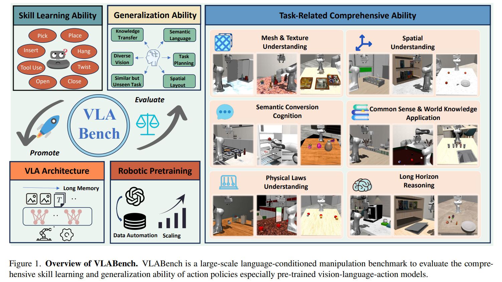

# VLABench: A Large-Scale Benchmark for Language-Conditioned Robotics Manipulation with Long-Horizon Reasoning Tasks

## 2.2-2.9周报.md

+ Motivation
    - VLABench 为了解决当前机器人学习领域在评测语言条件操作LCM能力时的不足而提出的。现有 benchmark 多关注低级操作、模板化语言或短 horizon 任务，无法有效评估当前 VLA 模型的泛化、推理与任务持续控制能力。为此，VLABench 明确提出要构建一个大规模的数据与任务集合。
+ Benchmark的主要内容
    - 任务规模与结构：包含 100 个精心设计的任务类别，使用 2000+ 个对象，具有强随机化，任务可分为：Primitive Tasks：偏向单个能力或简单动作；Composite Tasks：约 40 类，要求多个动作串联与长时序推理
    - **多能力综合评测**：
        * Mesh & Texture Understanding
        * Spatial Understanding
        * World Knowledge / Common Sense Transfer
        * Semantic Instruction Understanding
        * Physical Laws Understanding
        * Long-Horizon Reasoning
    - 任务自然语言与隐含目标：与 RLBench 那样使用模板化指令不同，VLABench 提供 自然语言指令，并包含隐含人类意图，要求模型不仅理解显式命令，还能从上下文或隐含需求中推断行动目标。
+ Benchmark的构建逻辑：
    - **任务定义与分类设计**
        * 使用 DSL（Domain-Specific Language） 机制来定义任务序列
        * 强随机化采样物体、场景布局、物体纹理等大范围变化
        * 随机化设计使得同一任务类别存在大量不同实例，避免过拟合
        * 任务分为基础任务（聚焦单一技能）和复合任务（涉及长时序逻辑）
    - **自动化数据采集框架：**在模拟环境中以多种 domain randomization 生成高质量数据，以及收集包括 RGB/D 图像、点云、对象位置等多模态观测与动作轨迹
    - **技能库与 RRT 路径规划（？）**
        * 内置技能库（Skill Library）定义机器人基本操作
        * 使用 RRT、SLERP 等运动规划方法生成平滑动作序列
        * 数据生成过程中集成启发式策略与先验知识
    - **评测协议与指标机制**
        * 对每个任务执行一系列 rollout 评估，引入 Progress Score、Skill Recall Rate、Parameter Recall Rate 等指标来衡量任务执行质量
