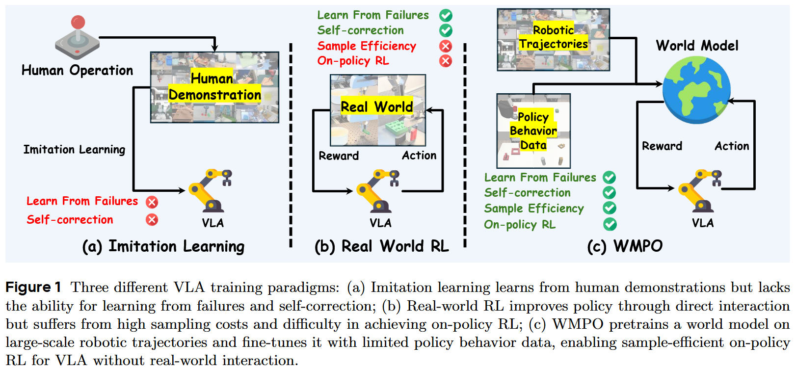
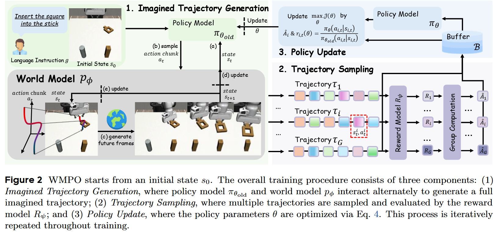

# WMPO: World Model-based Policy Optimization for Vision-Language-Action Models

## 1.19-1.26周报.md

    -  **Motivation  **
        * VLA 的结构性问题在于缺乏 world model：现有 VLA 多建模为$ π(a_t∣o_t,l) $，本质是 reactive policy，无法显式推理未来状态，尤其在 long-horizon manipulation 中容易失败。
        * Imitation Learning 无法从失败中学习：IL 只覆盖 expert manifold，一旦进入 OOD state，error 会快速累积，缺乏 self-correction 能力。
        * 真实世界 RL 不可扩展：On-policy RL 需要大量真实交互，成本高且危险，限制了 VLA + RL 的实际可行性。所以核心动机：用 learned world model 替代真实环境，让 policy 在“想象中”学习如何避免失败、完成任务。

    -  **Technique   **
        * 整体建模思路：RL 发生在 world model 中，而不是现实世界。论文首先做了一件很重要的事：**把 VLA + RL 的学习空间，从真实环境迁移到想象环境，这个和我之前的一个思路很像，主要是解决真机的采样太过于困难的问题**。整体目标可以概括为一句话：在 learned world model 中，最大化 imagined trajectory 的成功率。$ \max_\theta ; \mathbb{E}*{\tau \sim \pi*\theta,, p_\phi}\big[ R(\tau) \big] $其中：$ \pi_\theta $ 是 VLA policy，$ p_\phi $ 是 world model（而不是环境），reward 在 **trajectory level** 计算，而不是 step-level这一步直接决定了后面所有设计都是围绕 **imagined rollout 是否可信** 展开的。
        * World model 的选择：pixel / 3D space，而不是 latent dynamics。一个非常反直觉但很重要的选择是：world model **不在 latent space rollout**，而是在 **pixel 空间**。主要是VLA backbone 本身是在大规模 image / video 上预训练的，如果 world model 在 latent 空间生成，视觉语义会发生漂移，policy 在 imagined rollout 中反而看不懂世界。因此，world model 的任务被定义为：$ I_{t+1:t+K} \sim p_\phi(I_{t+1:t+K} \mid I_{t-c:t}, a_{t:t+K}) $
        * Action 条件化方式：保证动作真的影响画面.为了让 imagined trajectory 对 action 敏感，论文在 world model 中做了两个关键设计：**Action chunking**：policy 一次输出一段连续动作（而不是单步），降低 rollout 深度。**Frame-level action conditioning**：每一帧生成都显式注入 action embedding，而不是只在起点注入。
        * Policy Behavior Alignment：决定复现是否失败的关键。world model 的训练被明确分成两阶段：**Pretrain（expert data）**学到基本物理和交互模式，但几乎只有成功轨迹；**Finetune（policy rollout data）**覆盖失败状态，让 world model 对 policy 的真实行为分布负责。目标其实很明确：$ p_\phi(s_{t+1} \mid s_t, a_t) ;\approx; p_{\pi_\theta} $。如果 world model **只像 expert，不像当前 policy**，那 imagined failure 就是假的，RL 会直接学歪。
        * GRPO：为什么适合 imagined trajectory。在 imagined world 里，reward 有两个特点：非常 sparse（基本是成功 / 失败），同一初始状态可以反复 rollout 多条轨迹，因此论文采用 **group-relative advantage**，而不是 value-based RL：$ \hat{A}_i = \frac{R_i - \mu}{\sigma} $这种做法的好处是：不需要 learning value function，对 reward 误差不那么敏感，非常适合 imagined rollout 的 setting

    - Advantage：
        * Emergent self-correction：policy 学会从 near-failure state 中恢复，这些行为并未出现在 demonstration 中。
        * 更强的 long-horizon planning 能力：world model 提供对未来结果的显式建模，减少走一步看一步的策略行为。
        * 泛化能力提升：在 position / texture / background 扰动下，world-model-trained policy 明显优于纯 IL / DPO。
    - Thinking：
        * 缓解 world model 的 open-loop drift：例如 short-horizon rollout + frequent re-anchoring，或引入 3D structure 作为约束。（有点从3D-VLA迁移过来的意思）
        * 提升 reward signal 的信息密度：从 binary success 扩展到 trajectory preference、subgoal consistency、language-based critique。（这个其实是奖励稀疏性的研究的内容）
